# The First Circle: Previously On Nine Circles, Part One 
## Linear regression

<br/>
Jiří Fejlek

2025-11-26
<br/>

In the first circle, we will quickly go through statistical models used in machine learning that we already covered in Nine Circles of Statistical Modeling (<https://github.com/fejlek/Nine-Circles-Statistics>). We will use the same datasets, so there will be nothing new in the content itself. However, the implementation will be performed in *Python* (which we will use in this series) rather than *R*. My personal motivation is to *learn* Python, and I think the best place to start is to go back and revisit the datasets I already investigated using the tools in *R*. Consequently, I can easily check that I am doing things right (or doing them wrong again in the same way). We can also investigate whether the capabilities of Python packages are comparable to those in R.

Our brief revisit starts with linear regression and the life expectancy dataset (<https://www.kaggle.com/datasets/lashagoch/life-expectancy-who-updated>), which consists of health, immunization, and economic and demographic data about 179 countries.<br/>

## Table of Contents

- [Life Expectancy (WHO) Dataset](#life-expectancy-who-dataset)
- [Initial Linear Regression Model](#initial-linear-regression-model)
    - [Fit and Diagnostics](#fit-and-diagnostics)
    - [Dealing with Heteroskedasticity](#heteroskedasticity)
    - [Dealing with Autocorrelation](#autocorrelation)
- [Fixed and Random Effects Models](#fixed-and-random)
- [Confidence Intervals for Predictions](#predictions)
- [Model Validation](#validation)
- [References](#references)

## Life Expectancy (WHO) Dataset <a class="anchor" id="life-expectancy-who-dataset"></a>

The dataset contains the following data.

- **Country**
- **Region**
- **Year** - Data observed from 2000 to 2015
- **Infant_deaths** - Infant deaths per 1000 population
- **Under_five_deaths** - Deaths of children under five years old per 1000 population
- **Adult_mortality** - Deaths of adults between 15 and 60 per 1000 population
- **Alcohol_consumption** - Alcohol consumption in liters of pure alcohol per capita for 15+ years old
- **Hepatitis_B** - Coverage (%) of Hepatitis B (HepB3) immunization among 1-year-olds.
- **Measles** - Coverage (%) of Measles immunization among 1-year-olds
- **BMI** - Mean body mass index (BMI) of adult population 18+
- **Polio** - Coverage (%) of Polio (Pol3) immunization among 1-year-olds
- **Diptheria** - Coverage (%) of Diphtheria tetanus toxoid and pertussis (DTP3) immunization among 1-year-olds.
- **Incidents_HIV** - Incidents of HIV per 1000 population aged 15-49
- **GDP_per_capita** - GDP per capita in USD
- **Population_mln** - Total population in millions
- **Thinness_10-19** - Prevalence of thinness among adolescents aged 10-19 years: BMI \< -2 standard deviations below the median
- **Thinness_5-9** - Prevalence of thinness among children aged 5-9 years: BMI \< -2 standard deviations below the median
- **Schooling** - Average years that people aged 25+ spent in formal education
- **Developed** - Economically developed country (status in the World Trade Organization)
- **Developing** - Economically developing country (status in the World Trade Organization)
- **Life_expectancy** - Average life expectancy


<br/> Let us load the dataset and check the types.


```python
import pandas as pd
import numpy as np
np.set_printoptions(legacy='1.25') # more readable numerical outputs 
```


```python
life_expectancy = pd.read_csv('C:/Users/elini/Desktop/nine circles 2/Life-Expectancy-Data-Updated.csv')
life_expectancy
```


<div>
<style scoped>
    .dataframe tbody tr th:only-of-type {
        vertical-align: middle;
    }

    .dataframe tbody tr th {
        vertical-align: top;
    }

    .dataframe thead th {
        text-align: right;
    }
</style>
<table border="1" class="dataframe">
  <thead>
    <tr style="text-align: right;">
      <th></th>
      <th>Country</th>
      <th>Region</th>
      <th>Year</th>
      <th>Infant_deaths</th>
      <th>Under_five_deaths</th>
      <th>Adult_mortality</th>
      <th>Alcohol_consumption</th>
      <th>Hepatitis_B</th>
      <th>Measles</th>
      <th>BMI</th>
      <th>...</th>
      <th>Diphtheria</th>
      <th>Incidents_HIV</th>
      <th>GDP_per_capita</th>
      <th>Population_mln</th>
      <th>Thinness_ten_nineteen_years</th>
      <th>Thinness_five_nine_years</th>
      <th>Schooling</th>
      <th>Economy_status_Developed</th>
      <th>Economy_status_Developing</th>
      <th>Life_expectancy</th>
    </tr>
  </thead>
  <tbody>
    <tr>
      <th>0</th>
      <td>Turkiye</td>
      <td>Middle East</td>
      <td>2015</td>
      <td>11.1</td>
      <td>13.0</td>
      <td>105.8240</td>
      <td>1.320</td>
      <td>97</td>
      <td>65</td>
      <td>27.8</td>
      <td>...</td>
      <td>97</td>
      <td>0.08</td>
      <td>11006</td>
      <td>78.53</td>
      <td>4.9</td>
      <td>4.8</td>
      <td>7.8</td>
      <td>0</td>
      <td>1</td>
      <td>76.5</td>
    </tr>
    <tr>
      <th>1</th>
      <td>Spain</td>
      <td>European Union</td>
      <td>2015</td>
      <td>2.7</td>
      <td>3.3</td>
      <td>57.9025</td>
      <td>10.350</td>
      <td>97</td>
      <td>94</td>
      <td>26.0</td>
      <td>...</td>
      <td>97</td>
      <td>0.09</td>
      <td>25742</td>
      <td>46.44</td>
      <td>0.6</td>
      <td>0.5</td>
      <td>9.7</td>
      <td>1</td>
      <td>0</td>
      <td>82.8</td>
    </tr>
    <tr>
      <th>2</th>
      <td>India</td>
      <td>Asia</td>
      <td>2007</td>
      <td>51.5</td>
      <td>67.9</td>
      <td>201.0765</td>
      <td>1.570</td>
      <td>60</td>
      <td>35</td>
      <td>21.2</td>
      <td>...</td>
      <td>64</td>
      <td>0.13</td>
      <td>1076</td>
      <td>1183.21</td>
      <td>27.1</td>
      <td>28.0</td>
      <td>5.0</td>
      <td>0</td>
      <td>1</td>
      <td>65.4</td>
    </tr>
    <tr>
      <th>3</th>
      <td>Guyana</td>
      <td>South America</td>
      <td>2006</td>
      <td>32.8</td>
      <td>40.5</td>
      <td>222.1965</td>
      <td>5.680</td>
      <td>93</td>
      <td>74</td>
      <td>25.3</td>
      <td>...</td>
      <td>93</td>
      <td>0.79</td>
      <td>4146</td>
      <td>0.75</td>
      <td>5.7</td>
      <td>5.5</td>
      <td>7.9</td>
      <td>0</td>
      <td>1</td>
      <td>67.0</td>
    </tr>
    <tr>
      <th>4</th>
      <td>Israel</td>
      <td>Middle East</td>
      <td>2012</td>
      <td>3.4</td>
      <td>4.3</td>
      <td>57.9510</td>
      <td>2.890</td>
      <td>97</td>
      <td>89</td>
      <td>27.0</td>
      <td>...</td>
      <td>94</td>
      <td>0.08</td>
      <td>33995</td>
      <td>7.91</td>
      <td>1.2</td>
      <td>1.1</td>
      <td>12.8</td>
      <td>1</td>
      <td>0</td>
      <td>81.7</td>
    </tr>
    <tr>
      <th>...</th>
      <td>...</td>
      <td>...</td>
      <td>...</td>
      <td>...</td>
      <td>...</td>
      <td>...</td>
      <td>...</td>
      <td>...</td>
      <td>...</td>
      <td>...</td>
      <td>...</td>
      <td>...</td>
      <td>...</td>
      <td>...</td>
      <td>...</td>
      <td>...</td>
      <td>...</td>
      <td>...</td>
      <td>...</td>
      <td>...</td>
      <td>...</td>
    </tr>
    <tr>
      <th>2859</th>
      <td>Niger</td>
      <td>Africa</td>
      <td>2000</td>
      <td>97.0</td>
      <td>224.9</td>
      <td>291.8240</td>
      <td>0.092</td>
      <td>72</td>
      <td>64</td>
      <td>20.8</td>
      <td>...</td>
      <td>34</td>
      <td>0.49</td>
      <td>399</td>
      <td>11.33</td>
      <td>12.8</td>
      <td>12.9</td>
      <td>1.1</td>
      <td>0</td>
      <td>1</td>
      <td>49.9</td>
    </tr>
    <tr>
      <th>2860</th>
      <td>Mongolia</td>
      <td>Asia</td>
      <td>2009</td>
      <td>23.9</td>
      <td>28.6</td>
      <td>235.2330</td>
      <td>6.560</td>
      <td>97</td>
      <td>97</td>
      <td>25.3</td>
      <td>...</td>
      <td>95</td>
      <td>0.02</td>
      <td>2515</td>
      <td>2.67</td>
      <td>2.2</td>
      <td>2.3</td>
      <td>9.1</td>
      <td>0</td>
      <td>1</td>
      <td>66.9</td>
    </tr>
    <tr>
      <th>2861</th>
      <td>Sri Lanka</td>
      <td>Asia</td>
      <td>2004</td>
      <td>17.7</td>
      <td>28.9</td>
      <td>134.8950</td>
      <td>1.560</td>
      <td>62</td>
      <td>95</td>
      <td>21.9</td>
      <td>...</td>
      <td>97</td>
      <td>0.02</td>
      <td>2130</td>
      <td>19.39</td>
      <td>15.4</td>
      <td>15.5</td>
      <td>10.3</td>
      <td>0</td>
      <td>1</td>
      <td>74.3</td>
    </tr>
    <tr>
      <th>2862</th>
      <td>Lithuania</td>
      <td>European Union</td>
      <td>2002</td>
      <td>7.9</td>
      <td>9.9</td>
      <td>204.0120</td>
      <td>11.000</td>
      <td>94</td>
      <td>95</td>
      <td>26.1</td>
      <td>...</td>
      <td>95</td>
      <td>0.05</td>
      <td>7424</td>
      <td>3.44</td>
      <td>3.3</td>
      <td>3.3</td>
      <td>11.1</td>
      <td>1</td>
      <td>0</td>
      <td>71.8</td>
    </tr>
    <tr>
      <th>2863</th>
      <td>Iceland</td>
      <td>Rest of Europe</td>
      <td>2011</td>
      <td>2.1</td>
      <td>2.6</td>
      <td>50.5745</td>
      <td>6.840</td>
      <td>88</td>
      <td>90</td>
      <td>26.1</td>
      <td>...</td>
      <td>95</td>
      <td>0.05</td>
      <td>48934</td>
      <td>0.32</td>
      <td>0.9</td>
      <td>0.9</td>
      <td>11.0</td>
      <td>1</td>
      <td>0</td>
      <td>82.4</td>
    </tr>
  </tbody>
</table>
<p>2864 rows × 21 columns</p>
</div>


```python
life_expectancy.dtypes
```


    Country                         object
    Region                          object
    Year                             int64
    Infant_deaths                  float64
    Under_five_deaths              float64
    Adult_mortality                float64
    Alcohol_consumption            float64
    Hepatitis_B                      int64
    Measles                          int64
    BMI                            float64
    Polio                            int64
    Diphtheria                       int64
    Incidents_HIV                  float64
    GDP_per_capita                   int64
    Population_mln                 float64
    Thinness_ten_nineteen_years    float64
    Thinness_five_nine_years       float64
    Schooling                      float64
    Economy_status_Developed         int64
    Economy_status_Developing        int64
    Life_expectancy                float64
    dtype: object


<br/> First, we perform some data cleaning.


```python
# drop redundant column
life_expectancy = life_expectancy.drop('Economy_status_Developing', axis=1)
# turn column into factor and rename the column
life_expectancy = life_expectancy.rename(columns={'Economy_status_Developed': 'Economy_status'})
life_expectancy['Economy_status'] = life_expectancy['Economy_status'].astype(object)
# rename levels
life_expectancy.loc[life_expectancy['Economy_status'] == 0,'Economy_status'] = 'Developing'
life_expectancy.loc[life_expectancy['Economy_status'] == 1,'Economy_status'] = 'Developed'
```

<br/> Check for missing values and duplicated rows.


```python
life_expectancy.isna().any(axis = None)
```


    False


```python
life_expectancy.duplicated(keep = False).any(axis = None)
```


    False


<br/>Next, we check the predictors. For numerical predictors, we can get the basic descriptive statistics as follows.


```python
from scipy import stats

stats.describe(life_expectancy['Infant_deaths'], axis = 0)
```


    DescribeResult(nobs=2864, minmax=(1.8, 138.1), mean=30.36379189944134, variance=758.3478642053692, skewness=1.1035440527966804, kurtosis=0.3895217049700759)


<br/> Let us print a more transparent table of descriptive statistics for all numerical predictors (à la *summary* from R).


```python
numeric_variables = list(life_expectancy)[3:18]
numeric_basic_stats = np.zeros([len(numeric_variables),6])

for i in range(len(numeric_variables)):
    numeric_basic_stats[i,0] = np.mean(life_expectancy[numeric_variables[i]])
    numeric_basic_stats[i,1] = np.median(life_expectancy[numeric_variables[i]])
    numeric_basic_stats[i,2] = np.min(life_expectancy[numeric_variables[i]])
    numeric_basic_stats[i,3] = np.quantile(life_expectancy[numeric_variables[i]], 0.25)
    numeric_basic_stats[i,4] = np.quantile(life_expectancy[numeric_variables[i]], 0.75)
    numeric_basic_stats[i,5] = np.max(life_expectancy[numeric_variables[i]])
  
pd.DataFrame(data=numeric_basic_stats, index=numeric_variables, columns=['mean','median','min','1st qrt.','3rd qrt.','max'])
```


<div>
<style scoped>
    .dataframe tbody tr th:only-of-type {
        vertical-align: middle;
    }

    .dataframe tbody tr th {
        vertical-align: top;
    }

    .dataframe thead th {
        text-align: right;
    }
</style>
<table border="1" class="dataframe">
  <thead>
    <tr style="text-align: right;">
      <th></th>
      <th>mean</th>
      <th>median</th>
      <th>min</th>
      <th>1st qrt.</th>
      <th>3rd qrt.</th>
      <th>max</th>
    </tr>
  </thead>
  <tbody>
    <tr>
      <th>Infant_deaths</th>
      <td>30.363792</td>
      <td>19.6000</td>
      <td>1.800</td>
      <td>8.10000</td>
      <td>47.350000</td>
      <td>138.1000</td>
    </tr>
    <tr>
      <th>Under_five_deaths</th>
      <td>42.938268</td>
      <td>23.1000</td>
      <td>2.300</td>
      <td>9.67500</td>
      <td>66.000000</td>
      <td>224.9000</td>
    </tr>
    <tr>
      <th>Adult_mortality</th>
      <td>192.251775</td>
      <td>163.8415</td>
      <td>49.384</td>
      <td>106.91025</td>
      <td>246.791375</td>
      <td>719.3605</td>
    </tr>
    <tr>
      <th>Alcohol_consumption</th>
      <td>4.820882</td>
      <td>4.0200</td>
      <td>0.000</td>
      <td>1.20000</td>
      <td>7.777500</td>
      <td>17.8700</td>
    </tr>
    <tr>
      <th>Hepatitis_B</th>
      <td>84.292598</td>
      <td>89.0000</td>
      <td>12.000</td>
      <td>78.00000</td>
      <td>96.000000</td>
      <td>99.0000</td>
    </tr>
    <tr>
      <th>Measles</th>
      <td>77.344972</td>
      <td>83.0000</td>
      <td>10.000</td>
      <td>64.00000</td>
      <td>93.000000</td>
      <td>99.0000</td>
    </tr>
    <tr>
      <th>BMI</th>
      <td>25.032926</td>
      <td>25.5000</td>
      <td>19.800</td>
      <td>23.20000</td>
      <td>26.400000</td>
      <td>32.1000</td>
    </tr>
    <tr>
      <th>Polio</th>
      <td>86.499651</td>
      <td>93.0000</td>
      <td>8.000</td>
      <td>81.00000</td>
      <td>97.000000</td>
      <td>99.0000</td>
    </tr>
    <tr>
      <th>Diphtheria</th>
      <td>86.271648</td>
      <td>93.0000</td>
      <td>16.000</td>
      <td>81.00000</td>
      <td>97.000000</td>
      <td>99.0000</td>
    </tr>
    <tr>
      <th>Incidents_HIV</th>
      <td>0.894288</td>
      <td>0.1500</td>
      <td>0.010</td>
      <td>0.08000</td>
      <td>0.460000</td>
      <td>21.6800</td>
    </tr>
    <tr>
      <th>GDP_per_capita</th>
      <td>11540.924930</td>
      <td>4217.0000</td>
      <td>148.000</td>
      <td>1415.75000</td>
      <td>12557.000000</td>
      <td>112418.0000</td>
    </tr>
    <tr>
      <th>Population_mln</th>
      <td>36.675915</td>
      <td>7.8500</td>
      <td>0.080</td>
      <td>2.09750</td>
      <td>23.687500</td>
      <td>1379.8600</td>
    </tr>
    <tr>
      <th>Thinness_ten_nineteen_years</th>
      <td>4.865852</td>
      <td>3.3000</td>
      <td>0.100</td>
      <td>1.60000</td>
      <td>7.200000</td>
      <td>27.7000</td>
    </tr>
    <tr>
      <th>Thinness_five_nine_years</th>
      <td>4.899825</td>
      <td>3.4000</td>
      <td>0.100</td>
      <td>1.60000</td>
      <td>7.300000</td>
      <td>28.6000</td>
    </tr>
    <tr>
      <th>Schooling</th>
      <td>7.632123</td>
      <td>7.8000</td>
      <td>1.100</td>
      <td>5.10000</td>
      <td>10.300000</td>
      <td>14.1000</td>
    </tr>
  </tbody>
</table>
</div>


<br/> The distributions are easier to assess via histograms.


```python
import matplotlib.pyplot as plt

f,a = plt.subplots(1,3)
a = a.ravel()
for idx,ax in enumerate(a):
    ax.hist(life_expectancy[numeric_variables[idx]], bins=20)
    ax.set_title('Histogram')
    ax.set_xlabel(numeric_variables[idx])
    ax.set_ylabel('Frequency')
plt.tight_layout()
```


    

    


```python
f,a = plt.subplots(1,3)
a = a.ravel()
for idx,ax in enumerate(a):
    ax.hist(life_expectancy[numeric_variables[idx+3]], bins=20)
    ax.set_title('Histogram')
    ax.set_xlabel(numeric_variables[idx+3])
    ax.set_ylabel('Frequency')
plt.tight_layout()
```


    

    


```python
f,a = plt.subplots(1,3)
a = a.ravel()
for idx,ax in enumerate(a):
    ax.hist(life_expectancy[numeric_variables[idx+6]], bins=20)
    ax.set_title('Histogram')
    ax.set_xlabel(numeric_variables[idx+6])
    ax.set_ylabel('Frequency')
plt.tight_layout()
```


    

    


```python
f,a = plt.subplots(1,3)
a = a.ravel()
for idx,ax in enumerate(a):
    ax.hist(life_expectancy[numeric_variables[idx+9]], bins=20)
    ax.set_title('Histogram')
    ax.set_xlabel(numeric_variables[idx+9])
    ax.set_ylabel('Frequency')
plt.tight_layout()
```


    

    


```python
f,a = plt.subplots(1,3)
a = a.ravel()
for idx,ax in enumerate(a):
    ax.hist(life_expectancy[numeric_variables[idx+12]], bins=20)
    ax.set_title('Histogram')
    ax.set_xlabel(numeric_variables[idx+12])
    ax.set_ylabel('Frequency')
plt.tight_layout()
```


    
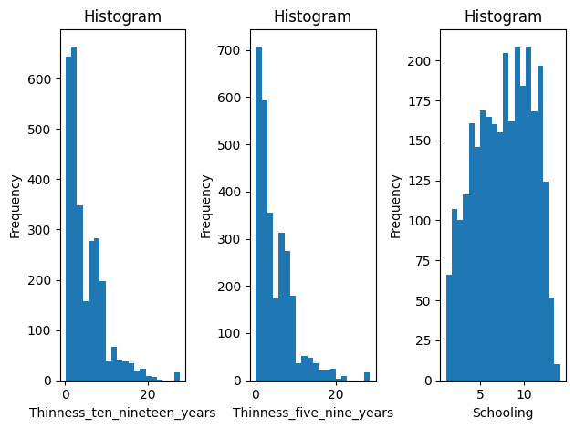
    


<br/> The distributions of **Population_mln** and **GDP_per_capita** are significantly skewed, and thus, we will use the logarithm transformation to reduce their spread.


```python
life_expectancy['GDP_log'] = np.log(life_expectancy['GDP_per_capita'])
life_expectancy['Pop_log'] = np.log(life_expectancy['Population_mln']+1)
```

<br/> Let us check the categorical predictors next.


```python
life_expectancy['Region'].value_counts()
```


    Region
    Africa                           816
    Asia                             432
    European Union                   432
    Central America and Caribbean    304
    Rest of Europe                   240
    Middle East                      224
    South America                    192
    Oceania                          176
    North America                     48
    Name: count, dtype: int64


```python
life_expectancy['Economy_status'].value_counts()
```


    Economy_status
    Developing    2272
    Developed      592
    Name: count, dtype: int64


<br/> As the last step, we will investigate the redundancy of variables via the variance inflation factor (VIF). We should note that in Python, we need to specify the whole design matrix, i.e., replace factors with dummy variables and add an intercept. As we will discuss in the next section, our model of life expectancy will contain as the main predictors of interest all predictors except **Country**, **Year**, and **Adult_mortality**. Hence, we exclude them from the design matrix.


```python
from statsmodels.stats.outliers_influence import variance_inflation_factor as VIF

ind = [*range(3,5),*range(6,13),*range(15,18),*range(20,22)] # extract relevant continous predictors
ind = [list(life_expectancy)[x] for x in ind]

VIF_dataframe = life_expectancy[ind].copy()
VIF_dataframe['Economy_status'] = (life_expectancy['Economy_status'] == 'Developing').astype(int) # add dummy variable for 'Economy_status'
VIF_dataframe = VIF_dataframe.assign(const=1) # add intercept!

VIF_vals = [VIF(VIF_dataframe, i) 
        for i in range(0, VIF_dataframe.shape[1]-1)]
VIF_vals = pd.DataFrame({'VIF':VIF_vals},index=VIF_dataframe.columns[0:15])
VIF_vals

```


<div>
<style scoped>
    .dataframe tbody tr th:only-of-type {
        vertical-align: middle;
    }

    .dataframe tbody tr th {
        vertical-align: top;
    }

    .dataframe thead th {
        text-align: right;
    }
</style>
<table border="1" class="dataframe">
  <thead>
    <tr style="text-align: right;">
      <th></th>
      <th>VIF</th>
    </tr>
  </thead>
  <tbody>
    <tr>
      <th>Infant_deaths</th>
      <td>45.496298</td>
    </tr>
    <tr>
      <th>Under_five_deaths</th>
      <td>43.384616</td>
    </tr>
    <tr>
      <th>Alcohol_consumption</th>
      <td>2.266525</td>
    </tr>
    <tr>
      <th>Hepatitis_B</th>
      <td>2.618636</td>
    </tr>
    <tr>
      <th>Measles</th>
      <td>1.622987</td>
    </tr>
    <tr>
      <th>BMI</th>
      <td>2.918694</td>
    </tr>
    <tr>
      <th>Polio</th>
      <td>12.154609</td>
    </tr>
    <tr>
      <th>Diphtheria</th>
      <td>13.065068</td>
    </tr>
    <tr>
      <th>Incidents_HIV</th>
      <td>1.350231</td>
    </tr>
    <tr>
      <th>Thinness_ten_nineteen_years</th>
      <td>8.894234</td>
    </tr>
    <tr>
      <th>Thinness_five_nine_years</th>
      <td>8.942022</td>
    </tr>
    <tr>
      <th>Schooling</th>
      <td>4.352311</td>
    </tr>
    <tr>
      <th>GDP_log</th>
      <td>4.257298</td>
    </tr>
    <tr>
      <th>Pop_log</th>
      <td>1.230802</td>
    </tr>
    <tr>
      <th>Economy_status</th>
      <td>2.657490</td>
    </tr>
  </tbody>
</table>
</div>


<br/> We notice that **Infant_deaths** and **Under_five_deaths** are highly correlated, since **Under_five_deaths** also include **Infant_deaths**. We can easily solve thiss issue by considering **Infant_deaths** and **Under_five_deaths - Infant_deaths**.


```python
plt.hist((life_expectancy['Under_five_deaths']-life_expectancy['Infant_deaths']), bins=20)
plt.title('Histogram')
plt.xlabel('Under_five_deaths - Infant_deaths')
plt.ylabel('Frequency');
```


    
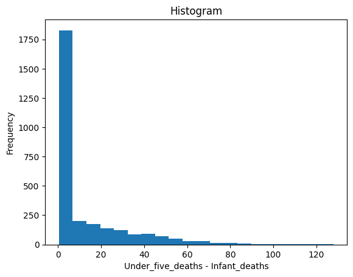
    


```python
life_expectancy['Child_deaths'] = life_expectancy['Under_five_deaths']-life_expectancy['Infant_deaths']
```

## Initial Linear Regression Model <a class="anchor" id="initial-linear-regression-model"></a>

Let us start the modelling. As we mentioned earlier, we will not include **Adult_mortality** in the model, because it can explain **Life_expectancy** almost by itself.


```python
import statsmodels.api as sm
import statsmodels.formula.api as smf # with statsmodels.formula.api we can use formulas fairly simmilar to R

adm_fit = smf.ols(formula='Life_expectancy ~ Adult_mortality', data=life_expectancy) 
print(adm_fit.fit().summary())
```

                                OLS Regression Results                            
    ==============================================================================
    Dep. Variable:        Life_expectancy   R-squared:                       0.894
    Model:                            OLS   Adj. R-squared:                  0.894
    Method:                 Least Squares   F-statistic:                 2.406e+04
    Date:                Wed, 26 Nov 2025   Prob (F-statistic):               0.00
    Time:                        19:57:20   Log-Likelihood:                -7272.5
    No. Observations:                2864   AIC:                         1.455e+04
    Df Residuals:                    2862   BIC:                         1.456e+04
    Df Model:                           1                                         
    Covariance Type:            nonrobust                                         
    ===================================================================================
                          coef    std err          t      P>|t|      [0.025      0.975]
    -----------------------------------------------------------------------------------
    Intercept          83.7324      0.112    749.489      0.000      83.513      83.951
    Adult_mortality    -0.0774      0.000   -155.124      0.000      -0.078      -0.076
    ==============================================================================
    Omnibus:                       75.634   Durbin-Watson:                   2.010
    Prob(Omnibus):                  0.000   Jarque-Bera (JB):              179.454
    Skew:                          -0.042   Prob(JB):                     1.08e-39
    Kurtosis:                       4.223   Cond. No.                         437.
    ==============================================================================
    
    Notes:
    [1] Standard Errors assume that the covariance matrix of the errors is correctly specified.
    

<br/> We observe that the model already explains about 90% variability in the data (by looking at the *R-squared* statistics). Consequently, let us explore other predictors and models that provide explanations beyond the fact that, in low **Life_expectancy** countries, more people tend to die young (before reaching 60).

### Fit and Diagnostics <a class="anchor" id="fit-and-diagnostics"></a>

Now, our data are so-called panel data; they consist of information on individual countries for the years 2000-2015. But for starters, let us ignore both **Country** and **Year** variables and stack all the data together, creating a *pooled* model [[1](#1),[2](#2)].


```python
lm_pooled = smf.ols(formula='Life_expectancy ~ Economy_status + Region + Alcohol_consumption + \
                    Hepatitis_B + Measles + BMI + Polio + Diphtheria + Incidents_HIV + GDP_log + \
                    Pop_log + Thinness_ten_nineteen_years + Thinness_five_nine_years + Schooling + \
                    Infant_deaths + Child_deaths', data=life_expectancy)

print(lm_pooled.fit().summary())  
```

                                OLS Regression Results                            
    ==============================================================================
    Dep. Variable:        Life_expectancy   R-squared:                       0.946
    Model:                            OLS   Adj. R-squared:                  0.945
    Method:                 Least Squares   F-statistic:                     2154.
    Date:                Wed, 26 Nov 2025   Prob (F-statistic):               0.00
    Time:                        19:57:20   Log-Likelihood:                -6308.4
    No. Observations:                2864   AIC:                         1.266e+04
    Df Residuals:                    2840   BIC:                         1.281e+04
    Df Model:                          23                                         
    Covariance Type:            nonrobust                                         
    ===========================================================================================================
                                                  coef    std err          t      P>|t|      [0.025      0.975]
    -----------------------------------------------------------------------------------------------------------
    Intercept                                  66.5891      1.198     55.590      0.000      64.240      68.938
    Economy_status[T.Developing]               -4.4966      0.259    -17.348      0.000      -5.005      -3.988
    Region[T.Asia]                              1.3854      0.181      7.656      0.000       1.031       1.740
    Region[T.Central America and Caribbean]     2.4281      0.197     12.340      0.000       2.042       2.814
    Region[T.European Union]                   -0.5693      0.293     -1.944      0.052      -1.144       0.005
    Region[T.Middle East]                       0.2398      0.226      1.061      0.289      -0.203       0.683
    Region[T.North America]                     0.3479      0.399      0.871      0.384      -0.435       1.131
    Region[T.Oceania]                          -0.6262      0.244     -2.570      0.010      -1.104      -0.148
    Region[T.Rest of Europe]                    1.2344      0.234      5.282      0.000       0.776       1.693
    Region[T.South America]                     2.1235      0.224      9.494      0.000       1.685       2.562
    Alcohol_consumption                        -0.2234      0.019    -11.851      0.000      -0.260      -0.186
    Hepatitis_B                                -0.0031      0.004     -0.737      0.461      -0.011       0.005
    Measles                                     0.0047      0.003      1.644      0.100      -0.001       0.010
    BMI                                         0.0550      0.037      1.480      0.139      -0.018       0.128
    Polio                                       0.0191      0.010      1.996      0.046       0.000       0.038
    Diphtheria                                 -0.0146      0.010     -1.521      0.128      -0.034       0.004
    Incidents_HIV                              -0.9244      0.021    -43.553      0.000      -0.966      -0.883
    GDP_log                                     1.4555      0.065     22.255      0.000       1.327       1.584
    Pop_log                                     0.1856      0.035      5.311      0.000       0.117       0.254
    Thinness_ten_nineteen_years                -0.0190      0.028     -0.686      0.493      -0.073       0.035
    Thinness_five_nine_years                    0.0207      0.028      0.753      0.451      -0.033       0.075
    Schooling                                  -0.1719      0.030     -5.708      0.000      -0.231      -0.113
    Infant_deaths                              -0.1655      0.005    -32.029      0.000      -0.176      -0.155
    Child_deaths                               -0.0840      0.006    -13.047      0.000      -0.097      -0.071
    ==============================================================================
    Omnibus:                       36.486   Durbin-Watson:                   2.029
    Prob(Omnibus):                  0.000   Jarque-Bera (JB):               52.860
    Skew:                          -0.140   Prob(JB):                     3.32e-12
    Kurtosis:                       3.604   Cond. No.                     5.12e+03
    ==============================================================================
    
    Notes:
    [1] Standard Errors assume that the covariance matrix of the errors is correctly specified.
    [2] The condition number is large, 5.12e+03. This might indicate that there are
    strong multicollinearity or other numerical problems.
    

<br/> Let us check the residuals.


```python
sm.qqplot(lm_pooled.fit().resid, line='s');
```


    
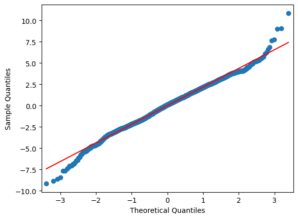
    


```python
plt.scatter(lm_pooled.fit().fittedvalues, lm_pooled.fit().resid)
plt.title('Residuals vs Predicted')
plt.xlabel('Predicted Values')
plt.ylabel('Residuals');
```


    

    


<br/> We can also plot the residuals against the predictors. Here are some examples


```python
boxplotresid_dataframe = pd.DataFrame({'Resid':lm_pooled.fit().resid, \
                                       'Economy_status':life_expectancy['Economy_status'],
                                       'Region':life_expectancy['Region'],})
boxplotresid_dataframe.boxplot('Resid',by='Economy_status');
```


    
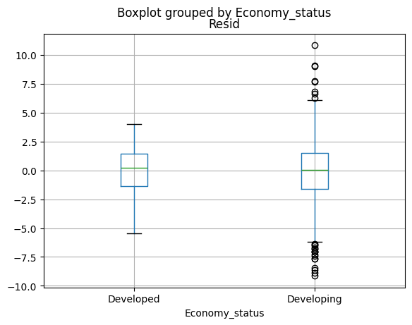
    


```python
boxplotresid_dataframe.boxplot('Resid',by='Region')
plt.xticks([1,2,3,4,5,6,7,8,9], ['Africa','Asia','C.Am.','EU','Md.East','N.Am.','Oceania','nonEU','S.Am.']);
```


    

    


```python
plt.scatter(life_expectancy['GDP_log'],lm_pooled.fit().resid)
plt.title('Residuals vs GDP_log')
plt.xlabel('Log GDP per capita')
plt.ylabel('Residuals');
```


    
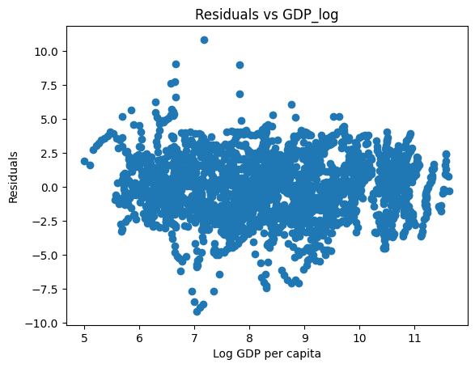
    


```python
plt.scatter(life_expectancy['Pop_log'],lm_pooled.fit().resid)
plt.title('Residuals vs Pop_log')
plt.xlabel('Log (Population_mln + 1)')
plt.ylabel('Residuals');
```


    

    


<br/> We observe that the residuals are fairly normal. However, we notice some heteroscedasticity in the residuals (see the residulas vs. **Economy_Status** plot). Consequently, the standard errors might be undersetimated. 

The last thing we will check that is often investigated is the influence of individual observations on the fit, measured usually in terms of Cook's distance.


```python
infl = lm_pooled.fit().get_influence()
sm_fr = infl.summary_frame()
plt.plot(sm_fr['cooks_d'])
plt.xlabel("Cook's distance")
plt.ylabel('Index');
```


    

    


<br/> We are primarily interested in observations that attained comparably large Cook's distances. Let us repeat the model fit, removing all observations with Cook's distance exceeding a given threshold. 


```python
lm_pooled_red = smf.ols(formula='Life_expectancy ~ Economy_status + Region + Alcohol_consumption + \
                    Hepatitis_B + Measles + BMI + Polio + Diphtheria + Incidents_HIV + GDP_log + \
                    Pop_log + Thinness_ten_nineteen_years + Thinness_five_nine_years + Schooling + \
                    Infant_deaths + Child_deaths', data=life_expectancy.loc[sm_fr['cooks_d'] < 0.005])

print(lm_pooled_red.fit().summary()) 
```

                                OLS Regression Results                            
    ==============================================================================
    Dep. Variable:        Life_expectancy   R-squared:                       0.948
    Model:                            OLS   Adj. R-squared:                  0.948
    Method:                 Least Squares   F-statistic:                     2246.
    Date:                Wed, 26 Nov 2025   Prob (F-statistic):               0.00
    Time:                        19:57:30   Log-Likelihood:                -6173.6
    No. Observations:                2846   AIC:                         1.240e+04
    Df Residuals:                    2822   BIC:                         1.254e+04
    Df Model:                          23                                         
    Covariance Type:            nonrobust                                         
    ===========================================================================================================
                                                  coef    std err          t      P>|t|      [0.025      0.975]
    -----------------------------------------------------------------------------------------------------------
    Intercept                                  68.1958      1.168     58.366      0.000      65.905      70.487
    Economy_status[T.Developing]               -4.4165      0.251    -17.581      0.000      -4.909      -3.924
    Region[T.Asia]                              1.1074      0.177      6.247      0.000       0.760       1.455
    Region[T.Central America and Caribbean]     2.1808      0.192     11.335      0.000       1.804       2.558
    Region[T.European Union]                   -0.8119      0.285     -2.853      0.004      -1.370      -0.254
    Region[T.Middle East]                       0.0702      0.219      0.320      0.749      -0.360       0.500
    Region[T.North America]                     0.1219      0.387      0.315      0.753      -0.637       0.881
    Region[T.Oceania]                          -0.8414      0.237     -3.551      0.000      -1.306      -0.377
    Region[T.Rest of Europe]                    0.9494      0.228      4.168      0.000       0.503       1.396
    Region[T.South America]                     1.8686      0.218      8.569      0.000       1.441       2.296
    Alcohol_consumption                        -0.2218      0.018    -12.114      0.000      -0.258      -0.186
    Hepatitis_B                                -0.0044      0.004     -1.061      0.289      -0.012       0.004
    Measles                                     0.0036      0.003      1.277      0.202      -0.002       0.009
    BMI                                         0.0242      0.036      0.673      0.501      -0.046       0.095
    Polio                                       0.0147      0.009      1.588      0.112      -0.003       0.033
    Diphtheria                                 -0.0126      0.009     -1.343      0.179      -0.031       0.006
    Incidents_HIV                              -0.9607      0.022    -42.958      0.000      -1.005      -0.917
    GDP_log                                     1.4215      0.063     22.413      0.000       1.297       1.546
    Pop_log                                     0.1868      0.034      5.512      0.000       0.120       0.253
    Thinness_ten_nineteen_years                -0.0374      0.028     -1.331      0.183      -0.093       0.018
    Thinness_five_nine_years                    0.0329      0.028      1.174      0.240      -0.022       0.088
    Schooling                                  -0.1523      0.029     -5.198      0.000      -0.210      -0.095
    Infant_deaths                              -0.1682      0.005    -32.673      0.000      -0.178      -0.158
    Child_deaths                               -0.0906      0.007    -13.679      0.000      -0.104      -0.078
    ==============================================================================
    Omnibus:                       16.987   Durbin-Watson:                   2.021
    Prob(Omnibus):                  0.000   Jarque-Bera (JB):               17.148
    Skew:                          -0.190   Prob(JB):                     0.000189
    Kurtosis:                       3.030   Cond. No.                     5.15e+03
    ==============================================================================
    
    Notes:
    [1] Standard Errors assume that the covariance matrix of the errors is correctly specified.
    [2] The condition number is large, 5.15e+03. This might indicate that there are
    strong multicollinearity or other numerical problems.
    

<br/> We observe that the fit did not dramatically change and thus, we keep all observations in the model.

### Dealing with Heteroskedasticity <a class="anchor" id="heteroskedasticity"></a>

A straightforward way of dealing with heteroskedasticity is to recompute the standard errors using some heteroskedasticity-consistent estimator of the covariance matrix, such as HC0 (Eicker–Huber–White) and HC3 (MacKinnon-White); HC3 is the default in the *vcovHC* function in R due to simulation experiments from [[3](#3)]. We should note that this approach uses the fact that the original coefficient estimates are consistent even though the covariance structure is misspecified.  The updated standard error estimates are as follows.


```python
hc_errors = pd.concat([lm_pooled.fit().bse, lm_pooled.fit(cov_type='HC0').bse, lm_pooled.fit(cov_type='HC3').bse], axis=1)
hc_errors = hc_errors.rename(columns={0: 'se', 1: 'HC0', 2: 'HC3'})
hc_errors
```


<div>
<style scoped>
    .dataframe tbody tr th:only-of-type {
        vertical-align: middle;
    }

    .dataframe tbody tr th {
        vertical-align: top;
    }

    .dataframe thead th {
        text-align: right;
    }
</style>
<table border="1" class="dataframe">
  <thead>
    <tr style="text-align: right;">
      <th></th>
      <th>se</th>
      <th>HC0</th>
      <th>HC3</th>
    </tr>
  </thead>
  <tbody>
    <tr>
      <th>Intercept</th>
      <td>1.197851</td>
      <td>1.337962</td>
      <td>1.357047</td>
    </tr>
    <tr>
      <th>Economy_status[T.Developing]</th>
      <td>0.259204</td>
      <td>0.242694</td>
      <td>0.245586</td>
    </tr>
    <tr>
      <th>Region[T.Asia]</th>
      <td>0.180943</td>
      <td>0.203073</td>
      <td>0.206048</td>
    </tr>
    <tr>
      <th>Region[T.Central America and Caribbean]</th>
      <td>0.196767</td>
      <td>0.223931</td>
      <td>0.227564</td>
    </tr>
    <tr>
      <th>Region[T.European Union]</th>
      <td>0.292840</td>
      <td>0.282591</td>
      <td>0.286643</td>
    </tr>
    <tr>
      <th>Region[T.Middle East]</th>
      <td>0.226081</td>
      <td>0.224780</td>
      <td>0.227035</td>
    </tr>
    <tr>
      <th>Region[T.North America]</th>
      <td>0.399422</td>
      <td>0.395753</td>
      <td>0.404200</td>
    </tr>
    <tr>
      <th>Region[T.Oceania]</th>
      <td>0.243685</td>
      <td>0.294050</td>
      <td>0.298285</td>
    </tr>
    <tr>
      <th>Region[T.Rest of Europe]</th>
      <td>0.233674</td>
      <td>0.262376</td>
      <td>0.265706</td>
    </tr>
    <tr>
      <th>Region[T.South America]</th>
      <td>0.223668</td>
      <td>0.216543</td>
      <td>0.219646</td>
    </tr>
    <tr>
      <th>Alcohol_consumption</th>
      <td>0.018848</td>
      <td>0.019506</td>
      <td>0.019709</td>
    </tr>
    <tr>
      <th>Hepatitis_B</th>
      <td>0.004251</td>
      <td>0.003809</td>
      <td>0.003867</td>
    </tr>
    <tr>
      <th>Measles</th>
      <td>0.002875</td>
      <td>0.002778</td>
      <td>0.002814</td>
    </tr>
    <tr>
      <th>BMI</th>
      <td>0.037135</td>
      <td>0.039317</td>
      <td>0.039835</td>
    </tr>
    <tr>
      <th>Polio</th>
      <td>0.009556</td>
      <td>0.008543</td>
      <td>0.008662</td>
    </tr>
    <tr>
      <th>Diphtheria</th>
      <td>0.009627</td>
      <td>0.008827</td>
      <td>0.008955</td>
    </tr>
    <tr>
      <th>Incidents_HIV</th>
      <td>0.021225</td>
      <td>0.034505</td>
      <td>0.035275</td>
    </tr>
    <tr>
      <th>GDP_log</th>
      <td>0.065401</td>
      <td>0.066620</td>
      <td>0.067253</td>
    </tr>
    <tr>
      <th>Pop_log</th>
      <td>0.034947</td>
      <td>0.034972</td>
      <td>0.035314</td>
    </tr>
    <tr>
      <th>Thinness_ten_nineteen_years</th>
      <td>0.027670</td>
      <td>0.027583</td>
      <td>0.028885</td>
    </tr>
    <tr>
      <th>Thinness_five_nine_years</th>
      <td>0.027540</td>
      <td>0.027739</td>
      <td>0.029041</td>
    </tr>
    <tr>
      <th>Schooling</th>
      <td>0.030119</td>
      <td>0.029349</td>
      <td>0.029694</td>
    </tr>
    <tr>
      <th>Infant_deaths</th>
      <td>0.005168</td>
      <td>0.006430</td>
      <td>0.006528</td>
    </tr>
    <tr>
      <th>Child_deaths</th>
      <td>0.006441</td>
      <td>0.009138</td>
      <td>0.009398</td>
    </tr>
  </tbody>
</table>
</div>


<br/> We observe that some standard errors are slightly larger. We can also quite easily recompute the P-values of the significance tests.


```python
print(lm_pooled.fit(cov_type='HC3').summary()) 
```

                                OLS Regression Results                            
    ==============================================================================
    Dep. Variable:        Life_expectancy   R-squared:                       0.946
    Model:                            OLS   Adj. R-squared:                  0.945
    Method:                 Least Squares   F-statistic:                     2079.
    Date:                Wed, 26 Nov 2025   Prob (F-statistic):               0.00
    Time:                        19:57:30   Log-Likelihood:                -6308.4
    No. Observations:                2864   AIC:                         1.266e+04
    Df Residuals:                    2840   BIC:                         1.281e+04
    Df Model:                          23                                         
    Covariance Type:                  HC3                                         
    ===========================================================================================================
                                                  coef    std err          z      P>|z|      [0.025      0.975]
    -----------------------------------------------------------------------------------------------------------
    Intercept                                  66.5891      1.357     49.069      0.000      63.929      69.249
    Economy_status[T.Developing]               -4.4966      0.246    -18.310      0.000      -4.978      -4.015
    Region[T.Asia]                              1.3854      0.206      6.724      0.000       0.982       1.789
    Region[T.Central America and Caribbean]     2.4281      0.228     10.670      0.000       1.982       2.874
    Region[T.European Union]                   -0.5693      0.287     -1.986      0.047      -1.131      -0.008
    Region[T.Middle East]                       0.2398      0.227      1.056      0.291      -0.205       0.685
    Region[T.North America]                     0.3479      0.404      0.861      0.389      -0.444       1.140
    Region[T.Oceania]                          -0.6262      0.298     -2.099      0.036      -1.211      -0.042
    Region[T.Rest of Europe]                    1.2344      0.266      4.646      0.000       0.714       1.755
    Region[T.South America]                     2.1235      0.220      9.668      0.000       1.693       2.554
    Alcohol_consumption                        -0.2234      0.020    -11.334      0.000      -0.262      -0.185
    Hepatitis_B                                -0.0031      0.004     -0.811      0.418      -0.011       0.004
    Measles                                     0.0047      0.003      1.680      0.093      -0.001       0.010
    BMI                                         0.0550      0.040      1.380      0.168      -0.023       0.133
    Polio                                       0.0191      0.009      2.203      0.028       0.002       0.036
    Diphtheria                                 -0.0146      0.009     -1.635      0.102      -0.032       0.003
    Incidents_HIV                              -0.9244      0.035    -26.205      0.000      -0.994      -0.855
    GDP_log                                     1.4555      0.067     21.642      0.000       1.324       1.587
    Pop_log                                     0.1856      0.035      5.256      0.000       0.116       0.255
    Thinness_ten_nineteen_years                -0.0190      0.029     -0.657      0.511      -0.076       0.038
    Thinness_five_nine_years                    0.0207      0.029      0.714      0.475      -0.036       0.078
    Schooling                                  -0.1719      0.030     -5.790      0.000      -0.230      -0.114
    Infant_deaths                              -0.1655      0.007    -25.354      0.000      -0.178      -0.153
    Child_deaths                               -0.0840      0.009     -8.941      0.000      -0.102      -0.066
    ==============================================================================
    Omnibus:                       36.486   Durbin-Watson:                   2.029
    Prob(Omnibus):                  0.000   Jarque-Bera (JB):               52.860
    Skew:                          -0.140   Prob(JB):                     3.32e-12
    Kurtosis:                       3.604   Cond. No.                     5.12e+03
    ==============================================================================
    
    Notes:
    [1] Standard Errors are heteroscedasticity robust (HC3)
    [2] The condition number is large, 5.12e+03. This might indicate that there are
    strong multicollinearity or other numerical problems.
    

<br/> An alternative to using heteroskedasticity-consistent errors is the nonparametric bootstrap (sometimes referred to as a *pairs* bootstrap), in which we resample the original dataset [[2](#2)]. Then, we simply refit the model using these new datasets. We can then obtain the confidence intervals from the coefficient resamples. We will compute simple percentile-based confidence intervals, which seem to work fairly well when the distribution of the bootstraped statistic is symmetrical and centered on the observed statistic, i.e, unbiased [[4](#4)].


```python
# nonparametric bootstrap
np.random.seed(123)
nb = 1000
boot_coef1 = np.zeros([nb,len(lm_pooled.fit().params)])

for i in range(nb):
    rand_ind = np.random.choice(range(len(life_expectancy)), size=len(life_expectancy), replace=True)
    life_expectancy_new = pd.DataFrame(life_expectancy.loc[x] for x in rand_ind)
    lm_pooled_new = smf.ols(formula='Life_expectancy ~ Economy_status + Region + Alcohol_consumption + \
                            Hepatitis_B + Measles + BMI + Polio + Diphtheria + Incidents_HIV + GDP_log + \
                            Pop_log + Thinness_ten_nineteen_years + Thinness_five_nine_years + Schooling + \
                            Infant_deaths + Child_deaths', data=life_expectancy_new)
    boot_coef1[i] = lm_pooled_new.fit().params

# percentile-based CI
pd.DataFrame(boot_coef1, columns=list(lm_pooled_new.fit().params.index)).quantile([0.025,0.975],0)
```


<div>
<style scoped>
    .dataframe tbody tr th:only-of-type {
        vertical-align: middle;
    }

    .dataframe tbody tr th {
        vertical-align: top;
    }

    .dataframe thead th {
        text-align: right;
    }
</style>
<table border="1" class="dataframe">
  <thead>
    <tr style="text-align: right;">
      <th></th>
      <th>Intercept</th>
      <th>Economy_status[T.Developing]</th>
      <th>Region[T.Asia]</th>
      <th>Region[T.Central America and Caribbean]</th>
      <th>Region[T.European Union]</th>
      <th>Region[T.Middle East]</th>
      <th>Region[T.North America]</th>
      <th>Region[T.Oceania]</th>
      <th>Region[T.Rest of Europe]</th>
      <th>Region[T.South America]</th>
      <th>...</th>
      <th>Polio</th>
      <th>Diphtheria</th>
      <th>Incidents_HIV</th>
      <th>GDP_log</th>
      <th>Pop_log</th>
      <th>Thinness_ten_nineteen_years</th>
      <th>Thinness_five_nine_years</th>
      <th>Schooling</th>
      <th>Infant_deaths</th>
      <th>Child_deaths</th>
    </tr>
  </thead>
  <tbody>
    <tr>
      <th>0.025</th>
      <td>63.865359</td>
      <td>-4.976775</td>
      <td>1.000854</td>
      <td>1.989291</td>
      <td>-1.147891</td>
      <td>-0.237657</td>
      <td>-0.492967</td>
      <td>-1.226442</td>
      <td>0.689046</td>
      <td>1.668761</td>
      <td>...</td>
      <td>0.001890</td>
      <td>-0.032431</td>
      <td>-1.002469</td>
      <td>1.328536</td>
      <td>0.115170</td>
      <td>-0.075541</td>
      <td>-0.036107</td>
      <td>-0.228246</td>
      <td>-0.17700</td>
      <td>-0.104481</td>
    </tr>
    <tr>
      <th>0.975</th>
      <td>69.149997</td>
      <td>-4.038406</td>
      <td>1.799886</td>
      <td>2.876219</td>
      <td>-0.036435</td>
      <td>0.664566</td>
      <td>1.155195</td>
      <td>-0.070201</td>
      <td>1.720022</td>
      <td>2.564763</td>
      <td>...</td>
      <td>0.037298</td>
      <td>0.002096</td>
      <td>-0.861144</td>
      <td>1.581857</td>
      <td>0.252981</td>
      <td>0.032745</td>
      <td>0.073184</td>
      <td>-0.114955</td>
      <td>-0.15296</td>
      <td>-0.066898</td>
    </tr>
  </tbody>
</table>
<p>2 rows × 24 columns</p>
</div>


### Dealing with Autocorrelation <a class="anchor" id="autocorrelation"></a>

Both of the approaches above that helped us to deal with heteroskedasticity assume that the error terms are independent. However, our dataset consists of longitudinal data for 179 countries, and thus these observations might be significantly correlated. We can check our suspicion by plotting the residuals of our model for a given country against **Year**.


```python
plt.scatter(life_expectancy[life_expectancy['Country'] == 'France']['Year'], \
            lm_pooled.fit().resid[life_expectancy['Country'] == 'France'])
plt.title('France');
```


    

    


```python
plt.scatter(life_expectancy[life_expectancy['Country'] == 'Madagascar']['Year'], \
            lm_pooled.fit().resid[life_expectancy['Country'] == 'Madagascar'])
plt.title('Madagascar');
```


    

    


<br/> These residuals are clearly strongly correlated. Hence, instead of heteroskedasticity-consistent standard errors, we should use cluster-robust standard errors. Our clusters consist of observations from the same country.


```python
cr_errors = pd.concat([lm_pooled.fit().bse, lm_pooled.fit(cov_type='HC0').bse, \
                       lm_pooled.fit(cov_type='HC3').bse, \
                       lm_pooled.fit(cov_type='cluster',cov_kwds = {'groups':life_expectancy['Country']}).bse], axis=1)
cr_errors = cr_errors.rename(columns={0: 'se', 1: 'HC0', 2: 'HC3', 3: 'CR'})
cr_errors
```


<div>
<style scoped>
    .dataframe tbody tr th:only-of-type {
        vertical-align: middle;
    }

    .dataframe tbody tr th {
        vertical-align: top;
    }

    .dataframe thead th {
        text-align: right;
    }
</style>
<table border="1" class="dataframe">
  <thead>
    <tr style="text-align: right;">
      <th></th>
      <th>se</th>
      <th>HC0</th>
      <th>HC3</th>
      <th>CR</th>
    </tr>
  </thead>
  <tbody>
    <tr>
      <th>Intercept</th>
      <td>1.197851</td>
      <td>1.337962</td>
      <td>1.357047</td>
      <td>4.313011</td>
    </tr>
    <tr>
      <th>Economy_status[T.Developing]</th>
      <td>0.259204</td>
      <td>0.242694</td>
      <td>0.245586</td>
      <td>0.861204</td>
    </tr>
    <tr>
      <th>Region[T.Asia]</th>
      <td>0.180943</td>
      <td>0.203073</td>
      <td>0.206048</td>
      <td>0.675859</td>
    </tr>
    <tr>
      <th>Region[T.Central America and Caribbean]</th>
      <td>0.196767</td>
      <td>0.223931</td>
      <td>0.227564</td>
      <td>0.690555</td>
    </tr>
    <tr>
      <th>Region[T.European Union]</th>
      <td>0.292840</td>
      <td>0.282591</td>
      <td>0.286643</td>
      <td>0.940909</td>
    </tr>
    <tr>
      <th>Region[T.Middle East]</th>
      <td>0.226081</td>
      <td>0.224780</td>
      <td>0.227035</td>
      <td>0.790664</td>
    </tr>
    <tr>
      <th>Region[T.North America]</th>
      <td>0.399422</td>
      <td>0.395753</td>
      <td>0.404200</td>
      <td>1.451847</td>
    </tr>
    <tr>
      <th>Region[T.Oceania]</th>
      <td>0.243685</td>
      <td>0.294050</td>
      <td>0.298285</td>
      <td>1.059227</td>
    </tr>
    <tr>
      <th>Region[T.Rest of Europe]</th>
      <td>0.233674</td>
      <td>0.262376</td>
      <td>0.265706</td>
      <td>0.900565</td>
    </tr>
    <tr>
      <th>Region[T.South America]</th>
      <td>0.223668</td>
      <td>0.216543</td>
      <td>0.219646</td>
      <td>0.710864</td>
    </tr>
    <tr>
      <th>Alcohol_consumption</th>
      <td>0.018848</td>
      <td>0.019506</td>
      <td>0.019709</td>
      <td>0.064343</td>
    </tr>
    <tr>
      <th>Hepatitis_B</th>
      <td>0.004251</td>
      <td>0.003809</td>
      <td>0.003867</td>
      <td>0.008836</td>
    </tr>
    <tr>
      <th>Measles</th>
      <td>0.002875</td>
      <td>0.002778</td>
      <td>0.002814</td>
      <td>0.009067</td>
    </tr>
    <tr>
      <th>BMI</th>
      <td>0.037135</td>
      <td>0.039317</td>
      <td>0.039835</td>
      <td>0.139951</td>
    </tr>
    <tr>
      <th>Polio</th>
      <td>0.009556</td>
      <td>0.008543</td>
      <td>0.008662</td>
      <td>0.021032</td>
    </tr>
    <tr>
      <th>Diphtheria</th>
      <td>0.009627</td>
      <td>0.008827</td>
      <td>0.008955</td>
      <td>0.020381</td>
    </tr>
    <tr>
      <th>Incidents_HIV</th>
      <td>0.021225</td>
      <td>0.034505</td>
      <td>0.035275</td>
      <td>0.095415</td>
    </tr>
    <tr>
      <th>GDP_log</th>
      <td>0.065401</td>
      <td>0.066620</td>
      <td>0.067253</td>
      <td>0.226540</td>
    </tr>
    <tr>
      <th>Pop_log</th>
      <td>0.034947</td>
      <td>0.034972</td>
      <td>0.035314</td>
      <td>0.128202</td>
    </tr>
    <tr>
      <th>Thinness_ten_nineteen_years</th>
      <td>0.027670</td>
      <td>0.027583</td>
      <td>0.028885</td>
      <td>0.025853</td>
    </tr>
    <tr>
      <th>Thinness_five_nine_years</th>
      <td>0.027540</td>
      <td>0.027739</td>
      <td>0.029041</td>
      <td>0.029151</td>
    </tr>
    <tr>
      <th>Schooling</th>
      <td>0.030119</td>
      <td>0.029349</td>
      <td>0.029694</td>
      <td>0.099299</td>
    </tr>
    <tr>
      <th>Infant_deaths</th>
      <td>0.005168</td>
      <td>0.006430</td>
      <td>0.006528</td>
      <td>0.020270</td>
    </tr>
    <tr>
      <th>Child_deaths</th>
      <td>0.006441</td>
      <td>0.009138</td>
      <td>0.009398</td>
      <td>0.024160</td>
    </tr>
  </tbody>
</table>
</div>


<br/> We immediately notice that the cluster-robust standard errors are much larger. Indeed, many variables are no longer statistically significant. I should note here that I did not found which type of cluster-robust errors are computed. Still, comparing the results with R suggests they are CR0 or CR1 (definitely not CR2, which is a shame since these are recommended based on simulation experiments [[5]](#5)).


```python
print(lm_pooled.fit(cov_type='cluster',cov_kwds = {'groups':life_expectancy['Country']}).summary()) 
```

                                OLS Regression Results                            
    ==============================================================================
    Dep. Variable:        Life_expectancy   R-squared:                       0.946
    Model:                            OLS   Adj. R-squared:                  0.945
    Method:                 Least Squares   F-statistic:                     215.6
    Date:                Wed, 26 Nov 2025   Prob (F-statistic):          3.62e-117
    Time:                        20:00:40   Log-Likelihood:                -6308.4
    No. Observations:                2864   AIC:                         1.266e+04
    Df Residuals:                    2840   BIC:                         1.281e+04
    Df Model:                          23                                         
    Covariance Type:              cluster                                         
    ===========================================================================================================
                                                  coef    std err          z      P>|z|      [0.025      0.975]
    -----------------------------------------------------------------------------------------------------------
    Intercept                                  66.5891      4.313     15.439      0.000      58.136      75.042
    Economy_status[T.Developing]               -4.4966      0.861     -5.221      0.000      -6.185      -2.809
    Region[T.Asia]                              1.3854      0.676      2.050      0.040       0.061       2.710
    Region[T.Central America and Caribbean]     2.4281      0.691      3.516      0.000       1.075       3.782
    Region[T.European Union]                   -0.5693      0.941     -0.605      0.545      -2.413       1.275
    Region[T.Middle East]                       0.2398      0.791      0.303      0.762      -1.310       1.790
    Region[T.North America]                     0.3479      1.452      0.240      0.811      -2.498       3.193
    Region[T.Oceania]                          -0.6262      1.059     -0.591      0.554      -2.702       1.450
    Region[T.Rest of Europe]                    1.2344      0.901      1.371      0.170      -0.531       2.999
    Region[T.South America]                     2.1235      0.711      2.987      0.003       0.730       3.517
    Alcohol_consumption                        -0.2234      0.064     -3.472      0.001      -0.349      -0.097
    Hepatitis_B                                -0.0031      0.009     -0.355      0.723      -0.020       0.014
    Measles                                     0.0047      0.009      0.521      0.602      -0.013       0.022
    BMI                                         0.0550      0.140      0.393      0.695      -0.219       0.329
    Polio                                       0.0191      0.021      0.907      0.364      -0.022       0.060
    Diphtheria                                 -0.0146      0.020     -0.718      0.473      -0.055       0.025
    Incidents_HIV                              -0.9244      0.095     -9.688      0.000      -1.111      -0.737
    GDP_log                                     1.4555      0.227      6.425      0.000       1.011       1.899
    Pop_log                                     0.1856      0.128      1.448      0.148      -0.066       0.437
    Thinness_ten_nineteen_years                -0.0190      0.026     -0.734      0.463      -0.070       0.032
    Thinness_five_nine_years                    0.0207      0.029      0.712      0.477      -0.036       0.078
    Schooling                                  -0.1719      0.099     -1.731      0.083      -0.367       0.023
    Infant_deaths                              -0.1655      0.020     -8.166      0.000      -0.205      -0.126
    Child_deaths                               -0.0840      0.024     -3.478      0.001      -0.131      -0.037
    ==============================================================================
    Omnibus:                       36.486   Durbin-Watson:                   2.029
    Prob(Omnibus):                  0.000   Jarque-Bera (JB):               52.860
    Skew:                          -0.140   Prob(JB):                     3.32e-12
    Kurtosis:                       3.604   Cond. No.                     5.12e+03
    ==============================================================================
    
    Notes:
    [1] Standard Errors are robust to cluster correlation (cluster)
    [2] The condition number is large, 5.12e+03. This might indicate that there are
    strong multicollinearity or other numerical problems.
    

<br/> Alternatively, we can use a bootstrap. However, we must use a pairs cluster bootstrap [[2](#2)] instead. In a pairs cluster bootstrap, we resample the entire clusters (in our case, time series for each country), preserving the correlation structure in the resampled data.


```python
# pairs cluster bootstrap
np.random.seed(123)
nb = 1000
boot_coef2 = pd.DataFrame(index=range(nb),columns=list(lm_pooled.fit().params.index))

np.zeros([nb,len(lm_pooled.fit().params)])

countries = life_expectancy['Country'].unique()

for i in range(nb):
    rand_ind_country = np.random.choice(range(len(countries)), size=len(life_expectancy), replace=True)
    rand_ind = []
    for j in range(len(countries)):
        rand_ind.append(np.nonzero(life_expectancy['Country'] == countries[rand_ind_country[j]]))
    rand_ind = np.concatenate(rand_ind, axis=1)[0]

    life_expectancy_new = pd.DataFrame(life_expectancy.loc[x] for x in rand_ind)
    lm_pooled_new = smf.ols(formula='Life_expectancy ~ Economy_status + Region + Alcohol_consumption + \
                            Hepatitis_B + Measles + BMI + Polio + Diphtheria + Incidents_HIV + GDP_log + \
                            Pop_log + Thinness_ten_nineteen_years + Thinness_five_nine_years + Schooling + \
                            Infant_deaths + Child_deaths', data=life_expectancy_new)                   
    boot_coef2.loc[i,lm_pooled_new.fit().params.to_frame().index] = lm_pooled_new.fit().params

pd.DataFrame(boot_coef2, columns=list(lm_pooled.fit().params.index)).quantile([0.025,0.975],0).T
```


<div>
<style scoped>
    .dataframe tbody tr th:only-of-type {
        vertical-align: middle;
    }

    .dataframe tbody tr th {
        vertical-align: top;
    }

    .dataframe thead th {
        text-align: right;
    }
</style>
<table border="1" class="dataframe">
  <thead>
    <tr style="text-align: right;">
      <th></th>
      <th>0.025</th>
      <th>0.975</th>
    </tr>
  </thead>
  <tbody>
    <tr>
      <th>Intercept</th>
      <td>56.862094</td>
      <td>75.694882</td>
    </tr>
    <tr>
      <th>Economy_status[T.Developing]</th>
      <td>-6.453177</td>
      <td>-2.686066</td>
    </tr>
    <tr>
      <th>Region[T.Asia]</th>
      <td>-0.167937</td>
      <td>2.683324</td>
    </tr>
    <tr>
      <th>Region[T.Central America and Caribbean]</th>
      <td>0.908531</td>
      <td>3.721229</td>
    </tr>
    <tr>
      <th>Region[T.European Union]</th>
      <td>-2.738943</td>
      <td>1.4206</td>
    </tr>
    <tr>
      <th>Region[T.Middle East]</th>
      <td>-1.442978</td>
      <td>1.815811</td>
    </tr>
    <tr>
      <th>Region[T.North America]</th>
      <td>-3.547185</td>
      <td>2.939132</td>
    </tr>
    <tr>
      <th>Region[T.Oceania]</th>
      <td>-3.077949</td>
      <td>1.401135</td>
    </tr>
    <tr>
      <th>Region[T.Rest of Europe]</th>
      <td>-0.736395</td>
      <td>3.198463</td>
    </tr>
    <tr>
      <th>Region[T.South America]</th>
      <td>0.586869</td>
      <td>3.563425</td>
    </tr>
    <tr>
      <th>Alcohol_consumption</th>
      <td>-0.360557</td>
      <td>-0.099848</td>
    </tr>
    <tr>
      <th>Hepatitis_B</th>
      <td>-0.019381</td>
      <td>0.01329</td>
    </tr>
    <tr>
      <th>Measles</th>
      <td>-0.015983</td>
      <td>0.023358</td>
    </tr>
    <tr>
      <th>BMI</th>
      <td>-0.224747</td>
      <td>0.382051</td>
    </tr>
    <tr>
      <th>Polio</th>
      <td>-0.023469</td>
      <td>0.059949</td>
    </tr>
    <tr>
      <th>Diphtheria</th>
      <td>-0.054745</td>
      <td>0.026932</td>
    </tr>
    <tr>
      <th>Incidents_HIV</th>
      <td>-1.260644</td>
      <td>-0.778989</td>
    </tr>
    <tr>
      <th>GDP_log</th>
      <td>1.004123</td>
      <td>1.934677</td>
    </tr>
    <tr>
      <th>Pop_log</th>
      <td>-0.096826</td>
      <td>0.455918</td>
    </tr>
    <tr>
      <th>Thinness_ten_nineteen_years</th>
      <td>-0.084979</td>
      <td>0.04057</td>
    </tr>
    <tr>
      <th>Thinness_five_nine_years</th>
      <td>-0.054917</td>
      <td>0.087148</td>
    </tr>
    <tr>
      <th>Schooling</th>
      <td>-0.38166</td>
      <td>0.050106</td>
    </tr>
    <tr>
      <th>Infant_deaths</th>
      <td>-0.205709</td>
      <td>-0.121076</td>
    </tr>
    <tr>
      <th>Child_deaths</th>
      <td>-0.140452</td>
      <td>-0.039546</td>
    </tr>
  </tbody>
</table>
</div>


<br/> We observe that the results of the pair cluster bootstrap and the cluster robust standard errors are very similar.

## Fixed and Random Effects Models <a class="anchor" id="fixed-and-random"></a>

This linear model we constructed is in the context of panel data models called *pooled* because it stacks the data for all individuals and time instants together. This model is consistent provided there is no unobserved heterogeneity in the data that is *correlated* with the predictors in the model (i.e., there is no omitted variable bias). We can alleviate some of this potential bias by considering so-called *fixed effects*.

We first consider time fixed effects, i.e., effects corresponding to unobservables that change in time but are independent of individual countries. From a technical standpoint, we can simply include factor variables corresponding to the variable **Year** to the model. Again, we have to use  cluster-robust standard errors for the coefficients. 


```python
life_expectancy_fe = life_expectancy.copy()
life_expectancy_fe['Year_factor'] = life_expectancy_fe['Year'].astype(object)

# time fixed effects model
lm_tfe = smf.ols(formula='Life_expectancy ~ Economy_status + Region + Alcohol_consumption + \
                    Hepatitis_B + Measles + BMI + Polio + Diphtheria + Incidents_HIV + GDP_log + \
                    Pop_log + Thinness_ten_nineteen_years + Thinness_five_nine_years + Schooling + \
                    Infant_deaths + Child_deaths + Year_factor', data=life_expectancy_fe)
                    
print(lm_tfe.fit(cov_type='cluster',cov_kwds = {'groups':life_expectancy_fe['Country']}).summary()) 
```

                                OLS Regression Results                            
    ==============================================================================
    Dep. Variable:        Life_expectancy   R-squared:                       0.947
    Model:                            OLS   Adj. R-squared:                  0.947
    Method:                 Least Squares   F-statistic:                     151.3
    Date:                Wed, 26 Nov 2025   Prob (F-statistic):          2.18e-116
    Time:                        20:04:17   Log-Likelihood:                -6269.3
    No. Observations:                2864   AIC:                         1.262e+04
    Df Residuals:                    2825   BIC:                         1.285e+04
    Df Model:                          38                                         
    Covariance Type:              cluster                                         
    ===========================================================================================================
                                                  coef    std err          z      P>|z|      [0.025      0.975]
    -----------------------------------------------------------------------------------------------------------
    Intercept                                  66.6777      4.287     15.552      0.000      58.275      75.081
    Economy_status[T.Developing]               -4.5016      0.861     -5.227      0.000      -6.189      -2.814
    Region[T.Asia]                              1.6200      0.703      2.304      0.021       0.242       2.998
    Region[T.Central America and Caribbean]     2.6772      0.731      3.661      0.000       1.244       4.110
    Region[T.European Union]                   -0.2863      0.969     -0.295      0.768      -2.186       1.613
    Region[T.Middle East]                       0.5773      0.842      0.686      0.493      -1.072       2.227
    Region[T.North America]                     0.6904      1.449      0.476      0.634      -2.150       3.531
    Region[T.Oceania]                          -0.3308      1.072     -0.309      0.758      -2.431       1.769
    Region[T.Rest of Europe]                    1.5694      0.934      1.680      0.093      -0.262       3.400
    Region[T.South America]                     2.3967      0.754      3.180      0.001       0.919       3.874
    Year_factor[T.2001]                        -0.0701      0.041     -1.696      0.090      -0.151       0.011
    Year_factor[T.2002]                        -0.1947      0.076     -2.568      0.010      -0.343      -0.046
    Year_factor[T.2003]                        -0.2581      0.101     -2.563      0.010      -0.455      -0.061
    Year_factor[T.2004]                        -0.2003      0.126     -1.585      0.113      -0.448       0.047
    Year_factor[T.2005]                        -0.2350      0.147     -1.602      0.109      -0.522       0.052
    Year_factor[T.2006]                        -0.1966      0.162     -1.212      0.226      -0.515       0.121
    Year_factor[T.2007]                        -0.1295      0.173     -0.749      0.454      -0.468       0.209
    Year_factor[T.2008]                        -0.0044      0.180     -0.024      0.981      -0.357       0.348
    Year_factor[T.2009]                         0.1245      0.194      0.643      0.521      -0.255       0.504
    Year_factor[T.2010]                         0.3053      0.207      1.477      0.140      -0.100       0.710
    Year_factor[T.2011]                         0.3959      0.214      1.850      0.064      -0.024       0.815
    Year_factor[T.2012]                         0.5242      0.217      2.411      0.016       0.098       0.950
    Year_factor[T.2013]                         0.6778      0.228      2.978      0.003       0.232       1.124
    Year_factor[T.2014]                         0.8184      0.237      3.447      0.001       0.353       1.284
    Year_factor[T.2015]                         0.8533      0.242      3.532      0.000       0.380       1.327
    Alcohol_consumption                        -0.2159      0.064     -3.364      0.001      -0.342      -0.090
    Hepatitis_B                                -0.0061      0.009     -0.664      0.507      -0.024       0.012
    Measles                                     0.0046      0.009      0.496      0.620      -0.013       0.023
    BMI                                         0.0232      0.138      0.168      0.867      -0.248       0.295
    Polio                                       0.0232      0.021      1.085      0.278      -0.019       0.065
    Diphtheria                                 -0.0142      0.021     -0.684      0.494      -0.055       0.026
    Incidents_HIV                              -0.9096      0.092     -9.871      0.000      -1.090      -0.729
    GDP_log                                     1.4951      0.228      6.563      0.000       1.049       1.942
    Pop_log                                     0.1656      0.130      1.274      0.203      -0.089       0.420
    Thinness_ten_nineteen_years                -0.0229      0.025     -0.910      0.363      -0.072       0.026
    Thinness_five_nine_years                    0.0185      0.029      0.628      0.530      -0.039       0.076
    Schooling                                  -0.1990      0.102     -1.951      0.051      -0.399       0.001
    Infant_deaths                              -0.1625      0.020     -7.982      0.000      -0.202      -0.123
    Child_deaths                               -0.0816      0.024     -3.391      0.001      -0.129      -0.034
    ==============================================================================
    Omnibus:                       22.438   Durbin-Watson:                   2.032
    Prob(Omnibus):                  0.000   Jarque-Bera (JB):               29.205
    Skew:                          -0.112   Prob(JB):                     4.55e-07
    Kurtosis:                       3.442   Cond. No.                     5.17e+03
    ==============================================================================
    
    Notes:
    [1] Standard Errors are robust to cluster correlation (cluster)
    [2] The condition number is large, 5.17e+03. This might indicate that there are
    strong multicollinearity or other numerical problems.
    

<br/> The **Year** fixed effects seem to be significant. We can formally test this using a cluster-robust Wald test.


```python
hypothesis_year = '(Year_factor[T.2001] = 0,Year_factor[T.2002] = 0,Year_factor[T.2003] = 0,\
Year_factor[T.2004] = 0,Year_factor[T.2005] = 0,Year_factor[T.2006] = 0,Year_factor[T.2007] = 0,\
Year_factor[T.2008] = 0,Year_factor[T.2009] = 0,Year_factor[T.2010] = 0,Year_factor[T.2011] = 0,\
Year_factor[T.2012] = 0,Year_factor[T.2013] = 0,Year_factor[T.2014] = 0,Year_factor[T.2015] = 0)' 

lm_tfe.fit(cov_type='cluster',cov_kwds = {'groups':life_expectancy_fe['Country']}).wald_test(hypothesis_year,scalar = True)
```


    <class 'statsmodels.stats.contrast.ContrastResults'>
    <Wald test (chi2): statistic=65.32738731648188, p-value=2.9938472820267525e-08, df_denom=15>


<br/> The **Year** fixed effects are clearly significant, indicating that there was an unmodeled trend in the pooled model.


```python
life_expectancy_fe['pooled_fit'] = lm_pooled.fit().fittedvalues
life_expectancy_fe['tfe_fit'] = lm_tfe.fit().fittedvalues

plt.plot([*range(2000,2016)], life_expectancy_fe[['Year','tfe_fit']].groupby(['Year']).mean(), label="fixed effects")
plt.plot([*range(2000,2016)], life_expectancy_fe[['Year','pooled_fit']].groupby(['Year']).mean(), label="pooled")
plt.xlabel('Year')
plt.ylabel('Predicted Mean Life Expectancy')
plt.legend();
```


    
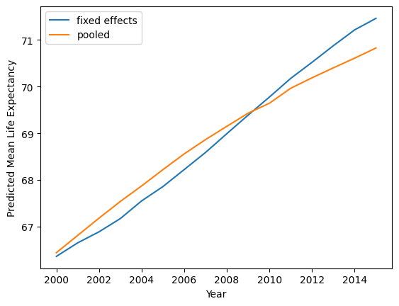
    


<br/> We observe that the pooled model seems to slightly overestimate the life expectancy for earlier years and underestimate the life expectancy for the latter years. We should note that the predicted mean **Life_expectancy** for the time fixed effects model per year is the observed mean **Life_expectancy** per year due to how linear regression fits the data. 

The second type of effects that could be considered in the model are effects corresponding to individual countries. These effects model unobservables that are specific to each country but constant over time. Again, from a technical standpoint, individual fixed effects can be simply modeled as factor variables corresponding to the variable **Country**.


```python
# individual & time fixed effects model

lm_itfe = smf.ols(formula='Life_expectancy ~  Alcohol_consumption + \
                    Hepatitis_B + Measles + BMI + Polio + Diphtheria + Incidents_HIV + GDP_log + \
                    Pop_log + Thinness_ten_nineteen_years + Thinness_five_nine_years + Schooling + \
                    Infant_deaths + Child_deaths + Year_factor + Country', data=life_expectancy_fe)
                    
                    
print(lm_itfe.fit(cov_type='cluster',cov_kwds = {'groups':life_expectancy_fe['Country']}).summary())
```

                                OLS Regression Results                            
    ==============================================================================
    Dep. Variable:        Life_expectancy   R-squared:                       0.994
    Model:                            OLS   Adj. R-squared:                  0.994
    Method:                 Least Squares   F-statistic:                     150.6
    Date:                Wed, 26 Nov 2025   Prob (F-statistic):          8.51e-110
    Time:                        20:04:17   Log-Likelihood:                -3157.5
    No. Observations:                2864   AIC:                             6731.
    Df Residuals:                    2656   BIC:                             7971.
    Df Model:                         207                                         
    Covariance Type:              cluster                                         
    =============================================================================================================
                                                    coef    std err          z      P>|z|      [0.025      0.975]
    -------------------------------------------------------------------------------------------------------------
    Intercept                                    84.0381      6.671     12.598      0.000      70.964      97.113
    Year_factor[T.2001]                           0.1156      0.042      2.781      0.005       0.034       0.197
    Year_factor[T.2002]                           0.1818      0.077      2.368      0.018       0.031       0.332
    Year_factor[T.2003]                           0.3007      0.109      2.767      0.006       0.088       0.514
    Year_factor[T.2004]                           0.5328      0.142      3.753      0.000       0.255       0.811
    Year_factor[T.2005]                           0.6585      0.170      3.874      0.000       0.325       0.992
    Year_factor[T.2006]                           0.8820      0.196      4.496      0.000       0.497       1.266
    Year_factor[T.2007]                           1.0971      0.220      4.990      0.000       0.666       1.528
    Year_factor[T.2008]                           1.3911      0.246      5.651      0.000       0.909       1.874
    Year_factor[T.2009]                           1.6749      0.270      6.205      0.000       1.146       2.204
    Year_factor[T.2010]                           1.9892      0.298      6.674      0.000       1.405       2.573
    Year_factor[T.2011]                           2.2515      0.322      6.998      0.000       1.621       2.882
    Year_factor[T.2012]                           2.5089      0.340      7.371      0.000       1.842       3.176
    Year_factor[T.2013]                           2.8027      0.367      7.643      0.000       2.084       3.521
    Year_factor[T.2014]                           3.1031      0.393      7.895      0.000       2.333       3.873
    Year_factor[T.2015]                           3.2899      0.414      7.954      0.000       2.479       4.101
    Country[T.Albania]                           11.8470      2.220      5.337      0.000       7.497      16.197
    Country[T.Algeria]                            9.4006      1.236      7.605      0.000       6.978      11.823
    Country[T.Angola]                            -2.9735      0.859     -3.461      0.001      -4.657      -1.290
    Country[T.Antigua and Barbuda]               10.1725      2.852      3.566      0.000       4.582      15.763
    Country[T.Argentina]                         10.4237      1.751      5.952      0.000       6.991      13.856
    Country[T.Armenia]                            9.6263      2.352      4.093      0.000       5.016      14.236
    Country[T.Australia]                         14.9887      2.184      6.864      0.000      10.709      19.269
    Country[T.Austria]                           12.6757      1.921      6.598      0.000       8.910      16.441
    Country[T.Azerbaijan]                         8.6630      1.902      4.553      0.000       4.934      12.392
    Country[T.Bahamas, The]                       8.9338      3.001      2.977      0.003       3.053      14.815
    Country[T.Bahrain]                            9.3085      2.442      3.812      0.000       4.522      14.095
    Country[T.Bangladesh]                         3.0256      1.544      1.960      0.050      -0.000       6.051
    Country[T.Barbados]                          14.8901      2.961      5.029      0.000       9.087      20.693
    Country[T.Belarus]                            5.3195      1.837      2.895      0.004       1.719       8.920
    Country[T.Belgium]                           12.7108      1.945      6.535      0.000       8.899      16.523
    Country[T.Belize]                            10.2335      3.253      3.146      0.002       3.859      16.608
    Country[T.Benin]                              0.3194      0.839      0.381      0.704      -1.325       1.964
    Country[T.Bhutan]                             3.1536      2.212      1.426      0.154      -1.181       7.489
    Country[T.Bolivia]                            5.1877      1.486      3.491      0.000       2.275       8.100
    Country[T.Bosnia and Herzegovina]             9.9594      1.950      5.107      0.000       6.137      13.782
    Country[T.Botswana]                           3.4059      2.631      1.295      0.195      -1.750       8.562
    Country[T.Brazil]                             7.4175      2.020      3.673      0.000       3.459      11.376
    Country[T.Brunei Darussalam]                  8.7834      2.779      3.160      0.002       3.336      14.231
    Country[T.Bulgaria]                           8.0862      1.842      4.389      0.000       4.475      11.697
    Country[T.Burkina Faso]                      -3.0732      1.215     -2.529      0.011      -5.455      -0.692
    Country[T.Burundi]                           -4.6587      1.117     -4.169      0.000      -6.849      -2.469
    Country[T.Cabo Verde]                         6.1982      2.466      2.514      0.012       1.366      11.031
    Country[T.Cambodia]                           0.2748      0.719      0.382      0.702      -1.135       1.685
    Country[T.Cameroon]                          -1.8072      0.689     -2.622      0.009      -3.158      -0.457
    Country[T.Canada]                            14.6250      2.174      6.727      0.000      10.364      18.886
    Country[T.Central African Republic]          -6.3202      1.292     -4.891      0.000      -8.853      -3.788
    Country[T.Chad]                              -5.5418      0.963     -5.754      0.000      -7.429      -3.654
    Country[T.Chile]                             13.6764      1.841      7.430      0.000      10.069      17.284
    Country[T.China]                              5.5764      3.303      1.688      0.091      -0.898      12.051
    Country[T.Colombia]                           9.8807      1.319      7.492      0.000       7.296      12.466
    Country[T.Comoros]                            1.8069      2.186      0.826      0.409      -2.478       6.092
    Country[T.Congo, Dem. Rep.]                  -2.7000      0.837     -3.226      0.001      -4.340      -1.060
    Country[T.Congo, Rep.]                       -2.4088      1.373     -1.754      0.079      -5.101       0.283
    Country[T.Costa Rica]                        13.8937      2.050      6.778      0.000       9.876      17.911
    Country[T.Cote d'Ivoire]                     -4.5590      0.659     -6.917      0.000      -5.851      -3.267
    Country[T.Croatia]                           10.5509      2.146      4.917      0.000       6.346      14.756
    Country[T.Cuba]                              11.5022      1.684      6.832      0.000       8.202      14.802
    Country[T.Cyprus]                            13.6322      2.683      5.080      0.000       8.373      18.892
    Country[T.Czechia]                           11.3273      2.034      5.569      0.000       7.341      15.314
    Country[T.Denmark]                           11.1993      2.206      5.077      0.000       6.876      15.523
    Country[T.Djibouti]                           0.9707      2.330      0.417      0.677      -3.597       5.538
    Country[T.Dominican Republic]                 8.9549      1.499      5.973      0.000       6.017      11.893
    Country[T.Ecuador]                           10.7358      1.525      7.039      0.000       7.746      13.725
    Country[T.Egypt, Arab Rep.]                   8.8016      1.825      4.823      0.000       5.224      12.379
    Country[T.El Salvador]                        7.9278      1.862      4.257      0.000       4.278      11.578
    Country[T.Equatorial Guinea]                  1.3847      2.188      0.633      0.527      -2.903       5.673
    Country[T.Eritrea]                           -4.3807      1.654     -2.649      0.008      -7.622      -1.139
    Country[T.Estonia]                            8.3183      2.622      3.173      0.002       3.180      13.457
    Country[T.Eswatini]                           4.3568      3.673      1.186      0.236      -2.842      11.556
    Country[T.Ethiopia]                          -3.0892      1.238     -2.496      0.013      -5.515      -0.664
    Country[T.Fiji]                               3.9476      2.812      1.404      0.160      -1.563       9.458
    Country[T.Finland]                           12.7735      2.183      5.850      0.000       8.494      17.053
    Country[T.France]                            12.8263      2.050      6.255      0.000       8.807      16.845
    Country[T.Gabon]                              0.9664      2.002      0.483      0.629      -2.958       4.891
    Country[T.Gambia, The]                       -1.2592      1.875     -0.672      0.502      -4.934       2.416
    Country[T.Georgia]                            8.2329      2.360      3.489      0.000       3.608      12.858
    Country[T.Germany]                           12.6053      2.395      5.262      0.000       7.911      17.300
    Country[T.Ghana]                             -1.0070      0.729     -1.381      0.167      -2.436       0.422
    Country[T.Greece]                            14.2329      1.932      7.369      0.000      10.447      18.019
    Country[T.Grenada]                            8.8872      2.891      3.074      0.002       3.220      14.554
    Country[T.Guatemala]                          8.1252      1.256      6.470      0.000       5.664      10.587
    Country[T.Guinea]                            -1.5659      0.706     -2.219      0.026      -2.949      -0.183
    Country[T.Guinea-Bissau]                     -1.0726      1.839     -0.583      0.560      -4.676       2.531
    Country[T.Guyana]                             5.5216      2.531      2.181      0.029       0.560      10.483
    Country[T.Haiti]                              1.9729      1.046      1.886      0.059      -0.077       4.023
    Country[T.Honduras]                           9.2856      1.528      6.076      0.000       6.290      12.281
    Country[T.Hungary]                            8.4658      1.939      4.367      0.000       4.666      12.265
    Country[T.Iceland]                           15.1156      2.842      5.318      0.000       9.544      20.687
    Country[T.India]                              0.5628      3.122      0.180      0.857      -5.555       6.681
    Country[T.Indonesia]                          1.8704      2.060      0.908      0.364      -2.166       5.907
    Country[T.Iran, Islamic Rep.]                 8.0150      1.617      4.958      0.000       4.846      11.184
    Country[T.Iraq]                               7.8778      1.605      4.908      0.000       4.732      11.024
    Country[T.Ireland]                           13.9240      2.353      5.917      0.000       9.312      18.536
    Country[T.Israel]                            15.1007      2.348      6.430      0.000      10.498      19.703
    Country[T.Italy]                             13.9575      1.995      6.995      0.000      10.046      17.868
    Country[T.Jamaica]                           11.0187      2.270      4.855      0.000       6.570      15.467
    Country[T.Japan]                             12.0327      2.526      4.764      0.000       7.082      16.984
    Country[T.Jordan]                            11.3854      2.347      4.850      0.000       6.785      15.986
    Country[T.Kazakhstan]                         3.8555      1.814      2.125      0.034       0.299       7.412
    Country[T.Kenya]                             -3.4169      0.836     -4.089      0.000      -5.055      -1.779
    Country[T.Kiribati]                           9.2245      3.458      2.667      0.008       2.447      16.002
    Country[T.Kuwait]                            10.8869      2.591      4.202      0.000       5.809      15.965
    Country[T.Kyrgyz Republic]                    6.7156      1.993      3.370      0.001       2.810      10.622
    Country[T.Lao PDR]                            1.0351      1.109      0.934      0.351      -1.138       3.208
    Country[T.Latvia]                             7.4011      2.462      3.007      0.003       2.576      12.226
    Country[T.Lebanon]                           13.1756      2.014      6.543      0.000       9.229      17.123
    Country[T.Lesotho]                            0.0837      3.048      0.027      0.978      -5.891       6.058
    Country[T.Liberia]                            4.0516      1.635      2.479      0.013       0.848       7.255
    Country[T.Libya]                              8.6073      2.043      4.214      0.000       4.604      12.611
    Country[T.Lithuania]                          7.4352      2.317      3.210      0.001       2.895      11.976
    Country[T.Luxembourg]                        13.1704      2.818      4.673      0.000       7.647      18.694
    Country[T.Madagascar]                        -0.7658      0.701     -1.092      0.275      -2.141       0.609
    Country[T.Malawi]                            -3.2018      1.061     -3.018      0.003      -5.281      -1.122
    Country[T.Malaysia]                           7.1217      1.537      4.634      0.000       4.110      10.134
    Country[T.Maldives]                           8.7341      2.410      3.625      0.000       4.011      13.457
    Country[T.Mali]                              -3.0028      0.859     -3.494      0.000      -4.687      -1.319
    Country[T.Malta]                             15.4486      2.878      5.367      0.000       9.807      21.090
    Country[T.Mauritania]                         3.9760      1.471      2.703      0.007       1.093       6.860
    Country[T.Mauritius]                          8.0773      2.311      3.495      0.000       3.548      12.607
    Country[T.Mexico]                            11.4008      1.992      5.724      0.000       7.497      15.304
    Country[T.Micronesia, Fed. Sts.]              6.9499      3.383      2.055      0.040       0.320      13.580
    Country[T.Moldova]                            6.2180      2.413      2.576      0.010       1.488      10.948
    Country[T.Mongolia]                           3.2464      2.133      1.522      0.128      -0.935       7.428
    Country[T.Montenegro]                         9.9283      2.807      3.537      0.000       4.426      15.430
    Country[T.Morocco]                            9.3410      0.983      9.498      0.000       7.413      11.269
    Country[T.Mozambique]                        -3.5975      0.549     -6.550      0.000      -4.674      -2.521
    Country[T.Myanmar]                            0.0604      0.625      0.097      0.923      -1.164       1.285
    Country[T.Namibia]                           -1.9404      2.134     -0.909      0.363      -6.123       2.242
    Country[T.Nepal]                              1.5968      0.515      3.101      0.002       0.588       2.606
    Country[T.Netherlands]                       12.6220      2.005      6.295      0.000       8.692      16.552
    Country[T.New Zealand]                       15.3338      2.433      6.303      0.000      10.565      20.102
    Country[T.Nicaragua]                          9.3644      1.862      5.029      0.000       5.715      13.014
    Country[T.Niger]                             -2.2762      1.611     -1.413      0.158      -5.434       0.881
    Country[T.Nigeria]                           -6.0473      1.915     -3.158      0.002      -9.800      -2.294
    Country[T.North Macedonia]                    9.9298      2.359      4.209      0.000       5.306      14.554
    Country[T.Norway]                            13.8306      2.424      5.706      0.000       9.080      18.581
    Country[T.Oman]                               9.2025      2.130      4.320      0.000       5.028      13.377
    Country[T.Pakistan]                           4.4368      1.624      2.733      0.006       1.255       7.619
    Country[T.Panama]                            12.8118      2.129      6.018      0.000       8.639      16.984
    Country[T.Papua New Guinea]                   0.6615      1.307      0.506      0.613      -1.900       3.223
    Country[T.Paraguay]                           8.6686      1.679      5.164      0.000       5.378      11.959
    Country[T.Peru]                               9.1767      1.366      6.717      0.000       6.499      11.854
    Country[T.Philippines]                        2.8933      1.462      1.978      0.048       0.027       5.760
    Country[T.Poland]                             9.5656      1.787      5.354      0.000       6.064      13.068
    Country[T.Portugal]                          12.1810      1.624      7.500      0.000       8.998      15.364
    Country[T.Qatar]                             14.8184      2.842      5.213      0.000       9.247      20.390
    Country[T.Romania]                            7.7015      1.570      4.905      0.000       4.624      10.779
    Country[T.Russian Federation]                 2.0763      2.105      0.987      0.324      -2.049       6.201
    Country[T.Rwanda]                            -1.1217      1.064     -1.054      0.292      -3.208       0.965
    Country[T.Samoa]                             12.7134      3.832      3.318      0.001       5.204      20.223
    Country[T.Sao Tome and Principe]              3.7285      2.648      1.408      0.159      -1.462       8.919
    Country[T.Saudi Arabia]                       9.8920      2.029      4.875      0.000       5.915      13.869
    Country[T.Senegal]                            0.4351      0.728      0.598      0.550      -0.991       1.861
    Country[T.Serbia]                             8.1784      1.826      4.479      0.000       4.599      11.757
    Country[T.Seychelles]                        11.0924      3.008      3.687      0.000       5.196      16.989
    Country[T.Sierra Leone]                      -5.2547      1.086     -4.840      0.000      -7.383      -3.127
    Country[T.Singapore]                         11.4833      2.093      5.486      0.000       7.381      15.586
    Country[T.Slovak Republic]                    9.0227      2.067      4.366      0.000       4.972      13.073
    Country[T.Slovenia]                          12.3824      2.457      5.040      0.000       7.567      17.197
    Country[T.Solomon Islands]                    6.8333      2.628      2.600      0.009       1.682      11.984
    Country[T.Somalia]                           -0.5992      0.878     -0.683      0.495      -2.319       1.121
    Country[T.South Africa]                       4.7036      2.128      2.210      0.027       0.532       8.875
    Country[T.Spain]                             14.4160      1.833      7.864      0.000      10.823      18.009
    Country[T.Sri Lanka]                          6.4107      1.364      4.700      0.000       3.737       9.084
    Country[T.St. Lucia]                         12.9550      3.141      4.124      0.000       6.799      19.111
    Country[T.St. Vincent and the Grenadines]     8.2949      2.939      2.822      0.005       2.534      14.056
    Country[T.Suriname]                           6.4573      2.587      2.496      0.013       1.388      11.527
    Country[T.Sweden]                            13.8668      2.136      6.493      0.000       9.681      18.053
    Country[T.Switzerland]                       13.8464      2.212      6.261      0.000       9.512      18.181
    Country[T.Syrian Arab Republic]              10.9260      1.596      6.848      0.000       7.799      14.053
    Country[T.Tajikistan]                         6.0901      1.837      3.315      0.001       2.490       9.690
    Country[T.Tanzania]                          -2.4725      0.716     -3.455      0.001      -3.875      -1.070
    Country[T.Thailand]                           6.0074      1.327      4.529      0.000       3.407       8.607
    Country[T.Timor-Leste]                        1.8606      2.029      0.917      0.359      -2.117       5.838
    Country[T.Togo]                              -2.1646      1.165     -1.857      0.063      -4.449       0.120
    Country[T.Tonga]                             11.5889      4.044      2.866      0.004       3.664      19.514
    Country[T.Trinidad and Tobago]                8.3469      2.603      3.207      0.001       3.245      13.448
    Country[T.Tunisia]                           10.2660      1.478      6.947      0.000       7.370      13.163
    Country[T.Turkiye]                            9.8296      1.763      5.576      0.000       6.375      13.285
    Country[T.Turkmenistan]                       4.4168      1.983      2.228      0.026       0.531       8.303
    Country[T.Uganda]                            -4.2616      0.809     -5.265      0.000      -5.848      -2.675
    Country[T.Ukraine]                            5.0733      1.551      3.270      0.001       2.033       8.114
    Country[T.United Arab Emirates]              11.3877      2.350      4.846      0.000       6.782      15.994
    Country[T.United Kingdom]                    13.4258      2.332      5.758      0.000       8.856      17.996
    Country[T.United States]                     12.8064      3.193      4.011      0.000       6.548      19.065
    Country[T.Uruguay]                           11.7470      2.140      5.488      0.000       7.552      15.942
    Country[T.Uzbekistan]                         6.4513      1.467      4.399      0.000       3.577       9.326
    Country[T.Vanuatu]                            6.2566      2.826      2.214      0.027       0.717      11.796
    Country[T.Venezuela, RB]                      8.9792      1.533      5.857      0.000       5.975      11.984
    Country[T.Vietnam]                            5.4226      1.473      3.681      0.000       2.535       8.310
    Country[T.Yemen, Rep.]                        1.9120      0.719      2.658      0.008       0.502       3.322
    Country[T.Zambia]                            -3.1869      1.177     -2.708      0.007      -5.494      -0.880
    Country[T.Zimbabwe]                          -5.5779      1.432     -3.894      0.000      -8.386      -2.770
    Alcohol_consumption                          -0.0101      0.055     -0.183      0.855      -0.118       0.098
    Hepatitis_B                                   0.0013      0.004      0.288      0.773      -0.007       0.010
    Measles                                      -0.0063      0.006     -1.137      0.256      -0.017       0.005
    BMI                                          -0.9489      0.265     -3.579      0.000      -1.469      -0.429
    Polio                                         0.0012      0.008      0.150      0.881      -0.015       0.017
    Diphtheria                                    0.0125      0.009      1.350      0.177      -0.006       0.031
    Incidents_HIV                                -0.8235      0.160     -5.163      0.000      -1.136      -0.511
    GDP_log                                       0.4896      0.393      1.247      0.212      -0.280       1.259
    Pop_log                                       0.2558      0.775      0.330      0.741      -1.263       1.774
    Thinness_ten_nineteen_years                   0.0004      0.012      0.035      0.972      -0.024       0.025
    Thinness_five_nine_years                      0.0004      0.013      0.030      0.976      -0.025       0.026
    Schooling                                    -0.0209      0.119     -0.176      0.860      -0.253       0.212
    Infant_deaths                                -0.1052      0.023     -4.561      0.000      -0.150      -0.060
    Child_deaths                                 -0.0507      0.032     -1.585      0.113      -0.113       0.012
    ==============================================================================
    Omnibus:                      923.142   Durbin-Watson:                   2.003
    Prob(Omnibus):                  0.000   Jarque-Bera (JB):            19997.486
    Skew:                           1.002   Prob(JB):                         0.00
    Kurtosis:                      15.789   Cond. No.                     1.05e+05
    ==============================================================================
    
    Notes:
    [1] Standard Errors are robust to cluster correlation (cluster)
    [2] The condition number is large, 1.05e+05. This might indicate that there are
    strong multicollinearity or other numerical problems.
    

    C:\Users\elini\Documents\pythonenv\ninecircles1\Lib\site-packages\statsmodels\base\model.py:1894: ValueWarning: covariance of constraints does not have full rank. The number of constraints is 207, but rank is 29
      warnings.warn('covariance of constraints does not have full '
    

<br/> There are several observations to make. First, effects of covariates that do not change in time for countries (**Economy_status** and **Region**) are no longer estimable; they are a part of the individual fixed effects. Second, we got a warning about the computation of the covariance matrix. I recomputed the cluster-robust standard errors in R using the *clubSandwich* package (CR2 errors with the Satterthwaite DOF correction for P-value computation) and I obtained a very similar result, with no warnings. Hence, the results should be fine. We should note that we could again use a pairs cluster bootstrap rather than computing cluster-robust standard errors. Third, after all adjustments, only **Incidents_HIV**, **BMI**, and **Infant_deaths** remain significant.

The fixed effects model is the most robust. We addressed heteroscedasticity and within-cluster correlations. We also reduced the omitted variable bias to effects that vary both in time and countries (we cannot fit these fixed effects since this would lead to a full model with no free degrees of freedom). The disadvantage is that some effects are no longer estimable, and we used many degrees of freedom to estimate the fixed effects; consequently, we lost a lot of power to assess the significance of the effects of interest. 

Consequently, we will consider an alternative model; a *random effects* model. In a random effects model, individual effects are assumed to be normal random variables with a constant mean and variance. Now, the key assumption of the random effects model is that these individual effects are *not* correlated with other covariates; i.e., the random effects model does not help account for unobserved heterogeneity that is correlated with the predictors in the model. Still, the random effects model might be more  *efficient*.

The pooled model is an ordinary linear regression model; thus, to be efficient, the errors need to be independent. By introducing random effects, a correlation structure arises between observations for the same individual. This structure is equicorrelated, i.e., the correlation of the composite error (random effect + error) between two distinct observations for the same individual is constant. This may not be as realistic in particular for a long time series (we expect the correlation between observations to reduce over time). However, it is still more realistic than the assumption of the pooled model that this correlation is always zero. So overall, the random effects model should provide more accurate estimates than the pooled model, provided that the exogeneity assumption (individual effects are uncorrelated with the rest of the predictors) holds [[2](#2)].


```python
# random effects model

lm_tre = smf.mixedlm(formula='Life_expectancy ~ Economy_status + Region + Alcohol_consumption + \
                    Hepatitis_B + Measles + BMI + Polio + Diphtheria + Incidents_HIV + GDP_log + \
                    Pop_log + Thinness_ten_nineteen_years + Thinness_five_nine_years + Schooling + \
                    Infant_deaths + Child_deaths + Year_factor', groups=life_expectancy_fe['Country'], \
                    data=life_expectancy_fe)

print(lm_tre.fit().summary())
```

                           Mixed Linear Model Regression Results
    ===================================================================================
    Model:                    MixedLM        Dependent Variable:        Life_expectancy
    No. Observations:         2864           Method:                    REML           
    No. Groups:               179            Scale:                     0.5787         
    Min. group size:          16             Log-Likelihood:            -3819.8226     
    Max. group size:          16             Converged:                 Yes            
    Mean group size:          16.0                                                     
    -----------------------------------------------------------------------------------
                                            Coef.  Std.Err.    z    P>|z| [0.025 0.975]
    -----------------------------------------------------------------------------------
    Intercept                               79.911    2.749  29.066 0.000 74.522 85.299
    Economy_status[T.Developing]            -5.836    1.142  -5.112 0.000 -8.074 -3.599
    Region[T.Asia]                           4.237    0.728   5.817 0.000  2.810  5.665
    Region[T.Central America and Caribbean]  7.219    0.864   8.358 0.000  5.526  8.911
    Region[T.European Union]                 3.336    1.334   2.501 0.012  0.722  5.951
    Region[T.Middle East]                    7.376    0.981   7.520 0.000  5.454  9.299
    Region[T.North America]                  6.747    1.957   3.447 0.001  2.910 10.583
    Region[T.Oceania]                        4.373    1.082   4.040 0.000  2.252  6.495
    Region[T.Rest of Europe]                 5.717    0.976   5.858 0.000  3.804  7.630
    Region[T.South America]                  7.174    0.997   7.194 0.000  5.220  9.129
    Year_factor[T.2001]                      0.069    0.081   0.850 0.395 -0.090  0.228
    Year_factor[T.2002]                      0.089    0.083   1.082 0.279 -0.073  0.251
    Year_factor[T.2003]                      0.160    0.085   1.881 0.060 -0.007  0.328
    Year_factor[T.2004]                      0.339    0.089   3.799 0.000  0.164  0.514
    Year_factor[T.2005]                      0.419    0.094   4.474 0.000  0.236  0.603
    Year_factor[T.2006]                      0.592    0.099   5.966 0.000  0.397  0.786
    Year_factor[T.2007]                      0.761    0.105   7.268 0.000  0.556  0.967
    Year_factor[T.2008]                      1.009    0.111   9.101 0.000  0.792  1.227
    Year_factor[T.2009]                      1.253    0.117  10.726 0.000  1.024  1.482
    Year_factor[T.2010]                      1.527    0.123  12.440 0.000  1.287  1.768
    Year_factor[T.2011]                      1.744    0.130  13.461 0.000  1.490  1.998
    Year_factor[T.2012]                      1.963    0.136  14.442 0.000  1.696  2.229
    Year_factor[T.2013]                      2.215    0.143  15.517 0.000  1.936  2.495
    Year_factor[T.2014]                      2.474    0.150  16.504 0.000  2.180  2.767
    Year_factor[T.2015]                      2.618    0.156  16.749 0.000  2.312  2.925
    Alcohol_consumption                     -0.035    0.019  -1.866 0.062 -0.072  0.002
    Hepatitis_B                              0.001    0.002   0.687 0.492 -0.003  0.006
    Measles                                 -0.005    0.002  -2.526 0.012 -0.010 -0.001
    BMI                                     -0.558    0.088  -6.309 0.000 -0.732 -0.385
    Polio                                    0.003    0.004   0.609 0.543 -0.006  0.011
    Diphtheria                               0.011    0.004   2.562 0.010  0.003  0.019
    Incidents_HIV                           -0.824    0.029 -28.405 0.000 -0.881 -0.767
    GDP_log                                  0.741    0.118   6.295 0.000  0.510  0.971
    Pop_log                                 -0.063    0.150  -0.423 0.672 -0.357  0.230
    Thinness_ten_nineteen_years             -0.000    0.011  -0.028 0.978 -0.022  0.022
    Thinness_five_nine_years                -0.001    0.011  -0.063 0.949 -0.023  0.021
    Schooling                                0.063    0.042   1.494 0.135 -0.020  0.146
    Infant_deaths                           -0.105    0.006 -18.410 0.000 -0.116 -0.094
    Child_deaths                            -0.056    0.006  -9.431 0.000 -0.067 -0.044
    Group Var                                8.461    1.431                            
    ===================================================================================
    
    

<br/> The variable *Group Var* is the estimate of the variance of individual random effects. The *scale* is the remaining *idiosyncratic* error. Predictions of random effect for particular countries are as follows.


```python
pd.DataFrame(lm_tre.fit().random_effects)
```


<div>
<style scoped>
    .dataframe tbody tr th:only-of-type {
        vertical-align: middle;
    }

    .dataframe tbody tr th {
        vertical-align: top;
    }

    .dataframe thead th {
        text-align: right;
    }
</style>
<table border="1" class="dataframe">
  <thead>
    <tr style="text-align: right;">
      <th></th>
      <th>Afghanistan</th>
      <th>Albania</th>
      <th>Algeria</th>
      <th>Angola</th>
      <th>Antigua and Barbuda</th>
      <th>Argentina</th>
      <th>Armenia</th>
      <th>Australia</th>
      <th>Austria</th>
      <th>Azerbaijan</th>
      <th>...</th>
      <th>United Kingdom</th>
      <th>United States</th>
      <th>Uruguay</th>
      <th>Uzbekistan</th>
      <th>Vanuatu</th>
      <th>Venezuela, RB</th>
      <th>Vietnam</th>
      <th>Yemen, Rep.</th>
      <th>Zambia</th>
      <th>Zimbabwe</th>
    </tr>
  </thead>
  <tbody>
    <tr>
      <th>Group</th>
      <td>-3.24073</td>
      <td>4.003245</td>
      <td>8.389968</td>
      <td>-2.469908</td>
      <td>0.155538</td>
      <td>1.223176</td>
      <td>1.626029</td>
      <td>2.040788</td>
      <td>1.302929</td>
      <td>2.251114</td>
      <td>...</td>
      <td>-0.507713</td>
      <td>-2.361985</td>
      <td>2.014463</td>
      <td>0.792001</td>
      <td>-0.385986</td>
      <td>-0.010181</td>
      <td>2.362288</td>
      <td>-5.265548</td>
      <td>-2.688791</td>
      <td>-5.827661</td>
    </tr>
  </tbody>
</table>
<p>1 rows × 179 columns</p>
</div>


```python
sm.qqplot((pd.DataFrame(lm_tre.fit().random_effects)).iloc[0,:], line='s');
```


    
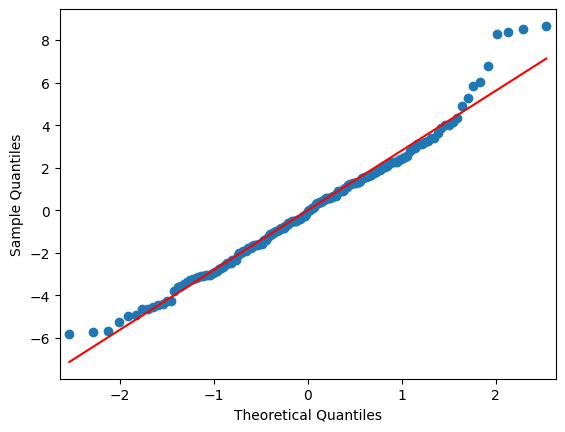
    


<br/> We observe that the random effects are approximately normal as assumed. However, the random effects model is consistent only under the exogeneity assumption (individual random effects are uncorrelated with the rest of the predictors). We can test the consistency of the random effects model as follows. First, we create a dataframe with cluster means of the time-varying predictors.


```python
alcohol_cent = life_expectancy[['Alcohol_consumption','Country']].groupby('Country').mean().rename(columns={'Alcohol_consumption': 'Alcohol_consumption_cent'})
hepatitis_cent = life_expectancy[['Hepatitis_B','Country']].groupby('Country').mean().rename(columns={'Hepatitis_B': 'Hepatitis_B_cent'})
measles_cent = life_expectancy[['Measles','Country']].groupby('Country').mean().rename(columns={'Measles': 'Measles_cent'})
bmi_cent = life_expectancy[['BMI','Country']].groupby('Country').mean().rename(columns={'BMI': 'BMI_cent'})
polio_cent = life_expectancy[['Polio','Country']].groupby('Country').mean().rename(columns={'Polio': 'Polio_cent'})
diphteria_cent = life_expectancy[['Diphtheria','Country']].groupby('Country').mean().rename(columns={'Diphtheria': 'Diphtheria_cent'})
hiv_cent = life_expectancy[['Incidents_HIV','Country']].groupby('Country').mean().rename(columns={'Incidents_HIV': 'Incidents_HIV_cent'})
gdp_log_cent = life_expectancy[['GDP_log','Country']].groupby('Country').mean().rename(columns={'GDP_log': 'GDP_log_cent'})
pop_log_cent = life_expectancy[['Pop_log','Country']].groupby('Country').mean().rename(columns={'Pop_log': 'Pop_log_cent'})
thinness19_cent = life_expectancy[['Thinness_ten_nineteen_years','Country']].groupby('Country').mean().rename(columns={'Thinness_ten_nineteen_years': 'Thinness_ten_nineteen_years_cent'})
thinness9_cent = life_expectancy[['Thinness_five_nine_years','Country']].groupby('Country').mean().rename(columns={'Thinness_five_nine_years': 'Thinness_five_nine_years_cent'})
schooling_cent = life_expectancy[['Schooling','Country']].groupby('Country').mean().rename(columns={'Schooling': 'Schooling_cent'})
infant_d_cent = life_expectancy[['Infant_deaths','Country']].groupby('Country').mean().rename(columns={'Infant_deaths': 'Infant_deaths_cent'})
child_d_cent = life_expectancy[['Child_deaths','Country']].groupby('Country').mean().rename(columns={'Child_deaths': 'Child_deaths_cent'})

life_expectancy_cent = life_expectancy_fe.merge(alcohol_cent,on = 'Country').merge(hepatitis_cent,on = 'Country').merge(measles_cent,on = 'Country').merge(bmi_cent,on = 'Country')\
.merge(polio_cent,on = 'Country').merge(diphteria_cent,on = 'Country').merge(hiv_cent,on = 'Country').merge(gdp_log_cent,on = 'Country')\
.merge(pop_log_cent,on = 'Country').merge(thinness19_cent,on = 'Country').merge(thinness9_cent,on = 'Country').merge(schooling_cent,on = 'Country')\
.merge(infant_d_cent,on = 'Country').merge(child_d_cent,on = 'Country');
```

<br/> Then, we fit a new random effects model with cluster means as additional predictors. Provided that the exogeneity assumption holds, these additional predictors hould be insignificant in the model [[6](#6)].


```python
lm_cr = smf.mixedlm(formula='Life_expectancy ~ Economy_status + Region + Alcohol_consumption + \
                    Hepatitis_B + Measles + BMI + Polio + Diphtheria + Incidents_HIV + GDP_log + \
                    Pop_log + Thinness_ten_nineteen_years + Thinness_five_nine_years + Schooling + \
                    Infant_deaths + Child_deaths + Year_factor + Alcohol_consumption_cent + \
                    Hepatitis_B_cent + Measles_cent + BMI_cent + Polio_cent + Diphtheria_cent + \
                    Incidents_HIV_cent + GDP_log_cent + Pop_log_cent + Thinness_ten_nineteen_years_cent + \
                    Thinness_five_nine_years_cent + Schooling_cent + Infant_deaths_cent + Child_deaths_cent', \
                    groups=life_expectancy_cent['Country'], \
                    data=life_expectancy_cent)

print(lm_cr.fit().summary())    
```

                           Mixed Linear Model Regression Results
    ===================================================================================
    Model:                    MixedLM        Dependent Variable:        Life_expectancy
    No. Observations:         2864           Method:                    REML           
    No. Groups:               179            Scale:                     0.5726         
    Min. group size:          16             Log-Likelihood:            -3768.6970     
    Max. group size:          16             Converged:                 Yes            
    Mean group size:          16.0                                                     
    -----------------------------------------------------------------------------------
                                            Coef.  Std.Err.    z    P>|z| [0.025 0.975]
    -----------------------------------------------------------------------------------
    Intercept                               68.489    5.127  13.358 0.000 58.440 78.538
    Economy_status[T.Developing]            -4.737    1.003  -4.722 0.000 -6.703 -2.771
    Region[T.Asia]                           1.123    0.734   1.529 0.126 -0.316  2.562
    Region[T.Central America and Caribbean]  2.111    0.794   2.660 0.008  0.556  3.666
    Region[T.European Union]                -1.021    1.165  -0.876 0.381 -3.305  1.263
    Region[T.Middle East]                    0.109    0.894   0.121 0.903 -1.644  1.861
    Region[T.North America]                 -0.032    1.576  -0.020 0.984 -3.121  3.058
    Region[T.Oceania]                       -0.943    0.978  -0.965 0.335 -2.860  0.973
    Region[T.Rest of Europe]                 1.000    0.942   1.062 0.288 -0.847  2.847
    Region[T.South America]                  1.790    0.904   1.979 0.048  0.017  3.563
    Year_factor[T.2001]                      0.116    0.081   1.433 0.152 -0.042  0.274
    Year_factor[T.2002]                      0.182    0.083   2.201 0.028  0.020  0.344
    Year_factor[T.2003]                      0.301    0.086   3.509 0.000  0.133  0.469
    Year_factor[T.2004]                      0.533    0.090   5.896 0.000  0.356  0.710
    Year_factor[T.2005]                      0.659    0.096   6.895 0.000  0.471  0.846
    Year_factor[T.2006]                      0.882    0.102   8.653 0.000  0.682  1.082
    Year_factor[T.2007]                      1.097    0.108  10.114 0.000  0.884  1.310
    Year_factor[T.2008]                      1.391    0.116  12.033 0.000  1.164  1.618
    Year_factor[T.2009]                      1.675    0.122  13.698 0.000  1.435  1.915
    Year_factor[T.2010]                      1.989    0.129  15.394 0.000  1.736  2.242
    Year_factor[T.2011]                      2.251    0.137  16.434 0.000  1.983  2.520
    Year_factor[T.2012]                      2.509    0.144  17.389 0.000  2.226  2.792
    Year_factor[T.2013]                      2.803    0.152  18.425 0.000  2.505  3.101
    Year_factor[T.2014]                      3.103    0.160  19.367 0.000  2.789  3.417
    Year_factor[T.2015]                      3.290    0.167  19.656 0.000  2.962  3.618
    Alcohol_consumption                     -0.010    0.019  -0.533 0.594 -0.047  0.027
    Hepatitis_B                              0.001    0.002   0.601 0.548 -0.003  0.006
    Measles                                 -0.006    0.002  -2.945 0.003 -0.010 -0.002
    BMI                                     -0.949    0.098  -9.693 0.000 -1.141 -0.757
    Polio                                    0.001    0.004   0.282 0.778 -0.007  0.010
    Diphtheria                               0.012    0.004   2.910 0.004  0.004  0.021
    Incidents_HIV                           -0.824    0.030 -27.374 0.000 -0.882 -0.765
    GDP_log                                  0.490    0.127   3.843 0.000  0.240  0.739
    Pop_log                                  0.256    0.281   0.910 0.363 -0.295  0.807
    Thinness_ten_nineteen_years              0.000    0.011   0.039 0.969 -0.022  0.022
    Thinness_five_nine_years                 0.000    0.011   0.035 0.972 -0.021  0.022
    Schooling                               -0.021    0.045  -0.468 0.640 -0.108  0.067
    Infant_deaths                           -0.105    0.006 -17.750 0.000 -0.117 -0.094
    Child_deaths                            -0.051    0.006  -8.299 0.000 -0.063 -0.039
    Alcohol_consumption_cent                -0.189    0.080  -2.345 0.019 -0.346 -0.031
    Hepatitis_B_cent                        -0.022    0.024  -0.895 0.371 -0.069  0.026
    Measles_cent                             0.010    0.013   0.766 0.443 -0.016  0.035
    BMI_cent                                 0.958    0.178   5.392 0.000  0.610  1.306
    Polio_cent                               0.044    0.059   0.750 0.453 -0.071  0.159
    Diphtheria_cent                         -0.039    0.060  -0.647 0.518 -0.156  0.079
    Incidents_HIV_cent                      -0.091    0.091  -1.000 0.317 -0.269  0.087
    GDP_log_cent                             0.949    0.289   3.277 0.001  0.381  1.516
    Pop_log_cent                            -0.092    0.312  -0.297 0.767 -0.704  0.519
    Thinness_ten_nineteen_years_cent        -0.092    0.243  -0.379 0.705 -0.568  0.384
    Thinness_five_nine_years_cent            0.068    0.243   0.279 0.780 -0.409  0.545
    Schooling_cent                          -0.277    0.131  -2.116 0.034 -0.534 -0.020
    Infant_deaths_cent                      -0.060    0.023  -2.650 0.008 -0.104 -0.016
    Child_deaths_cent                       -0.060    0.029  -2.049 0.041 -0.117 -0.003
    Group Var                                4.328    0.674                            
    ===================================================================================
    
    

<br/> We will test the significane via a Wald test. 


```python
hypothesis_cent = '(Alcohol_consumption_cent = 0,Hepatitis_B_cent = 0, Measles_cent = 0,\
BMI_cent = 0, Polio_cent = 0, Diphtheria_cent = 0, Incidents_HIV_cent = 0,\
GDP_log_cent = 0, Pop_log_cent = 0, Thinness_ten_nineteen_years_cent = 0, Thinness_five_nine_years_cent = 0,\
Schooling_cent = 0, Infant_deaths_cent = 0, Child_deaths_cent = 0)' 
    
lm_cr.fit().wald_test(hypothesis_cent, scalar = True)
```


    <class 'statsmodels.stats.contrast.ContrastResults'>
    <Wald test (chi2): statistic=188.797228910405, p-value=1.0564731311583879e-32, df_denom=14>


<br/> We observe that the cluster means are strongly significant, and thus, the random effects model should not be used. We should note that a simple Wald test (in the context of mixed effects models) is not generally recommended. We should use other tests (e.g., the likelihood ratio test or the Wald test with DOF corrections [[7](#7)]), but since we have almost 200 clusters and a simple random effects structure, the Wald test should perform just fine.

The last model we fitted to test the consistency of the random effects model is called *correlated random effects (CRE) model* . As we have observed, the CRE model is an extension of the random effects model that attempts to address unobserved endogeneity via cluster-mean predictors. A nice property of the CRE model is that estimates of the time-varying predictors are *identical* to the fixed-effects estimates. Hence, the CRE model provides a useful alternative to the fixed effects model that keeps the time-invariant predictors in the model [[6](#6), [8](#8)]. 

The CRE model will be our model of choice for modelling the dataset. As the last step of this section, let us evaluate the confidence intervals for our predictors of interest. As we have mentioned, the Wald standard errors provided by *mixedlm* are not ideal; hence, let us perform another cluster pairs bootstrap to obtain more accurate confidence intervals (you can check my R solution, First Circle, Part Two, for a bunch more options).


```python
# pairs cluster bootstrap

np.random.seed(123)
nb = 1000
boot_coef3 = pd.DataFrame(index=range(nb),columns=list(lm_cr.fit().params.index))

np.zeros([nb,len(lm_cr.fit().params)])

countries = life_expectancy_cent['Country'].unique()

for i in range(nb):
    rand_ind_country = np.random.choice(range(len(countries)), size=len(life_expectancy_cent), replace=True)
    rand_ind = []
    for j in range(len(countries)):
        rand_ind.append(np.nonzero(life_expectancy_cent['Country'] == countries[rand_ind_country[j]]))
    rand_ind = np.concatenate(rand_ind, axis=1)[0]

    life_expectancy_cent_new = pd.DataFrame(life_expectancy_cent.loc[x] for x in rand_ind)
    lm_cr_new = smf.mixedlm(formula='Life_expectancy ~ Economy_status + Region + Alcohol_consumption + \
                    Hepatitis_B + Measles + BMI + Polio + Diphtheria + Incidents_HIV + GDP_log + \
                    Pop_log + Thinness_ten_nineteen_years + Thinness_five_nine_years + Schooling + \
                    Infant_deaths + Child_deaths + Year_factor + Alcohol_consumption_cent + \
                    Hepatitis_B_cent + Measles_cent + BMI_cent + Polio_cent + Diphtheria_cent + \
                    Incidents_HIV_cent + GDP_log_cent + Pop_log_cent + Thinness_ten_nineteen_years_cent + \
                    Thinness_five_nine_years_cent + Schooling_cent + Infant_deaths_cent + Child_deaths_cent', \
                    groups=life_expectancy_cent_new['Country'], \
                    data=life_expectancy_cent_new)                   
    boot_coef3.loc[i,lm_cr_new.fit().params.to_frame().index] = lm_cr_new.fit().params

pd.DataFrame(boot_coef3, columns=list(lm_pooled.fit().params.index)).quantile([0.025,0.975],0).T
```


<div>
<style scoped>
    .dataframe tbody tr th:only-of-type {
        vertical-align: middle;
    }

    .dataframe tbody tr th {
        vertical-align: top;
    }

    .dataframe thead th {
        text-align: right;
    }
</style>
<table border="1" class="dataframe">
  <thead>
    <tr style="text-align: right;">
      <th></th>
      <th>0.025</th>
      <th>0.975</th>
    </tr>
  </thead>
  <tbody>
    <tr>
      <th>Intercept</th>
      <td>-533.892089</td>
      <td>-310.787167</td>
    </tr>
    <tr>
      <th>Economy_status[T.Developing]</th>
      <td>-6.534925</td>
      <td>-3.092763</td>
    </tr>
    <tr>
      <th>Region[T.Asia]</th>
      <td>-0.44914</td>
      <td>2.321589</td>
    </tr>
    <tr>
      <th>Region[T.Central America and Caribbean]</th>
      <td>0.704402</td>
      <td>3.429393</td>
    </tr>
    <tr>
      <th>Region[T.European Union]</th>
      <td>-3.299432</td>
      <td>0.765616</td>
    </tr>
    <tr>
      <th>Region[T.Middle East]</th>
      <td>-1.328602</td>
      <td>1.545519</td>
    </tr>
    <tr>
      <th>Region[T.North America]</th>
      <td>-3.705681</td>
      <td>2.635035</td>
    </tr>
    <tr>
      <th>Region[T.Oceania]</th>
      <td>-3.32199</td>
      <td>1.025621</td>
    </tr>
    <tr>
      <th>Region[T.Rest of Europe]</th>
      <td>-0.965183</td>
      <td>2.639528</td>
    </tr>
    <tr>
      <th>Region[T.South America]</th>
      <td>0.311063</td>
      <td>3.080674</td>
    </tr>
    <tr>
      <th>Alcohol_consumption</th>
      <td>-0.128443</td>
      <td>0.084811</td>
    </tr>
    <tr>
      <th>Hepatitis_B</th>
      <td>-0.007162</td>
      <td>0.010339</td>
    </tr>
    <tr>
      <th>Measles</th>
      <td>-0.015912</td>
      <td>0.004488</td>
    </tr>
    <tr>
      <th>BMI</th>
      <td>-1.50744</td>
      <td>-0.514019</td>
    </tr>
    <tr>
      <th>Polio</th>
      <td>-0.016024</td>
      <td>0.014415</td>
    </tr>
    <tr>
      <th>Diphtheria</th>
      <td>-0.005787</td>
      <td>0.027994</td>
    </tr>
    <tr>
      <th>Incidents_HIV</th>
      <td>-1.144453</td>
      <td>-0.397698</td>
    </tr>
    <tr>
      <th>GDP_log</th>
      <td>-0.216883</td>
      <td>1.2567</td>
    </tr>
    <tr>
      <th>Pop_log</th>
      <td>-1.315351</td>
      <td>1.912508</td>
    </tr>
    <tr>
      <th>Thinness_ten_nineteen_years</th>
      <td>-0.027577</td>
      <td>0.03285</td>
    </tr>
    <tr>
      <th>Thinness_five_nine_years</th>
      <td>-0.040204</td>
      <td>0.02107</td>
    </tr>
    <tr>
      <th>Schooling</th>
      <td>-0.275055</td>
      <td>0.159053</td>
    </tr>
    <tr>
      <th>Infant_deaths</th>
      <td>-0.139288</td>
      <td>-0.038152</td>
    </tr>
    <tr>
      <th>Child_deaths</th>
      <td>-0.148488</td>
      <td>-0.000989</td>
    </tr>
  </tbody>
</table>
</div>


<br/> We observe that the results are similar to the fixed effects model. **Economy_status**,**Incidents_HIV**, **BMI**, **Infant_deaths**, and **Child_deaths** seem to be significant. We should note that the significance of **Economy_status** could not be determined in the fixed effects model. Let us check the model.


```python
# residuals
sm.qqplot(lm_cr.fit().resid, line='s');
plt.title('Residuals Q-Q plot')
```


    Text(0.5, 1.0, 'Residuals Q-Q plot')


    

    


```python
plt.hist(lm_cr.fit().resid, bins=100);
plt.title('Histogram')
plt.xlabel('Residuals')
plt.ylabel('Frequency')
```


    Text(0, 0.5, 'Frequency')


    
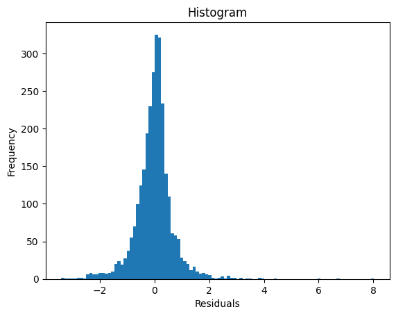
    


```python
# random effects
sm.qqplot((pd.DataFrame(lm_cr.fit().random_effects)).iloc[0,:], line='s');
plt.title('Random effects Q-Q plot')
```


    Text(0.5, 1.0, 'Random effects Q-Q plot')


    

    


<br/> Let us also check plots of residuals against the fitted values and the predictors.


```python
plt.scatter(lm_cr.fit().fittedvalues, lm_cr.fit().resid)
plt.title('Residuals vs Predicted')
plt.xlabel('Predicted Values')
plt.ylabel('Residuals');
```


    

    


```python
fig, axs = plt.subplots(1,3)
axs[0].scatter(life_expectancy['Alcohol_consumption'], lm_cr.fit().resid)
axs[0].set_xlabel('Alcohol_consumption')
axs[0].set_ylabel('Residuals')
axs[1].scatter(life_expectancy['Hepatitis_B'], lm_cr.fit().resid)
axs[1].set_xlabel('Hepatitis_B')
axs[2].scatter(life_expectancy['Measles'], lm_cr.fit().resid)
axs[2].set_xlabel('Measles');
```


    

    


```python
fig, axs = plt.subplots(1,3)
axs[0].scatter(life_expectancy['BMI'], lm_cr.fit().resid)
axs[0].set_xlabel('BMI')
axs[0].set_ylabel('Residuals')
axs[1].scatter(life_expectancy['Polio'], lm_cr.fit().resid)
axs[1].set_xlabel('Polio')
axs[2].scatter(life_expectancy['Diphtheria'], lm_cr.fit().resid)
axs[2].set_xlabel('Diphtheria');
```


    

    


```python
fig, axs = plt.subplots(1,3)
axs[0].scatter(life_expectancy['Incidents_HIV'], lm_cr.fit().resid)
axs[0].set_xlabel('Incidents_HIV')
axs[0].set_ylabel('Residuals')
axs[1].scatter(life_expectancy['GDP_log'], lm_cr.fit().resid)
axs[1].set_xlabel('GDP_log')
axs[2].scatter(life_expectancy['Pop_log'], lm_cr.fit().resid)
axs[2].set_xlabel('Pop_log');
```


    
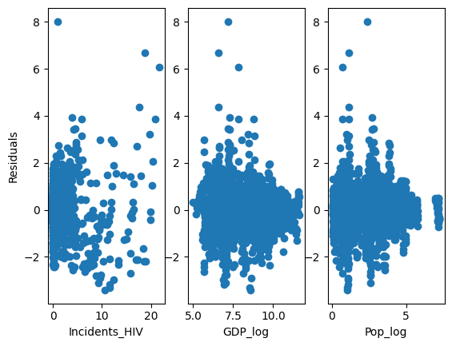
    


```python
fig, axs = plt.subplots(1,3)
axs[0].scatter(life_expectancy['Thinness_ten_nineteen_years'], lm_cr.fit().resid)
axs[0].set_xlabel('Thinness_ten_nineteen')
axs[0].set_ylabel('Residuals')
axs[1].scatter(life_expectancy['Thinness_five_nine_years'], lm_cr.fit().resid)
axs[1].set_xlabel('Thinness_five_nine')
axs[2].scatter(life_expectancy['Schooling'], lm_cr.fit().resid)
axs[2].set_xlabel('Schooling');
```


    

    


```python
fig, axs = plt.subplots(1,2)
axs[0].scatter(life_expectancy['Infant_deaths'], lm_cr.fit().resid)
axs[0].set_xlabel('Infant_deaths')
axs[0].set_ylabel('Residuals')
axs[1].scatter(life_expectancy['Child_deaths'], lm_cr.fit().resid)
axs[1].set_xlabel('Child_deaths');
```


    
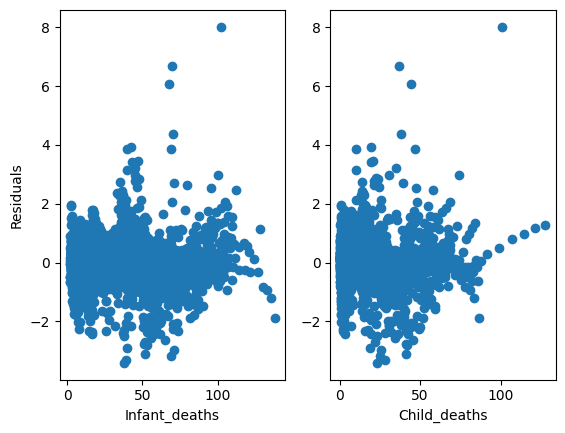
    


```python
boxplotresid_dataframe2 = pd.DataFrame({'Resid':lm_cr.fit().resid, \
                                       'Economy_status':life_expectancy['Economy_status'],
                                       'Region':life_expectancy['Region'],})
boxplotresid_dataframe2.boxplot('Resid',by='Economy_status');
```


    
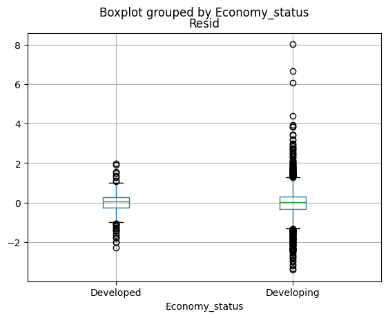
    


```python
boxplotresid_dataframe2.boxplot('Resid',by='Region')
plt.xticks([1,2,3,4,5,6,7,8,9], ['Africa','Asia','C.Am.','EU','Md.East','N.Am.','Oceania','nonEU','S.Am.']);
```


    

    


<br/> We observe that the distribution of residuals is fairly symmetric but not normal. We also observe some heteroskedasticity wrt. some predictors. The distribution of the random effects is close to normal as assumed. Overall, it seems that the model fits the data reasonably well.

## Confidence Intervals for Predictions <a class="anchor" id="predictions"></a>

Let us assume our CRE model. We will demonstrate how to compute confidence intervals for predictions. Let us take the dataset without, say, France. We will fit the CRE model on the dataset excluding France, then use it to predict France's life expectancy. We should note that we sorted the dataset by Country and Year to simplify further implementations.


```python
life_expectancy_sort = life_expectancy_cent.sort_values(axis = 0, by = ['Country','Year']).reset_index(drop=True) # sort by Country and Year
life_expectancy_nofrance = life_expectancy_sort.loc[life_expectancy_sort['Country'] != 'France'].reset_index(drop=True)
life_expectancy_france = life_expectancy_sort.loc[life_expectancy_sort['Country'] == 'France'].reset_index(drop=True)


lm_no_france = smf.mixedlm(formula='Life_expectancy ~ Economy_status + Region + Alcohol_consumption + \
                    Hepatitis_B + Measles + BMI + Polio + Diphtheria + Incidents_HIV + GDP_log + \
                    Pop_log + Thinness_ten_nineteen_years + Thinness_five_nine_years + Schooling + \
                    Infant_deaths + Child_deaths + Year_factor + Alcohol_consumption_cent + \
                    Hepatitis_B_cent + Measles_cent + BMI_cent + Polio_cent + Diphtheria_cent + \
                    Incidents_HIV_cent + GDP_log_cent + Pop_log_cent + Thinness_ten_nineteen_years_cent + \
                    Thinness_five_nine_years_cent + Schooling_cent + Infant_deaths_cent + Child_deaths_cent', \
                    groups=life_expectancy_nofrance['Country'], \
                    data=life_expectancy_nofrance)
life_expectancy_france_new = life_expectancy_nofrance.copy()  

ref_std = np.sqrt(lm_no_france.fit().cov_re.squeeze()) # std. deviation of random effects
res_std = np.sqrt(lm_no_france.fit().scale.squeeze()) # std. deviation of the idiosyncratic error
pred_no_france = lm_no_france.fit().predict() # fitted values
resid_no_france = lm_no_france.fit().resid; # residuals
```

<br/> Again, it is recommended for (especially more complicated) random effects models to use a bootstrap [[9](#9)]. First, we consider a *parametric* bootstrap. When using a parametric bootstrap, we assume the model is correctly specified, and we use the learned model to simulate new datasets to obtain the sampling distributions of our predictions. 


```python
# parametric bootstrap    
np.random.seed(123)
nb = 500  
boot_predict1 = pd.DataFrame(index=range(nb),columns=range(2000,2016))
for i in range(nb):
    ref_new = np.random.normal(0,ref_std,178).repeat(16) # generate new random effects
    resid_new = np.random.normal(0,res_std,2848) # generate new residuals
    life_expectancy_france_new['Life_expectancy'] = pred_no_france + ref_new + resid_new # new dataset
    lm_no_france_new = smf.mixedlm(formula='Life_expectancy ~ Economy_status + Region + Alcohol_consumption + \
                        Hepatitis_B + Measles + BMI + Polio + Diphtheria + Incidents_HIV + GDP_log + \
                        Pop_log + Thinness_ten_nineteen_years + Thinness_five_nine_years + Schooling + \
                        Infant_deaths + Child_deaths + Year_factor + Alcohol_consumption_cent + \
                        Hepatitis_B_cent + Measles_cent + BMI_cent + Polio_cent + Diphtheria_cent + \
                        Incidents_HIV_cent + GDP_log_cent + Pop_log_cent + Thinness_ten_nineteen_years_cent + \
                        Thinness_five_nine_years_cent + Schooling_cent + Infant_deaths_cent + Child_deaths_cent', \
                        groups=life_expectancy_france_new['Country'], \
                        data=life_expectancy_france_new)

    boot_predict1.iloc[i,:] = lm_no_france_new.fit().predict(life_expectancy_france) # new prediction for France
    
boot_predict1.quantile([0.025,0.975],0)
```


<div>
<style scoped>
    .dataframe tbody tr th:only-of-type {
        vertical-align: middle;
    }

    .dataframe tbody tr th {
        vertical-align: top;
    }

    .dataframe thead th {
        text-align: right;
    }
</style>
<table border="1" class="dataframe">
  <thead>
    <tr style="text-align: right;">
      <th></th>
      <th>2000</th>
      <th>2001</th>
      <th>2002</th>
      <th>2003</th>
      <th>2004</th>
      <th>2005</th>
      <th>2006</th>
      <th>2007</th>
      <th>2008</th>
      <th>2009</th>
      <th>2010</th>
      <th>2011</th>
      <th>2012</th>
      <th>2013</th>
      <th>2014</th>
      <th>2015</th>
    </tr>
  </thead>
  <tbody>
    <tr>
      <th>0.025</th>
      <td>74.937424</td>
      <td>74.866637</td>
      <td>75.054829</td>
      <td>75.14155</td>
      <td>75.384549</td>
      <td>75.543906</td>
      <td>75.710482</td>
      <td>75.98133</td>
      <td>76.313554</td>
      <td>76.613413</td>
      <td>76.928688</td>
      <td>77.169232</td>
      <td>77.427695</td>
      <td>77.761395</td>
      <td>78.043451</td>
      <td>78.206465</td>
    </tr>
    <tr>
      <th>0.975</th>
      <td>79.803966</td>
      <td>79.825484</td>
      <td>79.913547</td>
      <td>80.060316</td>
      <td>80.214831</td>
      <td>80.366957</td>
      <td>80.610478</td>
      <td>80.85129</td>
      <td>81.110378</td>
      <td>81.452346</td>
      <td>81.727304</td>
      <td>82.011223</td>
      <td>82.260274</td>
      <td>82.507808</td>
      <td>82.833185</td>
      <td>83.047327</td>
    </tr>
  </tbody>
</table>
</div>


<br/> An alternative to a parametric bootstrap is a semi-parametric bootstrap, a residual bootstrap. In a residual bootstrap, we resample the observed residuals rather than generating new ones from the distribution assumed by the model. This makes the residual bootstrap more robust to model misspecifications. Since we are dealing with the panel data, we can use a residual cluster bootstrap to account for the fact the residuals might be correlated within clusters.


```python
# residual cluster bootstrap
np.random.seed(123)
nb = 500   
boot_predict2 = pd.DataFrame(index=range(nb),columns=range(2000,2016))
for i in range(nb):
    ref_new = np.random.normal(0,ref_std,178).repeat(16) # generate new random effects
    resid_new = resid_no_france.iloc[np.random.choice([*range(0,len(life_expectancy_nofrance),16)],178, \
                                                      replace=True).repeat(16) + [*range(16)]*178] # resample the residuals by clusters
    life_expectancy_france_new['Life_expectancy'] = pred_no_france + ref_new + np.array(resid_new)
    lm_no_france_new = smf.mixedlm(formula='Life_expectancy ~ Economy_status + Region + Alcohol_consumption + \
                        Hepatitis_B + Measles + BMI + Polio + Diphtheria + Incidents_HIV + GDP_log + \
                        Pop_log + Thinness_ten_nineteen_years + Thinness_five_nine_years + Schooling + \
                        Infant_deaths + Child_deaths + Year_factor + Alcohol_consumption_cent + \
                        Hepatitis_B_cent + Measles_cent + BMI_cent + Polio_cent + Diphtheria_cent + \
                        Incidents_HIV_cent + GDP_log_cent + Pop_log_cent + Thinness_ten_nineteen_years_cent + \
                        Thinness_five_nine_years_cent + Schooling_cent + Infant_deaths_cent + Child_deaths_cent', \
                        groups=life_expectancy_france_new['Country'], \
                        data=life_expectancy_france_new)

    boot_predict2.iloc[i,:] = lm_no_france_new.fit().predict(life_expectancy_france)
    
boot_predict2.quantile([0.025,0.975],0)
```


<div>
<style scoped>
    .dataframe tbody tr th:only-of-type {
        vertical-align: middle;
    }

    .dataframe tbody tr th {
        vertical-align: top;
    }

    .dataframe thead th {
        text-align: right;
    }
</style>
<table border="1" class="dataframe">
  <thead>
    <tr style="text-align: right;">
      <th></th>
      <th>2000</th>
      <th>2001</th>
      <th>2002</th>
      <th>2003</th>
      <th>2004</th>
      <th>2005</th>
      <th>2006</th>
      <th>2007</th>
      <th>2008</th>
      <th>2009</th>
      <th>2010</th>
      <th>2011</th>
      <th>2012</th>
      <th>2013</th>
      <th>2014</th>
      <th>2015</th>
    </tr>
  </thead>
  <tbody>
    <tr>
      <th>0.025</th>
      <td>74.813012</td>
      <td>74.86468</td>
      <td>74.984927</td>
      <td>75.119378</td>
      <td>75.27635</td>
      <td>75.420221</td>
      <td>75.657149</td>
      <td>75.878908</td>
      <td>76.183769</td>
      <td>76.472448</td>
      <td>76.709136</td>
      <td>76.910822</td>
      <td>77.28145</td>
      <td>77.56459</td>
      <td>77.832578</td>
      <td>77.987525</td>
    </tr>
    <tr>
      <th>0.975</th>
      <td>80.190403</td>
      <td>80.228524</td>
      <td>80.280435</td>
      <td>80.391743</td>
      <td>80.546042</td>
      <td>80.67143</td>
      <td>80.906285</td>
      <td>81.136983</td>
      <td>81.431386</td>
      <td>81.723534</td>
      <td>82.01187</td>
      <td>82.255327</td>
      <td>82.645147</td>
      <td>82.932145</td>
      <td>83.138151</td>
      <td>83.343009</td>
    </tr>
  </tbody>
</table>
</div>


<br/> The disadvantage of a residual bootstrap is that this approach is not robust to heteroskedasticity between clusters. Thus, we can consider another semi-parametric bootstrap: *wild bootstrap*. Instead of resampling the residuals themselves, the wild bootstrap rescales residuals with a random variable *v* such that $\mathrm{E} v = 0$ and $\mathrm{Var} v = 1$. Often, these weights are chosen simply as *-1* with a probability *0.5* and *1* with a probability *0.5*, the so-called Rademacher weights. This is why the bootstrap is termed wild, because it is kind of *wild* that such a bootstrap provides asymptotically valid results [[10](#10)].


```python
# wild cluster bootstrap
np.random.seed(123)
nb = 500  
boot_predict3 = pd.DataFrame(index=range(nb),columns=range(2000,2016))
for i in range(nb):
    ref_new = np.random.normal(0,ref_std,178).repeat(16) # generate new random effects
    weights = (2*(np.random.uniform(0,1,178)).round(0)-1).repeat(16) # generate Rademacher weights
    resid_new = resid_no_france*weights # new residuals
    life_expectancy_france_new['Life_expectancy'] = pred_no_france + ref_new + np.array(resid_new)
    lm_no_france_new = smf.mixedlm(formula='Life_expectancy ~ Economy_status + Region + Alcohol_consumption + \
                        Hepatitis_B + Measles + BMI + Polio + Diphtheria + Incidents_HIV + GDP_log + \
                        Pop_log + Thinness_ten_nineteen_years + Thinness_five_nine_years + Schooling + \
                        Infant_deaths + Child_deaths + Year_factor + Alcohol_consumption_cent + \
                        Hepatitis_B_cent + Measles_cent + BMI_cent + Polio_cent + Diphtheria_cent + \
                        Incidents_HIV_cent + GDP_log_cent + Pop_log_cent + Thinness_ten_nineteen_years_cent + \
                        Thinness_five_nine_years_cent + Schooling_cent + Infant_deaths_cent + Child_deaths_cent', \
                        groups=life_expectancy_france_new['Country'], \
                        data=life_expectancy_france_new)

    boot_predict3.iloc[i,:] = lm_no_france_new.fit().predict(life_expectancy_france)
    
boot_predict3.quantile([0.025,0.975],0)
```


<div>
<style scoped>
    .dataframe tbody tr th:only-of-type {
        vertical-align: middle;
    }

    .dataframe tbody tr th {
        vertical-align: top;
    }

    .dataframe thead th {
        text-align: right;
    }
</style>
<table border="1" class="dataframe">
  <thead>
    <tr style="text-align: right;">
      <th></th>
      <th>2000</th>
      <th>2001</th>
      <th>2002</th>
      <th>2003</th>
      <th>2004</th>
      <th>2005</th>
      <th>2006</th>
      <th>2007</th>
      <th>2008</th>
      <th>2009</th>
      <th>2010</th>
      <th>2011</th>
      <th>2012</th>
      <th>2013</th>
      <th>2014</th>
      <th>2015</th>
    </tr>
  </thead>
  <tbody>
    <tr>
      <th>0.025</th>
      <td>74.805504</td>
      <td>74.862603</td>
      <td>74.94794</td>
      <td>75.085087</td>
      <td>75.284194</td>
      <td>75.426095</td>
      <td>75.687348</td>
      <td>75.939474</td>
      <td>76.219645</td>
      <td>76.547666</td>
      <td>76.818519</td>
      <td>77.10099</td>
      <td>77.437</td>
      <td>77.715132</td>
      <td>77.975164</td>
      <td>78.140984</td>
    </tr>
    <tr>
      <th>0.975</th>
      <td>79.952222</td>
      <td>79.986346</td>
      <td>80.083948</td>
      <td>80.196768</td>
      <td>80.379966</td>
      <td>80.524864</td>
      <td>80.759834</td>
      <td>80.985894</td>
      <td>81.315383</td>
      <td>81.57532</td>
      <td>81.915153</td>
      <td>82.164572</td>
      <td>82.451934</td>
      <td>82.734763</td>
      <td>83.021727</td>
      <td>83.230244</td>
    </tr>
  </tbody>
</table>
</div>


<br/> We can also use the pairs cluster bootstrap again.


```python
# pairs cluster bootstrap
np.random.seed(123)
nb = 500   
boot_predict4 = pd.DataFrame(index=range(nb),columns=range(2000,2016))

for i in range(nb):
    life_expectancy_france_new = life_expectancy_nofrance.iloc[np.random.choice([*range(0,len(life_expectancy_nofrance),16)],178, \
                                                                                replace=True).repeat(16) + [*range(16)]*178]
    lm_no_france_new = smf.mixedlm(formula='Life_expectancy ~ Economy_status + Region + Alcohol_consumption + \
                        Hepatitis_B + Measles + BMI + Polio + Diphtheria + Incidents_HIV + GDP_log + \
                        Pop_log + Thinness_ten_nineteen_years + Thinness_five_nine_years + Schooling + \
                        Infant_deaths + Child_deaths + Year_factor + Alcohol_consumption_cent + \
                        Hepatitis_B_cent + Measles_cent + BMI_cent + Polio_cent + Diphtheria_cent + \
                        Incidents_HIV_cent + GDP_log_cent + Pop_log_cent + Thinness_ten_nineteen_years_cent + \
                        Thinness_five_nine_years_cent + Schooling_cent + Infant_deaths_cent + Child_deaths_cent', \
                        groups=life_expectancy_france_new['Country'], \
                        data=life_expectancy_france_new)                   
    boot_predict4.iloc[i,:] = lm_no_france_new.fit().predict(life_expectancy_france)

boot_predict4.quantile([0.025,0.975],0)
```


<div>
<style scoped>
    .dataframe tbody tr th:only-of-type {
        vertical-align: middle;
    }

    .dataframe tbody tr th {
        vertical-align: top;
    }

    .dataframe thead th {
        text-align: right;
    }
</style>
<table border="1" class="dataframe">
  <thead>
    <tr style="text-align: right;">
      <th></th>
      <th>2000</th>
      <th>2001</th>
      <th>2002</th>
      <th>2003</th>
      <th>2004</th>
      <th>2005</th>
      <th>2006</th>
      <th>2007</th>
      <th>2008</th>
      <th>2009</th>
      <th>2010</th>
      <th>2011</th>
      <th>2012</th>
      <th>2013</th>
      <th>2014</th>
      <th>2015</th>
    </tr>
  </thead>
  <tbody>
    <tr>
      <th>0.025</th>
      <td>75.321853</td>
      <td>75.387403</td>
      <td>75.47449</td>
      <td>75.580609</td>
      <td>75.724866</td>
      <td>75.869823</td>
      <td>76.115125</td>
      <td>76.350195</td>
      <td>76.650709</td>
      <td>76.90392</td>
      <td>77.113962</td>
      <td>77.333296</td>
      <td>77.661413</td>
      <td>77.927943</td>
      <td>78.235045</td>
      <td>78.431922</td>
    </tr>
    <tr>
      <th>0.975</th>
      <td>79.64143</td>
      <td>79.643504</td>
      <td>79.742485</td>
      <td>79.899388</td>
      <td>80.05894</td>
      <td>80.213747</td>
      <td>80.461798</td>
      <td>80.683774</td>
      <td>80.997395</td>
      <td>81.281058</td>
      <td>81.578592</td>
      <td>81.870041</td>
      <td>82.247879</td>
      <td>82.509783</td>
      <td>82.805414</td>
      <td>83.011061</td>
    </tr>
  </tbody>
</table>
</div>


<br/> We observe that the results are fairly similar.

## Model Validation <a class="anchor" id="validation"></a>

As the final step of this notebook, we will validate our CRE model using 10-fold cross-validation. We will evaluate predictive performance using root mean squared error (RMSE) and calibration (slope of the linear regression of actual vs. predicted). 

For implementation, we need to create the model matrix manually. This allows us to account for the fact that, in some splits, levels of category variables may be missing, which messes up with the implementation of *predict* in Python.


```python
# creating the model matrix manually
dummies = pd.get_dummies(life_expectancy_sort[['Economy_status','Region','Year_factor']]) # create dummies for factor variables
life_expectancy_cv = pd.concat([life_expectancy_sort,dummies],axis = 1)

model_matrix = life_expectancy_cv.iloc[:,[3,*range(6,13),*range(15,18),20,21,22,*range(24,39),*range(42,6)]].astype(float)
model_matrix = pd.concat([model_matrix,pd.DataFrame(np.ones([len(model_matrix),1]))],axis = 1) # model matrix
model_response = life_expectancy_cv['Life_expectancy'] # vector of responses

np.random.seed(123)
rep = 100
folds = 10
rmse_cv =  pd.DataFrame(index=range(rep*folds),columns = ['mse'])
calib_cv = pd.DataFrame(index=range(rep*folds),columns = ['mse'])

from sklearn.model_selection import KFold
kf = KFold(n_splits=10) # create folds

k = 0
for i in range(rep):
    idx_cv = np.random.choice([*range(0,len(life_expectancy_cv),16)],179, replace=False) # reshuffle the observations
    
    for j, (train_index, test_index) in enumerate(kf.split(idx_cv)):
        
        train_set = idx_cv[train_index].repeat(16) + [*range(16)]*len(train_index) # extract train set indeces
        test_set = idx_cv[test_index].repeat(16) + [*range(16)]*len(test_index) # extract test set indeces

        # train set
        model_matrix_cv = model_matrix.iloc[train_set] 
        model_response_cv = model_response.iloc[train_set]
        model_country = life_expectancy_cv['Country'][train_set]
        
        # test set
        test_matrix_cv = model_matrix.iloc[test_set]
        test_response_cv = model_response.iloc[test_set]

        # check that some factor levels are not missing, i.e., whether there is a zero column in the model matrix
        # if it is, remove this column from the model matrix and the test observations
        zero_index = np.where(~model_matrix_cv.any(axis=0))[0]
        test_matrix_cv = test_matrix_cv.drop(model_matrix_cv.columns[zero_index], axis=1)
        model_matrix_cv = model_matrix_cv.drop(model_matrix_cv.columns[zero_index], axis=1)
        
        # fit the model
        lm_cv = sm.regression.mixed_linear_model.MixedLM(endog = model_response_cv, exog = model_matrix_cv, groups=model_country)

        # evaluate the model
        rmse_cv.iloc[k] = np.sqrt(((lm_cv.fit().predict(test_matrix_cv) - test_response_cv)**2).mean())
        calib_cv.iloc[k] = sm.OLS(endog = lm_cv.fit().predict(test_matrix_cv), exog = test_response_cv).fit().params.iloc[0]
        
        k = k +1
```

<br/> We observe that the model is well-calibrated.


```python
calib_cv.mean()
```


    mse    0.999559
    dtype: object


<br/> The cross-validated error is slightly larger than the error predicted by the model (random effects + idiosyncratic error).


```python
rmse_cv.mean()
```


    mse    2.368574
    dtype: object


```python
np.sqrt(np.sqrt(lm_cr.fit().cov_re.squeeze())**2 + np.sqrt(lm_cr.fit().scale.squeeze())**2)
```


    2.2138458606021794


```python
rmse_cv.mean()/np.sqrt(np.sqrt(lm_cr.fit().cov_re.squeeze())**2 + np.sqrt(lm_cr.fit().scale.squeeze())**2)
```


    mse    1.069891
    dtype: object


<br/> We observe that the performance decreased by about 10% which is overall quite reasonable. In this notebook, we will not go through commenting on the predictors that appeared important in the model. See First Circle Part Three, if you are interested.

## References <a class="anchor" id="references"></a>

<a id="1">[1]</a> WOOLDRIDGE, Jeffrey M. *Econometric analysis of cross section and panel data*. MIT press, 2010.

<a id="2">[2]</a> CAMERON, A. C. *Microeconometrics: methods and applications.* Cambridge University, 2005.

<a id="3">[3]</a> LONG, J. Scott; ERVIN, Laurie H. Using heteroscedasticity consistent standard errors in the linear regression model. *The American Statistician*, 2000, 54.3: 217-224.

<a id="4">[4]</a> HESTERBERG, Tim C. What teachers should know about the bootstrap: Resampling in the undergraduate statistics curriculum. *The american statistician*, 2015, 69.4: 371-386.

<a id="5">[5]</a> TYSZLER, Marcelo; PUSTEJOVSKY, James; TIPTON, Elizabeth. REG_SANDWICH: Stata module to compute cluster-robust (sandwich) variance estimators with small-sample corrections for linear regression. 2017.

<a id="6">[6]</a> ANTONAKIS, John; BASTARDOZ, Nicolas; RÖNKKÖ, Mikko. On ignoring the random effects assumption in multilevel models: Review, critique, and recommendations. *Organizational Research Methods*, 2021, 24.2: 443-483.

<a id="7">[7]</a> LUKE, Steven G. Evaluating significance in linear mixed-effects models in R. *Behavior research methods*, 2017, 49.4: 1494-1502.

<a id="8">[8]</a> MCNEISH, Daniel; KELLEY, Ken. Fixed effects models versus mixed effects models for clustered data: Reviewing the approaches, disentangling the differences, and making recommendations. *Psychological methods*, 2019, 24.1: 20.

<a id="9">[9]</a> FARAWAY, Julian J. Extending the linear model with R: generalized linear, mixed effects and nonparametric regression models. *Chapman and Hall/CRC*, 2016.

<a id="10">[10]</a> DJOGBENOU, Antoine A.; MACKINNON, James G.; NIELSEN, Morten Ørregaard. Asymptotic theory and wild bootstrap inference with clustered errors. *Journal of Econometrics*, 2019, 212.2: 393-412.

