# The Second Circle: Binary Classification, Part One 
## Linear Classifiers (+ QDA and Naive Bayes)

<br/>
Jiří Fejlek

2025-12-22
<br/>


## Table of Contents

- [Heart Disease Datasets (Cleveland, Hungary, Switzerland, and the VA Long Beach)](#heart)
- [Data Exploration](#exploration-heart)
- [Imputation and Design Matrix](#imputation-heart)
- [Linear Classifiers](#lin_class-heart)
    - [Logistic Regression](#logistic-heart)
    - [Linear Discriminant Analysis](#lda-heart)
    - [Support Vector Machines](#svm-heart)
        - [Linear SVM](#svm-lin-heart)
        - [Kernel Trick and Kernel SVM](#kernel-trick-heart)
- [Quadratic Discriminant Analysis](#qda-heart)
- [Naive Bayes](#nb-heart)
- [Validation](#valid)
- [References](#references)

In the Second Circle, we will explore the binary classification methods. We will start with classical linear methods: logistic regression, linear discriminant analysis, and linear support vector machines. In addition, we will consider some popular nonlinear extensions of these methods, namely, kernel support vector machines and quadratic discriminant analysis. Lastly, we will also have a look at naive Bayes classifiers.

## Heart Disease Datasets (Cleveland, Hungary, Switzerland, and the VA Long Beach) <a class="anchor" id="heart"></a>

We will consider datasets obtained from https://www.kaggle.com/datasets/redwankarimsony/heart-disease-data, based on https://archive.ics.uci.edu/dataset/45/heart+disease, which contain information about 920 patients in this project. The dataset is a combination of 4 studies (Cleveland Clinic in Cleveland, Ohio; Hungarian Institute of Cardiology in Budapest, Hungary; Veterans Administration Medical Center in
Long Beach, California; University Hospitals in Zurich and Basel, Switzerland) [[1](#1)]. The goal is to distinguish the patients with heart disease. The variables in the dataset are as follows.

* **age** 
* **sex** - age (at the time of examination)
* **dataset** - Cleveland, Hungary, Switzerland, and the VA Long Beach
* **cp** - chest pain type (typical angina, atypical angina, non-anginal, asymptomatic)
* **trestbps** - resting blood pressure in mm Hg 
* **chol** - serum cholesterol in mg/dl 
* **fbs** - fasting blood sugar > 120 mg/dl (True/False)
* **restecg** - resting electrocardiographic results (normal, ST-T abnormality, LV hypertrophy)
* **thalach** - maximum heart rate achieved
* **exang** -  exercise-induced angina (True/ False)
* **oldpeak** - ST depression induced by exercise relative to rest
* **slope** -  the slope of the peak exercise ST segment (flat, downsloping, upsloping)
* **ca** - number of major vessels (0-3) colored by fluoroscopy
* **thal** - thallium heart scan defect (normal, fixed defect, reversible defect)
* **num** -  diagnosis of heart disease (0 = no heart disease; 1,2,3,4 = stages of heart disease)

### Data Exploration <a class="anchor" id="exploration-heart"></a>

Let us start with loading the dataset.


```python
import pandas as pd
import numpy as np
import matplotlib.pyplot as plt
import statsmodels.api as sm

np.set_printoptions(legacy='1.25')
```


```python
heart = pd.read_csv('C:/Users/elini/Desktop/nine circles 2/heart_disease_uci.csv')
heart
```


<div>
<style scoped>
    .dataframe tbody tr th:only-of-type {
        vertical-align: middle;
    }

    .dataframe tbody tr th {
        vertical-align: top;
    }

    .dataframe thead th {
        text-align: right;
    }
</style>
<table border="1" class="dataframe">
  <thead>
    <tr style="text-align: right;">
      <th></th>
      <th>id</th>
      <th>age</th>
      <th>sex</th>
      <th>dataset</th>
      <th>cp</th>
      <th>trestbps</th>
      <th>chol</th>
      <th>fbs</th>
      <th>restecg</th>
      <th>thalch</th>
      <th>exang</th>
      <th>oldpeak</th>
      <th>slope</th>
      <th>ca</th>
      <th>thal</th>
      <th>num</th>
    </tr>
  </thead>
  <tbody>
    <tr>
      <th>0</th>
      <td>1</td>
      <td>63</td>
      <td>Male</td>
      <td>Cleveland</td>
      <td>typical angina</td>
      <td>145.0</td>
      <td>233.0</td>
      <td>True</td>
      <td>lv hypertrophy</td>
      <td>150.0</td>
      <td>False</td>
      <td>2.3</td>
      <td>downsloping</td>
      <td>0.0</td>
      <td>fixed defect</td>
      <td>0</td>
    </tr>
    <tr>
      <th>1</th>
      <td>2</td>
      <td>67</td>
      <td>Male</td>
      <td>Cleveland</td>
      <td>asymptomatic</td>
      <td>160.0</td>
      <td>286.0</td>
      <td>False</td>
      <td>lv hypertrophy</td>
      <td>108.0</td>
      <td>True</td>
      <td>1.5</td>
      <td>flat</td>
      <td>3.0</td>
      <td>normal</td>
      <td>2</td>
    </tr>
    <tr>
      <th>2</th>
      <td>3</td>
      <td>67</td>
      <td>Male</td>
      <td>Cleveland</td>
      <td>asymptomatic</td>
      <td>120.0</td>
      <td>229.0</td>
      <td>False</td>
      <td>lv hypertrophy</td>
      <td>129.0</td>
      <td>True</td>
      <td>2.6</td>
      <td>flat</td>
      <td>2.0</td>
      <td>reversable defect</td>
      <td>1</td>
    </tr>
    <tr>
      <th>3</th>
      <td>4</td>
      <td>37</td>
      <td>Male</td>
      <td>Cleveland</td>
      <td>non-anginal</td>
      <td>130.0</td>
      <td>250.0</td>
      <td>False</td>
      <td>normal</td>
      <td>187.0</td>
      <td>False</td>
      <td>3.5</td>
      <td>downsloping</td>
      <td>0.0</td>
      <td>normal</td>
      <td>0</td>
    </tr>
    <tr>
      <th>4</th>
      <td>5</td>
      <td>41</td>
      <td>Female</td>
      <td>Cleveland</td>
      <td>atypical angina</td>
      <td>130.0</td>
      <td>204.0</td>
      <td>False</td>
      <td>lv hypertrophy</td>
      <td>172.0</td>
      <td>False</td>
      <td>1.4</td>
      <td>upsloping</td>
      <td>0.0</td>
      <td>normal</td>
      <td>0</td>
    </tr>
    <tr>
      <th>...</th>
      <td>...</td>
      <td>...</td>
      <td>...</td>
      <td>...</td>
      <td>...</td>
      <td>...</td>
      <td>...</td>
      <td>...</td>
      <td>...</td>
      <td>...</td>
      <td>...</td>
      <td>...</td>
      <td>...</td>
      <td>...</td>
      <td>...</td>
      <td>...</td>
    </tr>
    <tr>
      <th>915</th>
      <td>916</td>
      <td>54</td>
      <td>Female</td>
      <td>VA Long Beach</td>
      <td>asymptomatic</td>
      <td>127.0</td>
      <td>333.0</td>
      <td>True</td>
      <td>st-t abnormality</td>
      <td>154.0</td>
      <td>False</td>
      <td>0.0</td>
      <td>NaN</td>
      <td>NaN</td>
      <td>NaN</td>
      <td>1</td>
    </tr>
    <tr>
      <th>916</th>
      <td>917</td>
      <td>62</td>
      <td>Male</td>
      <td>VA Long Beach</td>
      <td>typical angina</td>
      <td>NaN</td>
      <td>139.0</td>
      <td>False</td>
      <td>st-t abnormality</td>
      <td>NaN</td>
      <td>NaN</td>
      <td>NaN</td>
      <td>NaN</td>
      <td>NaN</td>
      <td>NaN</td>
      <td>0</td>
    </tr>
    <tr>
      <th>917</th>
      <td>918</td>
      <td>55</td>
      <td>Male</td>
      <td>VA Long Beach</td>
      <td>asymptomatic</td>
      <td>122.0</td>
      <td>223.0</td>
      <td>True</td>
      <td>st-t abnormality</td>
      <td>100.0</td>
      <td>False</td>
      <td>0.0</td>
      <td>NaN</td>
      <td>NaN</td>
      <td>fixed defect</td>
      <td>2</td>
    </tr>
    <tr>
      <th>918</th>
      <td>919</td>
      <td>58</td>
      <td>Male</td>
      <td>VA Long Beach</td>
      <td>asymptomatic</td>
      <td>NaN</td>
      <td>385.0</td>
      <td>True</td>
      <td>lv hypertrophy</td>
      <td>NaN</td>
      <td>NaN</td>
      <td>NaN</td>
      <td>NaN</td>
      <td>NaN</td>
      <td>NaN</td>
      <td>0</td>
    </tr>
    <tr>
      <th>919</th>
      <td>920</td>
      <td>62</td>
      <td>Male</td>
      <td>VA Long Beach</td>
      <td>atypical angina</td>
      <td>120.0</td>
      <td>254.0</td>
      <td>False</td>
      <td>lv hypertrophy</td>
      <td>93.0</td>
      <td>True</td>
      <td>0.0</td>
      <td>NaN</td>
      <td>NaN</td>
      <td>NaN</td>
      <td>1</td>
    </tr>
  </tbody>
</table>
<p>920 rows × 16 columns</p>
</div>


```python
heart.dtypes
```


    id            int64
    age           int64
    sex          object
    dataset      object
    cp           object
    trestbps    float64
    chol        float64
    fbs          object
    restecg      object
    thalch      float64
    exang        object
    oldpeak     float64
    slope        object
    ca          float64
    thal         object
    num           int64
    dtype: object


We can notice that some values of **trestbps**/**cholesterol** values are zero (e.g., cholesterol levels are all 0  in the dataset from Hungary), which is clearly a coding for missing values.


```python
heart.loc[heart['chol'] == 0,'chol'] = np.nan
heart.loc[heart['trestbps'] == 0,'trestbps'] = np.nan
```

Next, we will check for duplicated records.


```python
heart.iloc[:,range(1,16)].duplicated(keep = False).any(axis = None)
```


    True


Let us check which records are duplicated.


```python
 heart.loc[heart.iloc[:,range(1,16)].duplicated(keep = False) == True]
```


<div>
<style scoped>
    .dataframe tbody tr th:only-of-type {
        vertical-align: middle;
    }

    .dataframe tbody tr th {
        vertical-align: top;
    }

    .dataframe thead th {
        text-align: right;
    }
</style>
<table border="1" class="dataframe">
  <thead>
    <tr style="text-align: right;">
      <th></th>
      <th>id</th>
      <th>age</th>
      <th>sex</th>
      <th>dataset</th>
      <th>cp</th>
      <th>trestbps</th>
      <th>chol</th>
      <th>fbs</th>
      <th>restecg</th>
      <th>thalch</th>
      <th>exang</th>
      <th>oldpeak</th>
      <th>slope</th>
      <th>ca</th>
      <th>thal</th>
      <th>num</th>
    </tr>
  </thead>
  <tbody>
    <tr>
      <th>404</th>
      <td>405</td>
      <td>49</td>
      <td>Female</td>
      <td>Hungary</td>
      <td>atypical angina</td>
      <td>110.0</td>
      <td>NaN</td>
      <td>False</td>
      <td>normal</td>
      <td>160.0</td>
      <td>False</td>
      <td>0.0</td>
      <td>NaN</td>
      <td>NaN</td>
      <td>NaN</td>
      <td>0</td>
    </tr>
    <tr>
      <th>405</th>
      <td>406</td>
      <td>49</td>
      <td>Female</td>
      <td>Hungary</td>
      <td>atypical angina</td>
      <td>110.0</td>
      <td>NaN</td>
      <td>False</td>
      <td>normal</td>
      <td>160.0</td>
      <td>False</td>
      <td>0.0</td>
      <td>NaN</td>
      <td>NaN</td>
      <td>NaN</td>
      <td>0</td>
    </tr>
    <tr>
      <th>859</th>
      <td>860</td>
      <td>58</td>
      <td>Male</td>
      <td>VA Long Beach</td>
      <td>non-anginal</td>
      <td>150.0</td>
      <td>219.0</td>
      <td>False</td>
      <td>st-t abnormality</td>
      <td>118.0</td>
      <td>True</td>
      <td>0.0</td>
      <td>NaN</td>
      <td>NaN</td>
      <td>NaN</td>
      <td>2</td>
    </tr>
    <tr>
      <th>907</th>
      <td>908</td>
      <td>58</td>
      <td>Male</td>
      <td>VA Long Beach</td>
      <td>non-anginal</td>
      <td>150.0</td>
      <td>219.0</td>
      <td>False</td>
      <td>st-t abnormality</td>
      <td>118.0</td>
      <td>True</td>
      <td>0.0</td>
      <td>NaN</td>
      <td>NaN</td>
      <td>NaN</td>
      <td>2</td>
    </tr>
  </tbody>
</table>
</div>


We will assume these records are duplicates and remove them from the dataset.


```python
heart_red = heart.drop(axis = 0, index = [405,907]).reset_index()
```

As we have noticed, some records are missing in the dataset.


```python
heart_red.isna().sum(axis = 0)
```


    index         0
    id            0
    age           0
    sex           0
    dataset       0
    cp            0
    trestbps     60
    chol        201
    fbs          90
    restecg       2
    thalch       55
    exang        55
    oldpeak      62
    slope       307
    ca          609
    thal        484
    num           0
    dtype: int64


Let us also check the values of numerical variables.


```python
numeric_variables_heart = ['age','trestbps','chol','thalch','oldpeak']
categorical_variables_heart = ['sex','dataset','cp','fbs','restecg','exang','slope','thal']

numeric_basic_stats = np.zeros([len(numeric_variables_heart),6])

for i in range(len(numeric_variables_heart)):
    numeric_basic_stats[i,0] = np.mean(heart_red[numeric_variables_heart[i]])
    numeric_basic_stats[i,1] = np.nanmedian(heart_red[numeric_variables_heart[i]])
    numeric_basic_stats[i,2] = np.nanmin(heart_red[numeric_variables_heart[i]])
    numeric_basic_stats[i,3] = np.nanquantile(heart_red[numeric_variables_heart[i]], 0.25)
    numeric_basic_stats[i,4] = np.nanquantile(heart_red[numeric_variables_heart[i]], 0.75)
    numeric_basic_stats[i,5] = np.nanmax(heart_red[numeric_variables_heart[i]])

      
pd.DataFrame(data=numeric_basic_stats, index=numeric_variables_heart, columns=['mean','median','min','1st qrt.','3rd qrt.','max'])
```


<div>
<style scoped>
    .dataframe tbody tr th:only-of-type {
        vertical-align: middle;
    }

    .dataframe tbody tr th {
        vertical-align: top;
    }

    .dataframe thead th {
        text-align: right;
    }
</style>
<table border="1" class="dataframe">
  <thead>
    <tr style="text-align: right;">
      <th></th>
      <th>mean</th>
      <th>median</th>
      <th>min</th>
      <th>1st qrt.</th>
      <th>3rd qrt.</th>
      <th>max</th>
    </tr>
  </thead>
  <tbody>
    <tr>
      <th>age</th>
      <td>53.510893</td>
      <td>54.0</td>
      <td>28.0</td>
      <td>47.0</td>
      <td>60.0</td>
      <td>77.0</td>
    </tr>
    <tr>
      <th>trestbps</th>
      <td>132.291375</td>
      <td>130.0</td>
      <td>80.0</td>
      <td>120.0</td>
      <td>140.0</td>
      <td>200.0</td>
    </tr>
    <tr>
      <th>chol</th>
      <td>246.871688</td>
      <td>240.0</td>
      <td>85.0</td>
      <td>210.0</td>
      <td>277.0</td>
      <td>603.0</td>
    </tr>
    <tr>
      <th>thalch</th>
      <td>137.542294</td>
      <td>140.0</td>
      <td>60.0</td>
      <td>120.0</td>
      <td>157.0</td>
      <td>202.0</td>
    </tr>
    <tr>
      <th>oldpeak</th>
      <td>0.880841</td>
      <td>0.5</td>
      <td>-2.6</td>
      <td>0.0</td>
      <td>1.5</td>
      <td>6.2</td>
    </tr>
  </tbody>
</table>
</div>


```python
f,a = plt.subplots(1,3)
a = a.ravel()
for idx,ax in enumerate(a):
    ax.hist(heart_red[numeric_variables_heart[idx]], bins=20)
    ax.set_title('Histogram')
    ax.set_xlabel(numeric_variables_heart[idx])
    ax.set_ylabel('Frequency')
plt.tight_layout()
```


    
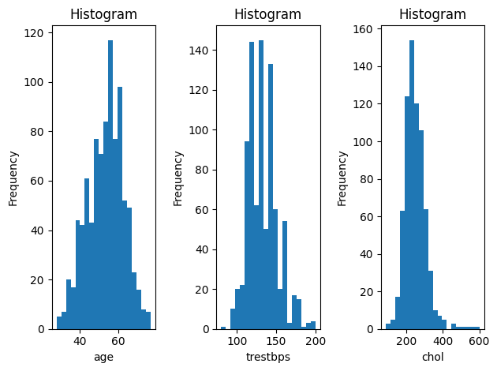
    


```python
f,a = plt.subplots(1,2)
a = a.ravel()
for idx,ax in enumerate(a):
    ax.hist(heart_red[numeric_variables_heart[idx+3]], bins=20)
    ax.set_title('Histogram')
    ax.set_xlabel(numeric_variables_heart[idx+3])
    ax.set_ylabel('Frequency')
plt.tight_layout()

```


    
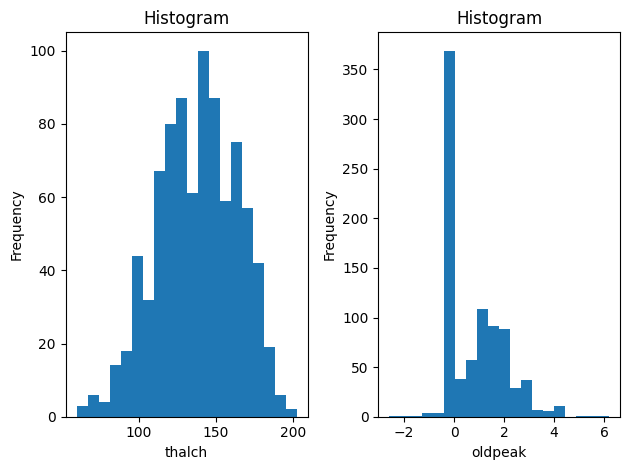
    


The categorical variables are as follows.


```python
heart_red['sex'].value_counts()
```


    sex
    Male      725
    Female    193
    Name: count, dtype: int64


```python
heart_red['dataset'].value_counts()
```


    dataset
    Cleveland        304
    Hungary          292
    VA Long Beach    199
    Switzerland      123
    Name: count, dtype: int64


```python
heart_red['cp'].value_counts()
```


    cp
    asymptomatic       496
    non-anginal        203
    atypical angina    173
    typical angina      46
    Name: count, dtype: int64


```python
heart_red['fbs'].value_counts()
```


    fbs
    False    690
    True     138
    Name: count, dtype: int64


```python
heart_red['restecg'].value_counts()
```


    restecg
    normal              550
    lv hypertrophy      188
    st-t abnormality    178
    Name: count, dtype: int64


```python
heart_red['exang'].value_counts()
```


    exang
    False    527
    True     336
    Name: count, dtype: int64


```python
heart_red['slope'].value_counts()
```


    slope
    flat           345
    upsloping      203
    downsloping     63
    Name: count, dtype: int64


```python
heart_red['thal'].value_counts()
```


    thal
    normal               196
    reversable defect    192
    fixed defect          46
    Name: count, dtype: int64


Apart from the missing records, we do not observe any obvious issues with the dataset.

### Imputation and Design Matrix <a class="anchor" id="imputation-heart"></a>

We will perform the imputation via *missForrest* to complete the records. To prepare the dataset, we need to label the categorical variables first.


```python
heart_imp = heart_red[['age','sex','dataset','cp','trestbps','chol','fbs','restecg','thalch','exang','oldpeak','slope', 'thal']].copy()

heart_imp['sex'] = heart_imp['sex'].map({'Male': 1, 'Female': 0})
heart_imp['dataset'] = heart_imp['dataset'].map({'Cleveland': 0, 'Hungary': 1, 'Switzerland': 2, 'VA Long Beach': 3})
heart_imp['cp'] = heart_imp['cp'].map({'asymptomatic': 0, 'typical angina': 1, 'atypical angina': 2, 'non-anginal': 3})
heart_imp['fbs'] = heart_imp['fbs'].map({True: 1, False: 0})
heart_imp['restecg'] = heart_imp['restecg'].map({'normal': 0, 'lv hypertrophy': 1, 'st-t abnormality': 2})
heart_imp['exang'] = heart_imp['exang'].map({True: 1, False: 0})
heart_imp['slope'] = heart_imp['slope'].map({'flat': 0, 'downsloping': 1, 'upsloping': 2})
heart_imp['thal'] = heart_imp['thal'].map({'normal': 0, 'reversable defect': 1, 'fixed defect': 2})

```

We will ignore variables **ca** and **thal** in the imputation model, since both of these are missing over half of the values.


```python
from missforest import MissForest

np.random.seed(123)

MissForest_imputation = MissForest(categorical=categorical_variables_heart)
MissForest_imputation._verbose = 0

MissForest_imputation.fit(x = heart_imp)
heart_imp_MissForest = heart_imp.copy()
heart_imp_MissForest =  MissForest_imputation.transform(x = heart_imp)
```


```python
heart_imp_MissForest
```


<div>
<style scoped>
    .dataframe tbody tr th:only-of-type {
        vertical-align: middle;
    }

    .dataframe tbody tr th {
        vertical-align: top;
    }

    .dataframe thead th {
        text-align: right;
    }
</style>
<table border="1" class="dataframe">
  <thead>
    <tr style="text-align: right;">
      <th></th>
      <th>age</th>
      <th>sex</th>
      <th>dataset</th>
      <th>cp</th>
      <th>restecg</th>
      <th>thalch</th>
      <th>exang</th>
      <th>trestbps</th>
      <th>oldpeak</th>
      <th>fbs</th>
      <th>chol</th>
      <th>slope</th>
      <th>thal</th>
    </tr>
  </thead>
  <tbody>
    <tr>
      <th>0</th>
      <td>63</td>
      <td>1</td>
      <td>0</td>
      <td>1</td>
      <td>1.0</td>
      <td>150.000000</td>
      <td>0.0</td>
      <td>145.000000</td>
      <td>2.300000</td>
      <td>1.0</td>
      <td>233.0</td>
      <td>1.0</td>
      <td>2.0</td>
    </tr>
    <tr>
      <th>1</th>
      <td>67</td>
      <td>1</td>
      <td>0</td>
      <td>0</td>
      <td>1.0</td>
      <td>108.000000</td>
      <td>1.0</td>
      <td>160.000000</td>
      <td>1.500000</td>
      <td>0.0</td>
      <td>286.0</td>
      <td>0.0</td>
      <td>0.0</td>
    </tr>
    <tr>
      <th>2</th>
      <td>67</td>
      <td>1</td>
      <td>0</td>
      <td>0</td>
      <td>1.0</td>
      <td>129.000000</td>
      <td>1.0</td>
      <td>120.000000</td>
      <td>2.600000</td>
      <td>0.0</td>
      <td>229.0</td>
      <td>0.0</td>
      <td>1.0</td>
    </tr>
    <tr>
      <th>3</th>
      <td>37</td>
      <td>1</td>
      <td>0</td>
      <td>3</td>
      <td>0.0</td>
      <td>187.000000</td>
      <td>0.0</td>
      <td>130.000000</td>
      <td>3.500000</td>
      <td>0.0</td>
      <td>250.0</td>
      <td>1.0</td>
      <td>0.0</td>
    </tr>
    <tr>
      <th>4</th>
      <td>41</td>
      <td>0</td>
      <td>0</td>
      <td>2</td>
      <td>1.0</td>
      <td>172.000000</td>
      <td>0.0</td>
      <td>130.000000</td>
      <td>1.400000</td>
      <td>0.0</td>
      <td>204.0</td>
      <td>2.0</td>
      <td>0.0</td>
    </tr>
    <tr>
      <th>...</th>
      <td>...</td>
      <td>...</td>
      <td>...</td>
      <td>...</td>
      <td>...</td>
      <td>...</td>
      <td>...</td>
      <td>...</td>
      <td>...</td>
      <td>...</td>
      <td>...</td>
      <td>...</td>
      <td>...</td>
    </tr>
    <tr>
      <th>913</th>
      <td>54</td>
      <td>0</td>
      <td>3</td>
      <td>0</td>
      <td>2.0</td>
      <td>154.000000</td>
      <td>0.0</td>
      <td>127.000000</td>
      <td>0.000000</td>
      <td>1.0</td>
      <td>333.0</td>
      <td>0.0</td>
      <td>0.0</td>
    </tr>
    <tr>
      <th>914</th>
      <td>62</td>
      <td>1</td>
      <td>3</td>
      <td>1</td>
      <td>2.0</td>
      <td>147.018515</td>
      <td>0.0</td>
      <td>129.296277</td>
      <td>0.325513</td>
      <td>0.0</td>
      <td>139.0</td>
      <td>0.0</td>
      <td>0.0</td>
    </tr>
    <tr>
      <th>915</th>
      <td>55</td>
      <td>1</td>
      <td>3</td>
      <td>0</td>
      <td>2.0</td>
      <td>100.000000</td>
      <td>0.0</td>
      <td>122.000000</td>
      <td>0.000000</td>
      <td>1.0</td>
      <td>223.0</td>
      <td>0.0</td>
      <td>2.0</td>
    </tr>
    <tr>
      <th>916</th>
      <td>58</td>
      <td>1</td>
      <td>3</td>
      <td>0</td>
      <td>1.0</td>
      <td>136.597430</td>
      <td>0.0</td>
      <td>138.586581</td>
      <td>0.200740</td>
      <td>1.0</td>
      <td>385.0</td>
      <td>0.0</td>
      <td>0.0</td>
    </tr>
    <tr>
      <th>917</th>
      <td>62</td>
      <td>1</td>
      <td>3</td>
      <td>2</td>
      <td>1.0</td>
      <td>93.000000</td>
      <td>1.0</td>
      <td>120.000000</td>
      <td>0.000000</td>
      <td>0.0</td>
      <td>254.0</td>
      <td>0.0</td>
      <td>0.0</td>
    </tr>
  </tbody>
</table>
<p>918 rows × 13 columns</p>
</div>


Let us create our final model matrix.


```python
heart_final = heart_imp_MissForest.copy()
heart_final['heart_disease'] = (heart['num'] > 0).astype(int) 
heart_final['dataset'] = heart_final['dataset'].map({0: 'Clv', 1: 'Hun', 2: 'Swit', 3: 'VA'})
heart_final['cp'] = heart_final['cp'].map({0: 'asymp', 1: 'typ', 2: 'atyp', 3: 'nonang'})
heart_final['restecg'] = heart_final['restecg'].map({0: 'normal', 1: 'hypertrophy', 2: 'stt'})
heart_final['slope'] = heart_final['slope'].map({0: 'flat', 1: 'down', 2: 'up'})
heart_final['thal'] = heart_final['thal'].map({0: 'normal', 1: 'rev', 2: 'fixed'})

heart_final = pd.concat([heart_final,pd.get_dummies(heart_final[['cp','restecg','slope','thal']], dtype=int)], axis=1)
heart_final = heart_final[['age','sex','cp_typ','cp_atyp','cp_nonang','restecg_hypertrophy','restecg_stt',\
                           'thalch','exang','trestbps','oldpeak','fbs','chol','slope_down','slope_up','thal_rev','thal_fixed','heart_disease']]
heart_final
```


<div>
<style scoped>
    .dataframe tbody tr th:only-of-type {
        vertical-align: middle;
    }

    .dataframe tbody tr th {
        vertical-align: top;
    }

    .dataframe thead th {
        text-align: right;
    }
</style>
<table border="1" class="dataframe">
  <thead>
    <tr style="text-align: right;">
      <th></th>
      <th>age</th>
      <th>sex</th>
      <th>cp_typ</th>
      <th>cp_atyp</th>
      <th>cp_nonang</th>
      <th>restecg_hypertrophy</th>
      <th>restecg_stt</th>
      <th>thalch</th>
      <th>exang</th>
      <th>trestbps</th>
      <th>oldpeak</th>
      <th>fbs</th>
      <th>chol</th>
      <th>slope_down</th>
      <th>slope_up</th>
      <th>thal_rev</th>
      <th>thal_fixed</th>
      <th>heart_disease</th>
    </tr>
  </thead>
  <tbody>
    <tr>
      <th>0</th>
      <td>63</td>
      <td>1</td>
      <td>1</td>
      <td>0</td>
      <td>0</td>
      <td>1</td>
      <td>0</td>
      <td>150.000000</td>
      <td>0.0</td>
      <td>145.000000</td>
      <td>2.300000</td>
      <td>1.0</td>
      <td>233.0</td>
      <td>1</td>
      <td>0</td>
      <td>0</td>
      <td>1</td>
      <td>0</td>
    </tr>
    <tr>
      <th>1</th>
      <td>67</td>
      <td>1</td>
      <td>0</td>
      <td>0</td>
      <td>0</td>
      <td>1</td>
      <td>0</td>
      <td>108.000000</td>
      <td>1.0</td>
      <td>160.000000</td>
      <td>1.500000</td>
      <td>0.0</td>
      <td>286.0</td>
      <td>0</td>
      <td>0</td>
      <td>0</td>
      <td>0</td>
      <td>1</td>
    </tr>
    <tr>
      <th>2</th>
      <td>67</td>
      <td>1</td>
      <td>0</td>
      <td>0</td>
      <td>0</td>
      <td>1</td>
      <td>0</td>
      <td>129.000000</td>
      <td>1.0</td>
      <td>120.000000</td>
      <td>2.600000</td>
      <td>0.0</td>
      <td>229.0</td>
      <td>0</td>
      <td>0</td>
      <td>1</td>
      <td>0</td>
      <td>1</td>
    </tr>
    <tr>
      <th>3</th>
      <td>37</td>
      <td>1</td>
      <td>0</td>
      <td>0</td>
      <td>1</td>
      <td>0</td>
      <td>0</td>
      <td>187.000000</td>
      <td>0.0</td>
      <td>130.000000</td>
      <td>3.500000</td>
      <td>0.0</td>
      <td>250.0</td>
      <td>1</td>
      <td>0</td>
      <td>0</td>
      <td>0</td>
      <td>0</td>
    </tr>
    <tr>
      <th>4</th>
      <td>41</td>
      <td>0</td>
      <td>0</td>
      <td>1</td>
      <td>0</td>
      <td>1</td>
      <td>0</td>
      <td>172.000000</td>
      <td>0.0</td>
      <td>130.000000</td>
      <td>1.400000</td>
      <td>0.0</td>
      <td>204.0</td>
      <td>0</td>
      <td>1</td>
      <td>0</td>
      <td>0</td>
      <td>0</td>
    </tr>
    <tr>
      <th>...</th>
      <td>...</td>
      <td>...</td>
      <td>...</td>
      <td>...</td>
      <td>...</td>
      <td>...</td>
      <td>...</td>
      <td>...</td>
      <td>...</td>
      <td>...</td>
      <td>...</td>
      <td>...</td>
      <td>...</td>
      <td>...</td>
      <td>...</td>
      <td>...</td>
      <td>...</td>
      <td>...</td>
    </tr>
    <tr>
      <th>913</th>
      <td>54</td>
      <td>0</td>
      <td>0</td>
      <td>0</td>
      <td>0</td>
      <td>0</td>
      <td>1</td>
      <td>154.000000</td>
      <td>0.0</td>
      <td>127.000000</td>
      <td>0.000000</td>
      <td>1.0</td>
      <td>333.0</td>
      <td>0</td>
      <td>0</td>
      <td>0</td>
      <td>0</td>
      <td>1</td>
    </tr>
    <tr>
      <th>914</th>
      <td>62</td>
      <td>1</td>
      <td>1</td>
      <td>0</td>
      <td>0</td>
      <td>0</td>
      <td>1</td>
      <td>147.018515</td>
      <td>0.0</td>
      <td>129.296277</td>
      <td>0.325513</td>
      <td>0.0</td>
      <td>139.0</td>
      <td>0</td>
      <td>0</td>
      <td>0</td>
      <td>0</td>
      <td>1</td>
    </tr>
    <tr>
      <th>915</th>
      <td>55</td>
      <td>1</td>
      <td>0</td>
      <td>0</td>
      <td>0</td>
      <td>0</td>
      <td>1</td>
      <td>100.000000</td>
      <td>0.0</td>
      <td>122.000000</td>
      <td>0.000000</td>
      <td>1.0</td>
      <td>223.0</td>
      <td>0</td>
      <td>0</td>
      <td>0</td>
      <td>1</td>
      <td>1</td>
    </tr>
    <tr>
      <th>916</th>
      <td>58</td>
      <td>1</td>
      <td>0</td>
      <td>0</td>
      <td>0</td>
      <td>1</td>
      <td>0</td>
      <td>136.597430</td>
      <td>0.0</td>
      <td>138.586581</td>
      <td>0.200740</td>
      <td>1.0</td>
      <td>385.0</td>
      <td>0</td>
      <td>0</td>
      <td>0</td>
      <td>0</td>
      <td>0</td>
    </tr>
    <tr>
      <th>917</th>
      <td>62</td>
      <td>1</td>
      <td>0</td>
      <td>1</td>
      <td>0</td>
      <td>1</td>
      <td>0</td>
      <td>93.000000</td>
      <td>1.0</td>
      <td>120.000000</td>
      <td>0.000000</td>
      <td>0.0</td>
      <td>254.0</td>
      <td>0</td>
      <td>0</td>
      <td>0</td>
      <td>0</td>
      <td>1</td>
    </tr>
  </tbody>
</table>
<p>918 rows × 18 columns</p>
</div>


### Linear Classifiers <a class="anchor" id="lin_class-heart"></a>

We will begin building a classifier for the dataset using the three most prominent linear classifiers: logistic regression, linear discriminant analysis, and support vector machines. These classifiers are termed as such because, in their basic form, the decision boundaries generated by these methods are linear (i.e., the classification is performed by separating the data points with a hyperplane).

#### Logistic Regression <a class="anchor" id="logistic-heart"></a>

We already explored logistic regression in the previous circle. The logistic regression model assumes that  $\mathrm{log} \frac{p}{1-p} = X\beta$, where $p$ is the probability of the response being one and $X$ is the model matrix of our predictor variables (so-called *features*) and $\beta$ are the parameters. The parameters are obtain by maximizing conditional likelihood $L(Y|X) = \Pi_{y_k = 0} (1-p_k) \cdot \Pi_{y_k = 1} p_k $ which is equivalent to minimizing the log loss (aka logarithmic score aka log-likelihood) $-\frac{1}{n}\sum_i y_i \mathrm{log}p_i + (1-y_i)\mathrm{log}(1-p_i)$.

From a classification standpoint, logistic regression is indeed a linear classifier, i.e., it has a linear decision boundary; the feature space $\mathcal{X}$ is split into cases classified as zeros and ones by a hyperplane. This is because the log-odds  $\mathrm{log} \frac{p}{1-p} = X\beta$ is linear in $X$, and hence, the separating hyperplane for threshold equals 0.5 is $\{x \in \mathcal{X} | x^T\beta = 0 \}$ since $\mathrm{log} \frac{p}{1-p} = 0$ on the threshold. For other probability thresholds the hyperplane merely shifts to $\{x \in \mathcal{X} | x^T\beta = c \}$, where $\mathrm{log} \frac{p}{1-p} = c$ [[2](#2)]. However, this observation also implies that we can obtain a nonlinear classifier using logistic regression; we merely need to consider nonlinear terms of the features from $\mathcal{X}$ in the formula for log-odds, e.g., by including interactions or using smooths for continuous predictors. 

Let us fit a simple logistic model using our design matrix.


```python
import statsmodels.formula.api as smf
log_reg_heart = smf.logit(formula='heart_disease ~ age + sex + cp_typ + cp_atyp + cp_nonang + restecg_hypertrophy + \
                          restecg_stt + thalch + exang + trestbps + oldpeak + fbs + chol + slope_down + slope_up + \
                          thal_rev + thal_fixed', data=heart_final)
log_reg_heart_fit = log_reg_heart.fit(disp=0)                              
print(log_reg_heart_fit.summary())
```

                               Logit Regression Results                           
    ==============================================================================
    Dep. Variable:          heart_disease   No. Observations:                  918
    Model:                          Logit   Df Residuals:                      900
    Method:                           MLE   Df Model:                           17
    Date:                Tue, 23 Dec 2025   Pseudo R-squ.:                  0.3131
    Time:                        21:37:30   Log-Likelihood:                -433.47
    converged:                       True   LL-Null:                       -631.07
    Covariance Type:            nonrobust   LLR p-value:                 1.866e-73
    =======================================================================================
                              coef    std err          z      P>|z|      [0.025      0.975]
    ---------------------------------------------------------------------------------------
    Intercept              -0.0444      1.126     -0.039      0.969      -2.251       2.162
    age                     0.0261      0.010      2.488      0.013       0.006       0.047
    sex                     1.2709      0.223      5.699      0.000       0.834       1.708
    cp_typ                 -0.7964      0.364     -2.190      0.029      -1.509      -0.084
    cp_atyp                -1.6294      0.249     -6.540      0.000      -2.118      -1.141
    cp_nonang              -1.2555      0.210     -5.973      0.000      -1.667      -0.843
    restecg_hypertrophy     0.1183      0.231      0.511      0.609      -0.335       0.572
    restecg_stt             0.2446      0.229      1.070      0.285      -0.203       0.693
    thalch                 -0.0156      0.004     -3.789      0.000      -0.024      -0.008
    exang                   0.4059      0.207      1.965      0.049       0.001       0.811
    trestbps               -0.0055      0.005     -1.119      0.263      -0.015       0.004
    oldpeak                 0.4861      0.100      4.878      0.000       0.291       0.681
    fbs                     0.2031      0.248      0.820      0.412      -0.282       0.689
    chol                    0.0031      0.002      1.889      0.059      -0.000       0.006
    slope_down             -0.8493      0.367     -2.316      0.021      -1.568      -0.131
    slope_up               -0.4526      0.218     -2.075      0.038      -0.880      -0.025
    thal_rev                0.7410      0.229      3.229      0.001       0.291       1.191
    thal_fixed              0.2329      0.384      0.606      0.545      -0.521       0.986
    =======================================================================================
    

Let us explore the performance of our classifiers. 


```python
from sklearn.metrics import (accuracy_score, balanced_accuracy_score, roc_curve, roc_auc_score, log_loss, brier_score_loss, f1_score, matthews_corrcoef, cohen_kappa_score)
from sklearn.calibration import calibration_curve  

pred_prob_heart = log_reg_heart_fit.predict()
obs_heart = heart_final['heart_disease'].to_numpy()

# scores
accuracy_scores_lr = np.zeros(41)
balanced_accuracy_scores_lr = np.zeros(41)
f1_scores_lr = np.zeros(41)
f1_scores_neg_lr = np.zeros(41)
matthews_corrcoefs_lr = np.zeros(41)
cohen_kappa_scores_lr = np.zeros(41)
accuracy_thresholds = np.zeros(41)


for k in range(41):
    accuracy_thresholds[k] = k/40
    accuracy_scores_lr[k] = accuracy_score(obs_heart,(pred_prob_heart > accuracy_thresholds[k]).astype(int))
    balanced_accuracy_scores_lr[k] = balanced_accuracy_score(obs_heart,(pred_prob_heart > accuracy_thresholds[k]).astype(int))
    f1_scores_lr[k] = f1_score(obs_heart,(pred_prob_heart > accuracy_thresholds[k]).astype(int))
    f1_scores_neg_lr[k] = f1_score(obs_heart,(pred_prob_heart > accuracy_thresholds[k]).astype(int),pos_label=0)
    matthews_corrcoefs_lr[k] = matthews_corrcoef(obs_heart,(pred_prob_heart > accuracy_thresholds[k]).astype(int))
    cohen_kappa_scores_lr[k] = cohen_kappa_score(obs_heart,(pred_prob_heart > accuracy_thresholds[k]).astype(int))
 
```


```python
plt.plot(accuracy_thresholds,accuracy_scores_lr)
plt.plot(accuracy_thresholds,balanced_accuracy_scores_lr)
plt.plot(accuracy_thresholds,f1_scores_lr)
plt.plot(accuracy_thresholds,f1_scores_neg_lr)
plt.plot(accuracy_thresholds,matthews_corrcoefs_lr)
plt.plot(accuracy_thresholds,cohen_kappa_scores_lr)

plt.legend(['Accuracy','Balanced Accuracy','F1-score','F1-score (for negatives)','Matthews correlation',"Cohen's kappa"], loc="lower right")
plt.xlabel('Probability Threshold')
plt.ylabel('Metrics');
```


    
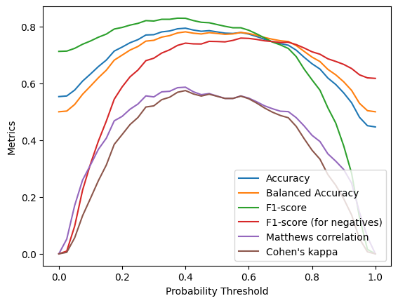
    


Accuracy is simply the percentage of correctly classified cases. The balanced accuracy is the arithmetic mean of sensitivity (also known as recall) $\frac{\text{true positives}}{\text{true positives + false positives}}$ and specificity $\frac{\text{true negatives}}{\text{true negatives + false negatives}}$. Balanced accuracy is used to alleviate the misleading nature of overall accuracy for imbalanced datasets.

The F1-score is the harmonic mean of the sensitivity and precision $\frac{\text{true positives}}{\text{true positives  + false negatives}}$ (i.e., what percentage of positives are detected; also known as positive predictive value). Notably, the F1-score focuses on the classifier's performance at detecting the positive class. To demonstrate the asymmetry of the F1-score, we also computed the F1-score for "switched" labels, i.e., the harmonic between specificity and negative predictive value.

The Matthews correlation coefficient is the Pearson correlation between predicted and observed classes. Its advantage over other scores, such as the balanced accuracy and the F1-score, is the fact that to obtain high values of the Matthews correlation coefficient close to one, all key metrics, specificity, sensitivity, and positive and negative predictive values must be high [[3](#3)]. 

Cohen's kappa coefficient measures the agreement between the predicted and observed classes by comparing the observed proportion of correctly classified data points with the expected proportion under random chance. The value of Cohen's kappa always lies between zero and the value of the Matthews correlation coefficient. Their values are always pretty close when both of them are positive (they can disagree for negative values: a classifier with a Matthews correlation coefficient of -1 can have an arbitrary value of Cohen's kappa from $[-1, 0]$) [[4](#4)].  

We observe that our predictions fairly agree with the observations. Let us check the concordance index (aka the area under the ROC curve) next.


```python
fpr, tpr, thresholds = roc_curve(obs_heart,pred_prob_heart)
plt.plot(fpr,tpr)
plt.xlabel('1 - Specificity (false positive rate)')
plt.ylabel('Sensitivity (true positive rate)');
```


    
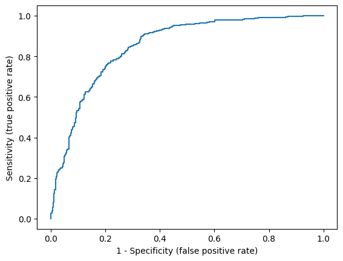
    


```python
roc_auc_score(obs_heart,pred_prob_heart)
```


    0.8517476473977339


Again, we observe that our predictions are fairly concordant with the observations. 


```python
log_loss(obs_heart, pred_prob_heart)
```


    0.47218627330677126


```python
brier_score_loss(obs_heart,pred_prob_heart)
```


    0.1518730142029965


The Brier score is significantly lower than 0.25 (corresponding to random predictions of 0.5) and predictions based on prevalence.


```python
brier_score_loss(obs_heart,(heart_final['heart_disease'].sum()/len(heart_final)).repeat(len(heart_final))) # Brier score for predictions based on prevalence
```


    0.2471509058719106


Lastly, we can check the calibration.


```python
prob_true, prob_pred = calibration_curve(obs_heart,pred_prob_heart, n_bins=10, strategy = 'quantile')
sm.graphics.abline_plot(intercept = 0,slope = 1,color = 'red')
plt.scatter(prob_true,prob_pred)
plt.xlabel('Observed Probability')
plt.ylabel('Predicted Probability');
```


    
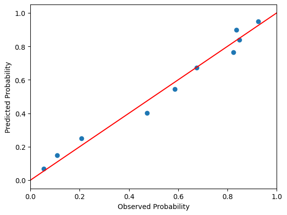
    


Overall, the logistic regression model seems to perform quite well. Of course, we need to cross-validate our results to estimate performance on new data. We will return to the cross-validation once we introduce other classifiers.

#### Linear Discriminant Analysis <a class="anchor" id="lda-heart"></a>

Linear discriminant analysis (LDA) assumes a multivariate normal distribution of predictors $X$ for the responses $Y$, i.e.,  $P(X = x|Y = k) = (2\pi)^{-p/2}|\Sigma|^{-1/2} \mathrm{exp} (-\frac{1}{2}(x-\mu_k)^T\Sigma(x-\mu_k))$ (parameters $\mu_k$ and $\Sigma$ are estimated from the data using the respective sample means and sample covariance). The probability of $k$th class $p_k$ can be subsequently computed using the Bayes rule $P(Y=k|X = x) = \frac{f_k(x)\pi_k}{\sum_j f_j(x)\pi_j}$, where $\pi_j$ are prior probabilities for $j$th class (usually estimated using the observed prevalence $\hat\pi_j = N_j/N$) [[2](#2),[5](#5)].

In our case, we assume a binary classification problem, i.e, $Y = 0, 1$. Let us denote $p = P(Y = 1|X = x)$. We can derive that $$\mathrm{logit}(p) =  \frac{p}{1-p} = \mathrm{log}\frac{\pi_1}{\pi_0} - \frac{1}{2}(\mu_1 +\mu_0)^T\Sigma^{-1} (\mu_1 -\mu_0) +  x^T\Sigma^{-1} (\mu_1 -\mu_0),$$ which is a linear function in $x$ as was also the case for the logistic regression. This implies that LDA also has a linear decision boundary for a given probability threshold. However, the coefficients in logistic regression are computed as argument maxima of the *conditional* likelihood $L(Y \mid X)$ (logistic regression is a so-called *discriminative* model). In contrast, LDA is based on the assumption of Gaussian distributions $P(X = x|Y=k)$ and maximizes the full joint likelihood $L(X, Y)$  (LDA is a so-called *generative* model) [[2](#2)].

Due to the normality assumption for $X$ (which is often clearly violated, e.g., for categorical predictors), LDA would seem to be significantly more restrictive in its use than logistic regression (logistic regression makes no distributional assumption on $X$). However, LDA and logistic regression are often quite close in predictive performance in practice, although logistic regression is considered more robust in general [[2](#2)].  This is because outliers can heavily influence the computation of class means, thereby shifting the centers of Gaussian distributions. This is even a problem in the case of *concordant* outliers (outliers with extreme values of $X$, but in the "correct" class). Logistic regression is robust to *concordant* outliers, since the sigmoid link "squishes" the effect of large values of predictors. 

Let us perform LDA and compare the results with those of the logistic model. 


```python
from sklearn.discriminant_analysis import LinearDiscriminantAnalysis

lda_heart = LinearDiscriminantAnalysis(store_covariance=True)
lda_heart_fit = lda_heart.fit(X = heart_final.iloc[:,range(0,17)], y = heart_final['heart_disease']) 
pred_prob_heart_lda = lda_heart_fit.predict_proba(heart_final.iloc[:,range(0,17)]) # predict probabilities
```

The class predictions using *predict* are based on 0.5 threshold.


```python
pred_class_heart_lda_class = lda_heart_fit.predict(heart_final.iloc[:,range(0,17)])
((pred_prob_heart_lda[:,1] > 0.5).astype(int) - pred_class_heart_lda_class)[range(20)]
```


    array([0, 0, 0, 0, 0, 0, 0, 0, 0, 0, 0, 0, 0, 0, 0, 0, 0, 0, 0, 0])


The estimated parameters can be obtained as follows.


```python
lda_heart_fit.priors_ # class priors
```


    array([0.44662309, 0.55337691])


```python
lda_heart_fit.means_ # class means for predictors 
```


    array([[5.07804878e+01, 6.56097561e-01, 5.85365854e-02, 3.39024390e-01,
            3.17073171e-01, 1.90243902e-01, 1.53658537e-01, 1.47859343e+02,
            1.73170732e-01, 1.30644130e+02, 4.71021870e-01, 1.14634146e-01,
            2.40851266e+02, 4.63414634e-02, 3.02439024e-01, 1.04878049e-01,
            3.41463415e-02],
           [5.57145669e+01, 8.97637795e-01, 4.33070866e-02, 6.69291339e-02,
            1.43700787e-01, 2.16535433e-01, 2.26377953e-01, 1.29450732e+02,
            5.21653543e-01, 1.33427158e+02, 1.17211142e+00, 1.79133858e-01,
            2.49192266e+02, 8.66141732e-02, 1.55511811e-01, 2.93307087e-01,
            6.29921260e-02]])


```python
np.matrix(lda_heart_fit.covariance_).round(3)[range(2),:]  # covariance matrix for predictors
```


    array([[ 8.2860e+01, -8.0000e-02,  8.4000e-02, -4.7300e-01,  1.6700e-01,
             5.2200e-01,  4.2100e-01, -6.1179e+01,  3.0200e-01,  3.7066e+01,
             1.5020e+00,  6.6300e-01,  2.1345e+01,  2.8100e-01,  1.3400e-01,
             2.7300e-01,  7.0000e-03],
           [-8.0000e-02,  1.5200e-01,  1.0000e-03, -9.0000e-03, -1.0000e-03,
            -1.0000e-02,  6.0000e-03, -6.6500e-01,  9.0000e-03, -1.7200e-01,
            -2.0000e-03,  7.0000e-03, -2.2880e+00,  4.0000e-03, -7.0000e-03,
             1.0000e-02,  4.0000e-03]])


Let us evaluate the prediction metrics.


```python
accuracy_scores_lda = np.zeros(41)
balanced_accuracy_scores_lda = np.zeros(41)
f1_scores_lda = np.zeros(41)
f1_scores_neg_lda = np.zeros(41)
matthews_corrcoefs_lda = np.zeros(41)
cohen_kappa_scores_lda = np.zeros(41)

for k in range(41):
    accuracy_thresholds[k] = k/40
    accuracy_scores_lda[k] = accuracy_score(obs_heart,(pred_prob_heart_lda[:,1] > accuracy_thresholds[k]).astype(int))
    balanced_accuracy_scores_lda[k] = balanced_accuracy_score(obs_heart,(pred_prob_heart_lda[:,1] > accuracy_thresholds[k]).astype(int))
    f1_scores_lda[k] = f1_score(obs_heart,(pred_prob_heart_lda[:,1] > accuracy_thresholds[k]).astype(int))
    f1_scores_neg_lda[k] = f1_score(obs_heart,(pred_prob_heart_lda[:,1] > accuracy_thresholds[k]).astype(int),pos_label=0)
    matthews_corrcoefs_lda[k] = matthews_corrcoef(obs_heart,(pred_prob_heart_lda[:,1] > accuracy_thresholds[k]).astype(int))
    cohen_kappa_scores_lda[k] = cohen_kappa_score(obs_heart,(pred_prob_heart_lda[:,1] > accuracy_thresholds[k]).astype(int))
```


```python
plt.plot(accuracy_thresholds,accuracy_scores_lda)
plt.plot(accuracy_thresholds,balanced_accuracy_scores_lda)
plt.plot(accuracy_thresholds,f1_scores_lda)
plt.plot(accuracy_thresholds,f1_scores_neg_lda)
plt.plot(accuracy_thresholds,matthews_corrcoefs_lda)
plt.plot(accuracy_thresholds,cohen_kappa_scores_lda)

plt.legend(['Accuracy','Balanced Accuracy','F1-score','F1-score (for negatives)','Matthews correlation',"Cohen's kappa"], loc="lower right")
plt.xlabel('Probability Threshold')
plt.ylabel('Metrics');
```


    
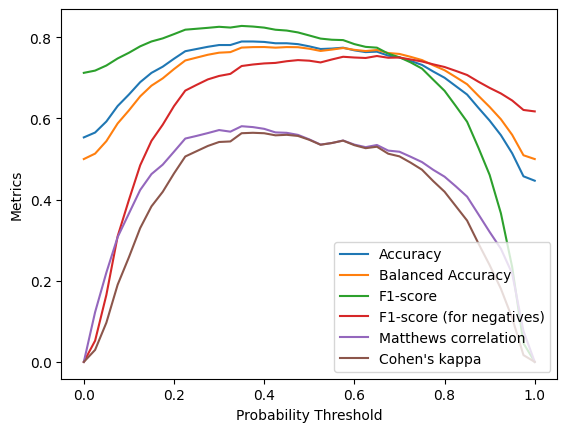
    


```python
fpr, tpr, thresholds = roc_curve(obs_heart,pred_prob_heart_lda[:,1])
plt.plot(fpr,tpr)
plt.xlabel('1 - Specificity (false positive rate)')
plt.ylabel('Sensitivity (true positive rate)');
```


    

    


```python
roc_auc_score(obs_heart,pred_prob_heart_lda[:,1])
```


    0.8504417130785481


```python
log_loss(obs_heart, pred_prob_heart_lda[:,1])
```


    0.4753977069238272


```python
brier_score_loss(obs_heart,pred_prob_heart_lda[:,1])
```


    0.15254711301673954


```python
prob_true_lda, prob_pred_lda = calibration_curve(obs_heart,pred_prob_heart_lda[:,1], n_bins=10, strategy = 'quantile')
sm.graphics.abline_plot(intercept = 0,slope = 1,color = 'red')
plt.scatter(prob_true_lda,prob_pred_lda)
plt.xlabel('Observed Probability')
plt.ylabel('Predicted Probability');
```


    
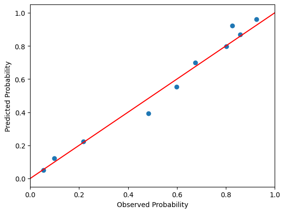
    


We observe that the metrics are pretty similar to the logistic regression.

#### Support Vector Machines <a class="anchor" id="svm-heart"></a>

Support vector machines are a family of classifier methods based on hyperplane separation via maximization of *margin*. We will first explore the classical linear SMV. Then, we will also discuss the kernel trick and kernel SVMs.  

##### Linear SVM <a class="anchor" id="svm-lin-heart"></a> 
A linear SVM is a linear classifier that selects the separating hyperplane as a solution of the optimization problem  $\text{maximize } M$  subject to $\Vert \beta \Vert = 1$, $\varepsilon \geq 0$, $y_i(x_i^T\beta + \beta_0 )\geq M(1-\xi_i)$, and $\sum_i \xi_i \leq C$, where $C>0$ is some constant. Here, we assume that the classes are denoted as $-1$ and $1$ [[2](#2), [5](#5)].  

The set $\{x \mid x^T\beta + \beta_0\}$ is the separating hyperplane for the SVM classifier. Provided that the data are perfectly linearly separable, we can find values of $\beta$ and $\beta_0$ such that  $(x^T\beta + \beta_0 ) > 0$ for all data points in class $y = 1$ and $y(x^T\beta + \beta_0 ) < 0$ for all data points in class $y = -1$. Since there are infinitely many such separating hyperplanes, the optimizer chooses that one that maximizes the *margin* $M$, the distance between the separating hyperplane and the data points from both classes.

Provided that the data are not linearly separable, some data points must be misclassified when a linear classifier is used. Consequently, a *soft margin*  $M(1-\xi_i)$ is introduced for each observation in the optimization of the margin. The missclassification error $\sum_i \xi_i$ is controlled in the optimization by a tuning hyperparameter $C$. 

Let us fit an SVM  for $C = 1$. Since the solution depends on distances in the feature space, we need to standardize the data first. We do this by implementing a simple *pipeline*.


```python
from sklearn import svm
from sklearn.pipeline import make_pipeline
from sklearn.preprocessing import StandardScaler

svm_pipeline_heart1 = make_pipeline(StandardScaler(),  svm.SVC(C=1.0, kernel = 'linear'))
svm_pipeline_heart_fit1 = svm_pipeline_heart1.fit(X = heart_final.iloc[:,range(0,17)], y = heart_final['heart_disease'])
svm_predict_heart1 = svm_pipeline_heart_fit1.predict(heart_final.iloc[:,range(0,17)])
```


```python
from sklearn.metrics import confusion_matrix
confusion_matrix(obs_heart,svm_predict_heart1) 
```


    array([[286, 124],
           [ 73, 435]])


The solution for $C = 10$ is as follows.


```python
svm_pipeline_heart2 = make_pipeline(StandardScaler(),  svm.SVC(C=100.0, kernel = 'linear'))
svm_pipeline_heart_fit2 = svm_pipeline_heart2.fit(X = heart_final.iloc[:,range(0,17)], y = heart_final['heart_disease'])
svm_predict_heart2 = svm_pipeline_heart_fit2.predict(heart_final.iloc[:,range(0,17)])
```


```python
confusion_matrix(obs_heart,svm_predict_heart2) 
```


    array([[287, 123],
           [ 74, 434]])


We observe that the solution differs slightly. To estimate the optimal value of $C$, we can use cross-validation using *GridSearchCV*. We will use the balanced accuracy as our criterion for choosing the best model.


```python
from sklearn.model_selection import GridSearchCV

parameters = {'kernel':['linear'], 'C':[0.001, 0.01, 0.1, 1, 10, 100, 1000]} # hyperparameter grid

svm_pipeline_heart3 = make_pipeline(StandardScaler(),  GridSearchCV(estimator=svm.SVC(),param_grid=parameters, scoring = 'balanced_accuracy'))
svm_pipeline_heart_fit3 = svm_pipeline_heart3.fit(X = heart_final.iloc[:,range(0,17)], y = heart_final['heart_disease'])
svm_predict_heart3 = svm_pipeline_heart_fit3.predict(heart_final.iloc[:,range(0,17)])
```

The chosen model can be obtained as follows.


```python
svm_pipeline_heart_fit3._final_estimator.best_estimator_
```


<style>#sk-container-id-1 {
  /* Definition of color scheme common for light and dark mode */
  --sklearn-color-text: #000;
  --sklearn-color-text-muted: #666;
  --sklearn-color-line: gray;
  /* Definition of color scheme for unfitted estimators */
  --sklearn-color-unfitted-level-0: #fff5e6;
  --sklearn-color-unfitted-level-1: #f6e4d2;
  --sklearn-color-unfitted-level-2: #ffe0b3;
  --sklearn-color-unfitted-level-3: chocolate;
  /* Definition of color scheme for fitted estimators */
  --sklearn-color-fitted-level-0: #f0f8ff;
  --sklearn-color-fitted-level-1: #d4ebff;
  --sklearn-color-fitted-level-2: #b3dbfd;
  --sklearn-color-fitted-level-3: cornflowerblue;

  /* Specific color for light theme */
  --sklearn-color-text-on-default-background: var(--sg-text-color, var(--theme-code-foreground, var(--jp-content-font-color1, black)));
  --sklearn-color-background: var(--sg-background-color, var(--theme-background, var(--jp-layout-color0, white)));
  --sklearn-color-border-box: var(--sg-text-color, var(--theme-code-foreground, var(--jp-content-font-color1, black)));
  --sklearn-color-icon: #696969;

  @media (prefers-color-scheme: dark) {
    /* Redefinition of color scheme for dark theme */
    --sklearn-color-text-on-default-background: var(--sg-text-color, var(--theme-code-foreground, var(--jp-content-font-color1, white)));
    --sklearn-color-background: var(--sg-background-color, var(--theme-background, var(--jp-layout-color0, #111)));
    --sklearn-color-border-box: var(--sg-text-color, var(--theme-code-foreground, var(--jp-content-font-color1, white)));
    --sklearn-color-icon: #878787;
  }
}

#sk-container-id-1 {
  color: var(--sklearn-color-text);
}

#sk-container-id-1 pre {
  padding: 0;
}

#sk-container-id-1 input.sk-hidden--visually {
  border: 0;
  clip: rect(1px 1px 1px 1px);
  clip: rect(1px, 1px, 1px, 1px);
  height: 1px;
  margin: -1px;
  overflow: hidden;
  padding: 0;
  position: absolute;
  width: 1px;
}

#sk-container-id-1 div.sk-dashed-wrapped {
  border: 1px dashed var(--sklearn-color-line);
  margin: 0 0.4em 0.5em 0.4em;
  box-sizing: border-box;
  padding-bottom: 0.4em;
  background-color: var(--sklearn-color-background);
}

#sk-container-id-1 div.sk-container {
  /* jupyter's `normalize.less` sets `[hidden] { display: none; }`
     but bootstrap.min.css set `[hidden] { display: none !important; }`
     so we also need the `!important` here to be able to override the
     default hidden behavior on the sphinx rendered scikit-learn.org.
     See: https://github.com/scikit-learn/scikit-learn/issues/21755 */
  display: inline-block !important;
  position: relative;
}

#sk-container-id-1 div.sk-text-repr-fallback {
  display: none;
}

div.sk-parallel-item,
div.sk-serial,
div.sk-item {
  /* draw centered vertical line to link estimators */
  background-image: linear-gradient(var(--sklearn-color-text-on-default-background), var(--sklearn-color-text-on-default-background));
  background-size: 2px 100%;
  background-repeat: no-repeat;
  background-position: center center;
}

/* Parallel-specific style estimator block */

#sk-container-id-1 div.sk-parallel-item::after {
  content: "";
  width: 100%;
  border-bottom: 2px solid var(--sklearn-color-text-on-default-background);
  flex-grow: 1;
}

#sk-container-id-1 div.sk-parallel {
  display: flex;
  align-items: stretch;
  justify-content: center;
  background-color: var(--sklearn-color-background);
  position: relative;
}

#sk-container-id-1 div.sk-parallel-item {
  display: flex;
  flex-direction: column;
}

#sk-container-id-1 div.sk-parallel-item:first-child::after {
  align-self: flex-end;
  width: 50%;
}

#sk-container-id-1 div.sk-parallel-item:last-child::after {
  align-self: flex-start;
  width: 50%;
}

#sk-container-id-1 div.sk-parallel-item:only-child::after {
  width: 0;
}

/* Serial-specific style estimator block */

#sk-container-id-1 div.sk-serial {
  display: flex;
  flex-direction: column;
  align-items: center;
  background-color: var(--sklearn-color-background);
  padding-right: 1em;
  padding-left: 1em;
}


/* Toggleable style: style used for estimator/Pipeline/ColumnTransformer box that is
clickable and can be expanded/collapsed.
- Pipeline and ColumnTransformer use this feature and define the default style
- Estimators will overwrite some part of the style using the `sk-estimator` class
*/

/* Pipeline and ColumnTransformer style (default) */

#sk-container-id-1 div.sk-toggleable {
  /* Default theme specific background. It is overwritten whether we have a
  specific estimator or a Pipeline/ColumnTransformer */
  background-color: var(--sklearn-color-background);
}

/* Toggleable label */
#sk-container-id-1 label.sk-toggleable__label {
  cursor: pointer;
  display: flex;
  width: 100%;
  margin-bottom: 0;
  padding: 0.5em;
  box-sizing: border-box;
  text-align: center;
  align-items: start;
  justify-content: space-between;
  gap: 0.5em;
}

#sk-container-id-1 label.sk-toggleable__label .caption {
  font-size: 0.6rem;
  font-weight: lighter;
  color: var(--sklearn-color-text-muted);
}

#sk-container-id-1 label.sk-toggleable__label-arrow:before {
  /* Arrow on the left of the label */
  content: "▸";
  float: left;
  margin-right: 0.25em;
  color: var(--sklearn-color-icon);
}

#sk-container-id-1 label.sk-toggleable__label-arrow:hover:before {
  color: var(--sklearn-color-text);
}

/* Toggleable content - dropdown */

#sk-container-id-1 div.sk-toggleable__content {
  display: none;
  text-align: left;
  /* unfitted */
  background-color: var(--sklearn-color-unfitted-level-0);
}

#sk-container-id-1 div.sk-toggleable__content.fitted {
  /* fitted */
  background-color: var(--sklearn-color-fitted-level-0);
}

#sk-container-id-1 div.sk-toggleable__content pre {
  margin: 0.2em;
  border-radius: 0.25em;
  color: var(--sklearn-color-text);
  /* unfitted */
  background-color: var(--sklearn-color-unfitted-level-0);
}

#sk-container-id-1 div.sk-toggleable__content.fitted pre {
  /* unfitted */
  background-color: var(--sklearn-color-fitted-level-0);
}

#sk-container-id-1 input.sk-toggleable__control:checked~div.sk-toggleable__content {
  /* Expand drop-down */
  display: block;
  width: 100%;
  overflow: visible;
}

#sk-container-id-1 input.sk-toggleable__control:checked~label.sk-toggleable__label-arrow:before {
  content: "▾";
}

/* Pipeline/ColumnTransformer-specific style */

#sk-container-id-1 div.sk-label input.sk-toggleable__control:checked~label.sk-toggleable__label {
  color: var(--sklearn-color-text);
  background-color: var(--sklearn-color-unfitted-level-2);
}

#sk-container-id-1 div.sk-label.fitted input.sk-toggleable__control:checked~label.sk-toggleable__label {
  background-color: var(--sklearn-color-fitted-level-2);
}

/* Estimator-specific style */

/* Colorize estimator box */
#sk-container-id-1 div.sk-estimator input.sk-toggleable__control:checked~label.sk-toggleable__label {
  /* unfitted */
  background-color: var(--sklearn-color-unfitted-level-2);
}

#sk-container-id-1 div.sk-estimator.fitted input.sk-toggleable__control:checked~label.sk-toggleable__label {
  /* fitted */
  background-color: var(--sklearn-color-fitted-level-2);
}

#sk-container-id-1 div.sk-label label.sk-toggleable__label,
#sk-container-id-1 div.sk-label label {
  /* The background is the default theme color */
  color: var(--sklearn-color-text-on-default-background);
}

/* On hover, darken the color of the background */
#sk-container-id-1 div.sk-label:hover label.sk-toggleable__label {
  color: var(--sklearn-color-text);
  background-color: var(--sklearn-color-unfitted-level-2);
}

/* Label box, darken color on hover, fitted */
#sk-container-id-1 div.sk-label.fitted:hover label.sk-toggleable__label.fitted {
  color: var(--sklearn-color-text);
  background-color: var(--sklearn-color-fitted-level-2);
}

/* Estimator label */

#sk-container-id-1 div.sk-label label {
  font-family: monospace;
  font-weight: bold;
  display: inline-block;
  line-height: 1.2em;
}

#sk-container-id-1 div.sk-label-container {
  text-align: center;
}

/* Estimator-specific */
#sk-container-id-1 div.sk-estimator {
  font-family: monospace;
  border: 1px dotted var(--sklearn-color-border-box);
  border-radius: 0.25em;
  box-sizing: border-box;
  margin-bottom: 0.5em;
  /* unfitted */
  background-color: var(--sklearn-color-unfitted-level-0);
}

#sk-container-id-1 div.sk-estimator.fitted {
  /* fitted */
  background-color: var(--sklearn-color-fitted-level-0);
}

/* on hover */
#sk-container-id-1 div.sk-estimator:hover {
  /* unfitted */
  background-color: var(--sklearn-color-unfitted-level-2);
}

#sk-container-id-1 div.sk-estimator.fitted:hover {
  /* fitted */
  background-color: var(--sklearn-color-fitted-level-2);
}

/* Specification for estimator info (e.g. "i" and "?") */

/* Common style for "i" and "?" */

.sk-estimator-doc-link,
a:link.sk-estimator-doc-link,
a:visited.sk-estimator-doc-link {
  float: right;
  font-size: smaller;
  line-height: 1em;
  font-family: monospace;
  background-color: var(--sklearn-color-background);
  border-radius: 1em;
  height: 1em;
  width: 1em;
  text-decoration: none !important;
  margin-left: 0.5em;
  text-align: center;
  /* unfitted */
  border: var(--sklearn-color-unfitted-level-1) 1pt solid;
  color: var(--sklearn-color-unfitted-level-1);
}

.sk-estimator-doc-link.fitted,
a:link.sk-estimator-doc-link.fitted,
a:visited.sk-estimator-doc-link.fitted {
  /* fitted */
  border: var(--sklearn-color-fitted-level-1) 1pt solid;
  color: var(--sklearn-color-fitted-level-1);
}

/* On hover */
div.sk-estimator:hover .sk-estimator-doc-link:hover,
.sk-estimator-doc-link:hover,
div.sk-label-container:hover .sk-estimator-doc-link:hover,
.sk-estimator-doc-link:hover {
  /* unfitted */
  background-color: var(--sklearn-color-unfitted-level-3);
  color: var(--sklearn-color-background);
  text-decoration: none;
}

div.sk-estimator.fitted:hover .sk-estimator-doc-link.fitted:hover,
.sk-estimator-doc-link.fitted:hover,
div.sk-label-container:hover .sk-estimator-doc-link.fitted:hover,
.sk-estimator-doc-link.fitted:hover {
  /* fitted */
  background-color: var(--sklearn-color-fitted-level-3);
  color: var(--sklearn-color-background);
  text-decoration: none;
}

/* Span, style for the box shown on hovering the info icon */
.sk-estimator-doc-link span {
  display: none;
  z-index: 9999;
  position: relative;
  font-weight: normal;
  right: .2ex;
  padding: .5ex;
  margin: .5ex;
  width: min-content;
  min-width: 20ex;
  max-width: 50ex;
  color: var(--sklearn-color-text);
  box-shadow: 2pt 2pt 4pt #999;
  /* unfitted */
  background: var(--sklearn-color-unfitted-level-0);
  border: .5pt solid var(--sklearn-color-unfitted-level-3);
}

.sk-estimator-doc-link.fitted span {
  /* fitted */
  background: var(--sklearn-color-fitted-level-0);
  border: var(--sklearn-color-fitted-level-3);
}

.sk-estimator-doc-link:hover span {
  display: block;
}

/* "?"-specific style due to the `<a>` HTML tag */

#sk-container-id-1 a.estimator_doc_link {
  float: right;
  font-size: 1rem;
  line-height: 1em;
  font-family: monospace;
  background-color: var(--sklearn-color-background);
  border-radius: 1rem;
  height: 1rem;
  width: 1rem;
  text-decoration: none;
  /* unfitted */
  color: var(--sklearn-color-unfitted-level-1);
  border: var(--sklearn-color-unfitted-level-1) 1pt solid;
}

#sk-container-id-1 a.estimator_doc_link.fitted {
  /* fitted */
  border: var(--sklearn-color-fitted-level-1) 1pt solid;
  color: var(--sklearn-color-fitted-level-1);
}

/* On hover */
#sk-container-id-1 a.estimator_doc_link:hover {
  /* unfitted */
  background-color: var(--sklearn-color-unfitted-level-3);
  color: var(--sklearn-color-background);
  text-decoration: none;
}

#sk-container-id-1 a.estimator_doc_link.fitted:hover {
  /* fitted */
  background-color: var(--sklearn-color-fitted-level-3);
}

.estimator-table summary {
    padding: .5rem;
    font-family: monospace;
    cursor: pointer;
}

.estimator-table details[open] {
    padding-left: 0.1rem;
    padding-right: 0.1rem;
    padding-bottom: 0.3rem;
}

.estimator-table .parameters-table {
    margin-left: auto !important;
    margin-right: auto !important;
}

.estimator-table .parameters-table tr:nth-child(odd) {
    background-color: #fff;
}

.estimator-table .parameters-table tr:nth-child(even) {
    background-color: #f6f6f6;
}

.estimator-table .parameters-table tr:hover {
    background-color: #e0e0e0;
}

.estimator-table table td {
    border: 1px solid rgba(106, 105, 104, 0.232);
}

.user-set td {
    color:rgb(255, 94, 0);
    text-align: left;
}

.user-set td.value pre {
    color:rgb(255, 94, 0) !important;
    background-color: transparent !important;
}

.default td {
    color: black;
    text-align: left;
}

.user-set td i,
.default td i {
    color: black;
}

.copy-paste-icon {
    background-image: url(data:image/svg+xml;base64,PHN2ZyB4bWxucz0iaHR0cDovL3d3dy53My5vcmcvMjAwMC9zdmciIHZpZXdCb3g9IjAgMCA0NDggNTEyIj48IS0tIUZvbnQgQXdlc29tZSBGcmVlIDYuNy4yIGJ5IEBmb250YXdlc29tZSAtIGh0dHBzOi8vZm9udGF3ZXNvbWUuY29tIExpY2Vuc2UgLSBodHRwczovL2ZvbnRhd2Vzb21lLmNvbS9saWNlbnNlL2ZyZWUgQ29weXJpZ2h0IDIwMjUgRm9udGljb25zLCBJbmMuLS0+PHBhdGggZD0iTTIwOCAwTDMzMi4xIDBjMTIuNyAwIDI0LjkgNS4xIDMzLjkgMTQuMWw2Ny45IDY3LjljOSA5IDE0LjEgMjEuMiAxNC4xIDMzLjlMNDQ4IDMzNmMwIDI2LjUtMjEuNSA0OC00OCA0OGwtMTkyIDBjLTI2LjUgMC00OC0yMS41LTQ4LTQ4bDAtMjg4YzAtMjYuNSAyMS41LTQ4IDQ4LTQ4ek00OCAxMjhsODAgMCAwIDY0LTY0IDAgMCAyNTYgMTkyIDAgMC0zMiA2NCAwIDAgNDhjMCAyNi41LTIxLjUgNDgtNDggNDhMNDggNTEyYy0yNi41IDAtNDgtMjEuNS00OC00OEwwIDE3NmMwLTI2LjUgMjEuNS00OCA0OC00OHoiLz48L3N2Zz4=);
    background-repeat: no-repeat;
    background-size: 14px 14px;
    background-position: 0;
    display: inline-block;
    width: 14px;
    height: 14px;
    cursor: pointer;
}
</style><body><div id="sk-container-id-1" class="sk-top-container"><div class="sk-text-repr-fallback"><pre>SVC(C=0.01, kernel=&#x27;linear&#x27;)</pre><b>In a Jupyter environment, please rerun this cell to show the HTML representation or trust the notebook. <br />On GitHub, the HTML representation is unable to render, please try loading this page with nbviewer.org.</b></div><div class="sk-container" hidden><div class="sk-item"><div class="sk-estimator fitted sk-toggleable"><input class="sk-toggleable__control sk-hidden--visually" id="sk-estimator-id-1" type="checkbox" checked><label for="sk-estimator-id-1" class="sk-toggleable__label fitted sk-toggleable__label-arrow"><div><div>SVC</div></div><div><a class="sk-estimator-doc-link fitted" rel="noreferrer" target="_blank" href="https://scikit-learn.org/1.7/modules/generated/sklearn.svm.SVC.html">?<span>Documentation for SVC</span></a><span class="sk-estimator-doc-link fitted">i<span>Fitted</span></span></div></label><div class="sk-toggleable__content fitted" data-param-prefix="">
        <div class="estimator-table">
            <details>
                <summary>Parameters</summary>
                <table class="parameters-table">
                  <tbody>

        <tr class="user-set">
            <td><i class="copy-paste-icon"
                 onclick="copyToClipboard('C',
                          this.parentElement.nextElementSibling)"
            ></i></td>
            <td class="param">C&nbsp;</td>
            <td class="value">0.01</td>
        </tr>


        <tr class="user-set">
            <td><i class="copy-paste-icon"
                 onclick="copyToClipboard('kernel',
                          this.parentElement.nextElementSibling)"
            ></i></td>
            <td class="param">kernel&nbsp;</td>
            <td class="value">&#x27;linear&#x27;</td>
        </tr>


        <tr class="default">
            <td><i class="copy-paste-icon"
                 onclick="copyToClipboard('degree',
                          this.parentElement.nextElementSibling)"
            ></i></td>
            <td class="param">degree&nbsp;</td>
            <td class="value">3</td>
        </tr>


        <tr class="default">
            <td><i class="copy-paste-icon"
                 onclick="copyToClipboard('gamma',
                          this.parentElement.nextElementSibling)"
            ></i></td>
            <td class="param">gamma&nbsp;</td>
            <td class="value">&#x27;scale&#x27;</td>
        </tr>


        <tr class="default">
            <td><i class="copy-paste-icon"
                 onclick="copyToClipboard('coef0',
                          this.parentElement.nextElementSibling)"
            ></i></td>
            <td class="param">coef0&nbsp;</td>
            <td class="value">0.0</td>
        </tr>


        <tr class="default">
            <td><i class="copy-paste-icon"
                 onclick="copyToClipboard('shrinking',
                          this.parentElement.nextElementSibling)"
            ></i></td>
            <td class="param">shrinking&nbsp;</td>
            <td class="value">True</td>
        </tr>


        <tr class="default">
            <td><i class="copy-paste-icon"
                 onclick="copyToClipboard('probability',
                          this.parentElement.nextElementSibling)"
            ></i></td>
            <td class="param">probability&nbsp;</td>
            <td class="value">False</td>
        </tr>


        <tr class="default">
            <td><i class="copy-paste-icon"
                 onclick="copyToClipboard('tol',
                          this.parentElement.nextElementSibling)"
            ></i></td>
            <td class="param">tol&nbsp;</td>
            <td class="value">0.001</td>
        </tr>


        <tr class="default">
            <td><i class="copy-paste-icon"
                 onclick="copyToClipboard('cache_size',
                          this.parentElement.nextElementSibling)"
            ></i></td>
            <td class="param">cache_size&nbsp;</td>
            <td class="value">200</td>
        </tr>


        <tr class="default">
            <td><i class="copy-paste-icon"
                 onclick="copyToClipboard('class_weight',
                          this.parentElement.nextElementSibling)"
            ></i></td>
            <td class="param">class_weight&nbsp;</td>
            <td class="value">None</td>
        </tr>


        <tr class="default">
            <td><i class="copy-paste-icon"
                 onclick="copyToClipboard('verbose',
                          this.parentElement.nextElementSibling)"
            ></i></td>
            <td class="param">verbose&nbsp;</td>
            <td class="value">False</td>
        </tr>


        <tr class="default">
            <td><i class="copy-paste-icon"
                 onclick="copyToClipboard('max_iter',
                          this.parentElement.nextElementSibling)"
            ></i></td>
            <td class="param">max_iter&nbsp;</td>
            <td class="value">-1</td>
        </tr>


        <tr class="default">
            <td><i class="copy-paste-icon"
                 onclick="copyToClipboard('decision_function_shape',
                          this.parentElement.nextElementSibling)"
            ></i></td>
            <td class="param">decision_function_shape&nbsp;</td>
            <td class="value">&#x27;ovr&#x27;</td>
        </tr>


        <tr class="default">
            <td><i class="copy-paste-icon"
                 onclick="copyToClipboard('break_ties',
                          this.parentElement.nextElementSibling)"
            ></i></td>
            <td class="param">break_ties&nbsp;</td>
            <td class="value">False</td>
        </tr>


        <tr class="default">
            <td><i class="copy-paste-icon"
                 onclick="copyToClipboard('random_state',
                          this.parentElement.nextElementSibling)"
            ></i></td>
            <td class="param">random_state&nbsp;</td>
            <td class="value">None</td>
        </tr>

                  </tbody>
                </table>
            </details>
        </div>
    </div></div></div></div></div><script>function copyToClipboard(text, element) {
    // Get the parameter prefix from the closest toggleable content
    const toggleableContent = element.closest('.sk-toggleable__content');
    const paramPrefix = toggleableContent ? toggleableContent.dataset.paramPrefix : '';
    const fullParamName = paramPrefix ? `${paramPrefix}${text}` : text;

    const originalStyle = element.style;
    const computedStyle = window.getComputedStyle(element);
    const originalWidth = computedStyle.width;
    const originalHTML = element.innerHTML.replace('Copied!', '');

    navigator.clipboard.writeText(fullParamName)
        .then(() => {
            element.style.width = originalWidth;
            element.style.color = 'green';
            element.innerHTML = "Copied!";

            setTimeout(() => {
                element.innerHTML = originalHTML;
                element.style = originalStyle;
            }, 2000);
        })
        .catch(err => {
            console.error('Failed to copy:', err);
            element.style.color = 'red';
            element.innerHTML = "Failed!";
            setTimeout(() => {
                element.innerHTML = originalHTML;
                element.style = originalStyle;
            }, 2000);
        });
    return false;
}

document.querySelectorAll('.fa-regular.fa-copy').forEach(function(element) {
    const toggleableContent = element.closest('.sk-toggleable__content');
    const paramPrefix = toggleableContent ? toggleableContent.dataset.paramPrefix : '';
    const paramName = element.parentElement.nextElementSibling.textContent.trim();
    const fullParamName = paramPrefix ? `${paramPrefix}${paramName}` : paramName;

    element.setAttribute('title', fullParamName);
});
</script></body>


```python
svm_pipeline_heart_fit3._final_estimator.cv_results_
```


    {'mean_fit_time': array([8.22877884e-03, 6.64825439e-03, 8.09612274e-03, 1.39503002e-02,
            6.40759468e-02, 6.14347172e-01, 6.97907276e+00]),
     'std_fit_time': array([0.00160447, 0.00161604, 0.00165144, 0.0022364 , 0.00924734,
            0.18489613, 1.16999427]),
     'mean_score_time': array([0.00288868, 0.00235806, 0.00206585, 0.00193963, 0.00184565,
            0.00200477, 0.00188961]),
     'std_score_time': array([4.02484458e-04, 3.47924179e-04, 2.80269184e-04, 1.17512510e-04,
            9.86396645e-05, 1.98110179e-04, 1.44915010e-04]),
     'param_C': masked_array(data=[0.001, 0.01, 0.1, 1.0, 10.0, 100.0, 1000.0],
                  mask=[False, False, False, False, False, False, False],
            fill_value=1e+20),
     'param_kernel': masked_array(data=['linear', 'linear', 'linear', 'linear', 'linear',
                        'linear', 'linear'],
                  mask=[False, False, False, False, False, False, False],
            fill_value='?',
                 dtype=object),
     'params': [{'C': 0.001, 'kernel': 'linear'},
      {'C': 0.01, 'kernel': 'linear'},
      {'C': 0.1, 'kernel': 'linear'},
      {'C': 1, 'kernel': 'linear'},
      {'C': 10, 'kernel': 'linear'},
      {'C': 100, 'kernel': 'linear'},
      {'C': 1000, 'kernel': 'linear'}],
     'split0_test_score': array([0.7631516 , 0.81910569, 0.82771401, 0.82771401, 0.82771401,
            0.82771401, 0.82771401]),
     'split1_test_score': array([0.74713056, 0.75920612, 0.72740316, 0.72740316, 0.7225012 ,
            0.7225012 , 0.7225012 ]),
     'split2_test_score': array([0.8448111 , 0.84708274, 0.83357245, 0.83357245, 0.83357245,
            0.83357245, 0.83357245]),
     'split3_test_score': array([0.80071239, 0.79884086, 0.78398937, 0.78398937, 0.78398937,
            0.78893987, 0.78893987]),
     'split4_test_score': array([0.56025115, 0.56900507, 0.56290751, 0.56900507, 0.56900507,
            0.56900507, 0.56900507]),
     'mean_test_score': array([0.74321136, 0.7586481 , 0.7471173 , 0.74833681, 0.74735642,
            0.74834652, 0.74834652]),
     'std_test_score': array([0.09748465, 0.09905156, 0.09965116, 0.09740128, 0.09763146,
            0.09802226, 0.09802226]),
     'rank_test_score': array([7, 1, 6, 4, 5, 2, 2], dtype=int32)}


We observe that the best results were obtained for $C = 0.01$.

The SVM classifier seems quite different from the remaining models we used up to this point. The model was described as essentially a solution to a geometric problem, without any underlying probability model. However, it turns out that linear SVMs are not that different from other regression approaches, such as logistic regression. It can be shown that the optimization problem used for determining the separating hyperplane is equivalent to the following problem. $$ \text{minimize}_{\beta,\beta_0} \sum_i \max[0,1-y_i(x_i^T\beta + \beta_0)] + \lambda \Vert\beta \Vert^2$$ for some appropriate value of $\lambda$ (corresponding to our choice of $C$). We see that the solution to the linear SVM can be described as a minimizer of the so-called *hinge loss* (which actually has a shape quite similar to the log loss used in logistic regression) with a *ridge* penalty, i.e., the optimized term has a very familiar form $L(X,Y;\beta) + \lambda \Vert\beta \Vert^2$. We also observe that the hyperparameter $C$ is tied to the regularization of the fit [[5](#5)].

One key difference between SVMs and classifiers we considered so far is that SVMs do not provide estimated class probabilities. To obtain these, we can use *Platt scaling*, which fits the scores obtained from SVM by logistic regression.


```python
svm_pipeline_heart_best = make_pipeline(StandardScaler(),  svm.SVC(C=0.01, kernel = 'linear', probability = True))
svm_pipeline_heart_fit_best = svm_pipeline_heart_best.fit(X = heart_final.iloc[:,range(0,17)], y = heart_final['heart_disease'])
pred_prob_heart_svm = svm_pipeline_heart_fit_best.predict_proba(heart_final.iloc[:,range(0,17)])
pred_prob_heart_svm
```


    array([[0.24855727, 0.75144273],
           [0.08379629, 0.91620371],
           [0.03914627, 0.96085373],
           ...,
           [0.13303399, 0.86696601],
           [0.21704878, 0.78295122],
           [0.39015479, 0.60984521]])


Let us check the performance metrics.


```python
accuracy_scores_svm = np.zeros(41)
balanced_accuracy_scores_svm = np.zeros(41)
f1_scores_svm = np.zeros(41)
f1_scores_neg_svm = np.zeros(41)
matthews_corrcoefs_svm = np.zeros(41)
cohen_kappa_scores_svm = np.zeros(41)

for k in range(41):
    accuracy_thresholds[k] = k/40
    accuracy_scores_svm[k] = accuracy_score(obs_heart,(pred_prob_heart_svm[:,1] > accuracy_thresholds[k]).astype(int))
    balanced_accuracy_scores_svm[k] = balanced_accuracy_score(obs_heart,(pred_prob_heart_svm[:,1] > accuracy_thresholds[k]).astype(int))
    f1_scores_svm[k] = f1_score(obs_heart,(pred_prob_heart_svm[:,1] > accuracy_thresholds[k]).astype(int))
    f1_scores_neg_svm[k] = f1_score(obs_heart,(pred_prob_heart_svm[:,1] > accuracy_thresholds[k]).astype(int),pos_label=0)
    matthews_corrcoefs_svm[k] = matthews_corrcoef(obs_heart,(pred_prob_heart_svm[:,1] > accuracy_thresholds[k]).astype(int))
    cohen_kappa_scores_svm[k] = cohen_kappa_score(obs_heart,(pred_prob_heart_svm[:,1] > accuracy_thresholds[k]).astype(int))
```


```python
plt.plot(accuracy_thresholds,accuracy_scores_svm)
plt.plot(accuracy_thresholds,balanced_accuracy_scores_svm)
plt.plot(accuracy_thresholds,f1_scores_svm)
plt.plot(accuracy_thresholds,f1_scores_neg_svm)
plt.plot(accuracy_thresholds,matthews_corrcoefs_svm)
plt.plot(accuracy_thresholds,cohen_kappa_scores_svm)

plt.legend(['Accuracy','Balanced Accuracy','F1-score','F1-score (for negatives)','Matthews correlation',"Cohen's kappa"], loc="lower right")
plt.xlabel('Probability Threshold')
plt.ylabel('Metrics');
```


    

    


```python
fpr, tpr, thresholds = roc_curve(obs_heart,pred_prob_heart_svm[:,1])
plt.plot(fpr,tpr)
plt.xlabel('1 - Specificity (false positive rate)')
plt.ylabel('Sensitivity (true positive rate)');
```


    
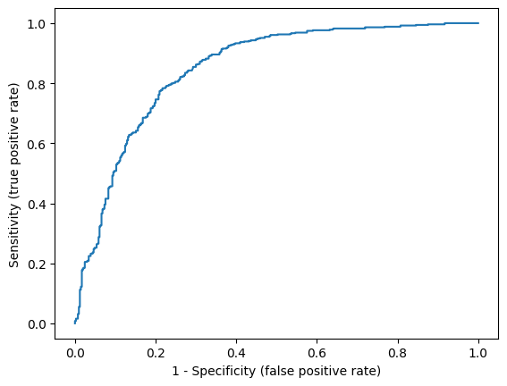
    


```python
roc_auc_score(obs_heart,pred_prob_heart_svm[:,1])
```


    0.8486748607643555


```python
log_loss(obs_heart, pred_prob_heart_svm[:,1])
```


    0.4754906903608862


```python
brier_score_loss(obs_heart,pred_prob_heart_svm[:,1])
```


    0.15231116103340167


```python
prob_true_svm, prob_pred_svm = calibration_curve(obs_heart,pred_prob_heart_svm[:,1], n_bins=10, strategy = 'quantile')
sm.graphics.abline_plot(intercept = 0,slope = 1,color = 'red')
plt.scatter(prob_true_svm,prob_pred_svm)
plt.xlabel('Observed Probability')
plt.ylabel('Predicted Probability');
```


    
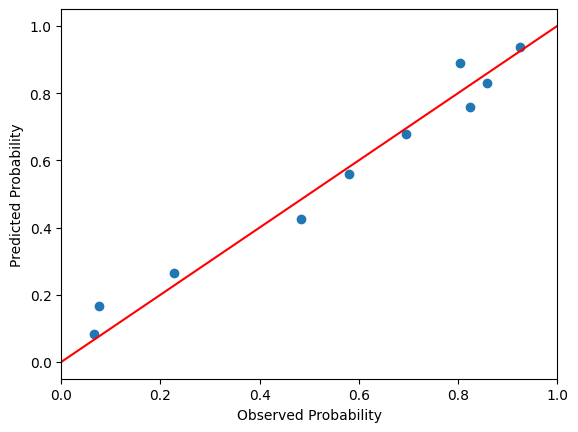
    


As expected, the metrics are again quite similar to logistic regression and LDA.

##### Kernel Trick and Kernel SVM <a class="anchor" id="kernel-trick-heart"></a>

One important property of SVMs is the fact that the solution depends on features $X$ merely via the inner products $\langle x_i,x_j \rangle = x_i^Tx_j$. This can be seen by deriving the dual optimization problem for the SVM [[2](#2),[5](#5)] $$\text{max } \sum_i\alpha_i - \frac{1}{2} \sum_i \sum_j \alpha_i \alpha_j y_i y_j \langle x_i,x_j \rangle$$ subject to $\sum_i \alpha_i y_i = 0$ and $0 \leq \alpha_i \leq C$. We would also get from the KKT conditions used to derive the dual problem that $\beta = \sum_i \alpha_i y_i x_i$.  Consequently, the classification hyperplane  meets $f(x)  = \beta_0 + x^T \beta = \beta_0 + \sum_i \alpha_i y_i \langle x,x_i \rangle = \beta_0 + \sum_i \tilde{\alpha_i} \langle x,x_i \rangle$ [[2](#2),[5](#5)]. In addition, since $\alpha_i$ are Lagrange multipliers that are non-zero only for active constraints (in our case,  $y_i(x_i^T\beta + \beta_0 ) =  M(1-\xi_i)$), we conclude that the SVM classifier depends merely on several so-called *support vectors* (hence, the name of the method). Intuitively, this makes sense; the data points that lie deep in the "correct" half-space do not influence the coefficients of the optimal separating hyperplane. This also means that the SVM is robust to concordant outliers. 

These derivations imply that to obtain a nonlinear classifier on $X$, we do not need to specify an appropriate transformation of the feature space to get a new feature space $\phi(X)$, where the data would be well separated. Instead, we can employ the *kernel trick*: we pick an inner product using a *kernel* $\langle \phi(x_i),\phi(x_j) \rangle = K(x_i,x_j)$ without explicitly stating the transformation $\phi$. Naturally, not all functions $K(x_i,x_j)$ define a proper inner product. The two most popular so-called *positive-definite kernel* functions that do are [[5](#5)]  
- polynomial kernel $K(x_i,x_j) = (\gamma \langle x_i,x_j \rangle + r)^d$, where $\gamma >0$, $d \geq 1$, $r\geq 0$
- radial kernel $K(x_i,x_j) = \mathrm{exp}(-\gamma \Vert x_i-x_j \Vert^2)$, where $\gamma >0$

Another popular kernel function is the sigmoid kernel $\mathrm{tanh}(\gamma \langle x_i,x_j \rangle + r)$. However, this kernel is not always positive-definite (depending on parameter values), and thus a sigmoid kernel might not define an inner product (see Mercer's theorem, e.g., [[6](#6)]). From a computational standpoint, this means that the underlying optimization problem is no longer guaranteed to be convex (the optimal objective value might even be $-\infty$) [[7](#7)].

We should note here that this "kernelization" is not something *unique* to SVM. On the contrary, kernel SVM is just a special case of the application of the *representer theorem* [[8](#8)]. It can be shownn that  that any minimizer function $\phi^*$ from a so-called *reproducing kernel Hilbert space* of functions $\mathcal{H}_K$ given by a positive-definite kernel $K$ (from Moore–Aronszajn theorem kernel $K$ defines $\mathcal{H}_K$) $$\phi^*= \text{argmin}_{\phi \in \mathcal{H}_K} E(y_1,x_1,\phi(x_1), \ldots, y_n,x_n,\phi(x_n) + g(\Vert \phi \Vert)_{\mathcal{H}_K},$$ where $E$ is an error function and $g$ is an increasing non-negative function,  can be expressed as $\phi^* (x) = \sum_i \alpha_i^* K(x,x_i)$ for some real $\alpha^*_i$. Thus, for example, if we want to "kernelize" ridge regression (we will assume centered responses, i.e., no intercept in the model)
$$\text{minimize}_{\beta} \frac{1}{n} \sum_i (y_i - x_i^T\beta)^2 + \lambda\Vert \beta \Vert^2,$$ we restate the problem as $$\text{minimize}_{\phi \in \mathcal{H}_K} \frac{1}{n} \sum_i (y_i - \phi(x_i))^2 + \lambda\Vert \phi \Vert_{\mathcal{H}_K}^2$$ and the solution from the representer theorem is $\phi^* (x) = \sum_i \alpha_i^*, K(x,x_i)$. In fact,  $\alpha^*  = (G+\lambda I)^{-1}y$ and $G_{i,j} = \langle x_i,x_j \rangle$ is the Gram matrix of $K$, which can be derived by substituting back in the solution from the representer theorem and solving the optimization [[6](#6)].

Similarly, kernel SVM can be understood as an application of the representer theorem on the hinge loss (although we saw that it can also be derived just from the dual problem). Looking at the representer theorem, we also got an alternative interpretation of the kernel trick. By choosing a kernel, we picked a transformation of the feature space that is optimal (in the space induced by the kernel) with respect to our cost. 

Returning to SVMs, let us fit an SVM based on a radial kernel. We need to optimize for two parameters: $C$ and $\gamma$.


```python
parameters_rbf = {'kernel':['rbf'], 'C':[0.001, 0.01, 0.1, 1, 10, 100, 1000], 'gamma':[0.001, 0.01, 0.1, 1, 10, 100, 1000]}
svm_pipeline_heart_rbf = make_pipeline(StandardScaler(),  GridSearchCV(estimator=svm.SVC(probability=True),param_grid=parameters_rbf, scoring = 'balanced_accuracy'))
svm_pipeline_heart_rbf_fit = svm_pipeline_heart_rbf.fit(X = heart_final.iloc[:,range(0,17)], y = heart_final['heart_disease'])
svm_pipeline_heart_rbf_fit._final_estimator.best_estimator_
```


<style>#sk-container-id-2 {
  /* Definition of color scheme common for light and dark mode */
  --sklearn-color-text: #000;
  --sklearn-color-text-muted: #666;
  --sklearn-color-line: gray;
  /* Definition of color scheme for unfitted estimators */
  --sklearn-color-unfitted-level-0: #fff5e6;
  --sklearn-color-unfitted-level-1: #f6e4d2;
  --sklearn-color-unfitted-level-2: #ffe0b3;
  --sklearn-color-unfitted-level-3: chocolate;
  /* Definition of color scheme for fitted estimators */
  --sklearn-color-fitted-level-0: #f0f8ff;
  --sklearn-color-fitted-level-1: #d4ebff;
  --sklearn-color-fitted-level-2: #b3dbfd;
  --sklearn-color-fitted-level-3: cornflowerblue;

  /* Specific color for light theme */
  --sklearn-color-text-on-default-background: var(--sg-text-color, var(--theme-code-foreground, var(--jp-content-font-color1, black)));
  --sklearn-color-background: var(--sg-background-color, var(--theme-background, var(--jp-layout-color0, white)));
  --sklearn-color-border-box: var(--sg-text-color, var(--theme-code-foreground, var(--jp-content-font-color1, black)));
  --sklearn-color-icon: #696969;

  @media (prefers-color-scheme: dark) {
    /* Redefinition of color scheme for dark theme */
    --sklearn-color-text-on-default-background: var(--sg-text-color, var(--theme-code-foreground, var(--jp-content-font-color1, white)));
    --sklearn-color-background: var(--sg-background-color, var(--theme-background, var(--jp-layout-color0, #111)));
    --sklearn-color-border-box: var(--sg-text-color, var(--theme-code-foreground, var(--jp-content-font-color1, white)));
    --sklearn-color-icon: #878787;
  }
}

#sk-container-id-2 {
  color: var(--sklearn-color-text);
}

#sk-container-id-2 pre {
  padding: 0;
}

#sk-container-id-2 input.sk-hidden--visually {
  border: 0;
  clip: rect(1px 1px 1px 1px);
  clip: rect(1px, 1px, 1px, 1px);
  height: 1px;
  margin: -1px;
  overflow: hidden;
  padding: 0;
  position: absolute;
  width: 1px;
}

#sk-container-id-2 div.sk-dashed-wrapped {
  border: 1px dashed var(--sklearn-color-line);
  margin: 0 0.4em 0.5em 0.4em;
  box-sizing: border-box;
  padding-bottom: 0.4em;
  background-color: var(--sklearn-color-background);
}

#sk-container-id-2 div.sk-container {
  /* jupyter's `normalize.less` sets `[hidden] { display: none; }`
     but bootstrap.min.css set `[hidden] { display: none !important; }`
     so we also need the `!important` here to be able to override the
     default hidden behavior on the sphinx rendered scikit-learn.org.
     See: https://github.com/scikit-learn/scikit-learn/issues/21755 */
  display: inline-block !important;
  position: relative;
}

#sk-container-id-2 div.sk-text-repr-fallback {
  display: none;
}

div.sk-parallel-item,
div.sk-serial,
div.sk-item {
  /* draw centered vertical line to link estimators */
  background-image: linear-gradient(var(--sklearn-color-text-on-default-background), var(--sklearn-color-text-on-default-background));
  background-size: 2px 100%;
  background-repeat: no-repeat;
  background-position: center center;
}

/* Parallel-specific style estimator block */

#sk-container-id-2 div.sk-parallel-item::after {
  content: "";
  width: 100%;
  border-bottom: 2px solid var(--sklearn-color-text-on-default-background);
  flex-grow: 1;
}

#sk-container-id-2 div.sk-parallel {
  display: flex;
  align-items: stretch;
  justify-content: center;
  background-color: var(--sklearn-color-background);
  position: relative;
}

#sk-container-id-2 div.sk-parallel-item {
  display: flex;
  flex-direction: column;
}

#sk-container-id-2 div.sk-parallel-item:first-child::after {
  align-self: flex-end;
  width: 50%;
}

#sk-container-id-2 div.sk-parallel-item:last-child::after {
  align-self: flex-start;
  width: 50%;
}

#sk-container-id-2 div.sk-parallel-item:only-child::after {
  width: 0;
}

/* Serial-specific style estimator block */

#sk-container-id-2 div.sk-serial {
  display: flex;
  flex-direction: column;
  align-items: center;
  background-color: var(--sklearn-color-background);
  padding-right: 1em;
  padding-left: 1em;
}


/* Toggleable style: style used for estimator/Pipeline/ColumnTransformer box that is
clickable and can be expanded/collapsed.
- Pipeline and ColumnTransformer use this feature and define the default style
- Estimators will overwrite some part of the style using the `sk-estimator` class
*/

/* Pipeline and ColumnTransformer style (default) */

#sk-container-id-2 div.sk-toggleable {
  /* Default theme specific background. It is overwritten whether we have a
  specific estimator or a Pipeline/ColumnTransformer */
  background-color: var(--sklearn-color-background);
}

/* Toggleable label */
#sk-container-id-2 label.sk-toggleable__label {
  cursor: pointer;
  display: flex;
  width: 100%;
  margin-bottom: 0;
  padding: 0.5em;
  box-sizing: border-box;
  text-align: center;
  align-items: start;
  justify-content: space-between;
  gap: 0.5em;
}

#sk-container-id-2 label.sk-toggleable__label .caption {
  font-size: 0.6rem;
  font-weight: lighter;
  color: var(--sklearn-color-text-muted);
}

#sk-container-id-2 label.sk-toggleable__label-arrow:before {
  /* Arrow on the left of the label */
  content: "▸";
  float: left;
  margin-right: 0.25em;
  color: var(--sklearn-color-icon);
}

#sk-container-id-2 label.sk-toggleable__label-arrow:hover:before {
  color: var(--sklearn-color-text);
}

/* Toggleable content - dropdown */

#sk-container-id-2 div.sk-toggleable__content {
  display: none;
  text-align: left;
  /* unfitted */
  background-color: var(--sklearn-color-unfitted-level-0);
}

#sk-container-id-2 div.sk-toggleable__content.fitted {
  /* fitted */
  background-color: var(--sklearn-color-fitted-level-0);
}

#sk-container-id-2 div.sk-toggleable__content pre {
  margin: 0.2em;
  border-radius: 0.25em;
  color: var(--sklearn-color-text);
  /* unfitted */
  background-color: var(--sklearn-color-unfitted-level-0);
}

#sk-container-id-2 div.sk-toggleable__content.fitted pre {
  /* unfitted */
  background-color: var(--sklearn-color-fitted-level-0);
}

#sk-container-id-2 input.sk-toggleable__control:checked~div.sk-toggleable__content {
  /* Expand drop-down */
  display: block;
  width: 100%;
  overflow: visible;
}

#sk-container-id-2 input.sk-toggleable__control:checked~label.sk-toggleable__label-arrow:before {
  content: "▾";
}

/* Pipeline/ColumnTransformer-specific style */

#sk-container-id-2 div.sk-label input.sk-toggleable__control:checked~label.sk-toggleable__label {
  color: var(--sklearn-color-text);
  background-color: var(--sklearn-color-unfitted-level-2);
}

#sk-container-id-2 div.sk-label.fitted input.sk-toggleable__control:checked~label.sk-toggleable__label {
  background-color: var(--sklearn-color-fitted-level-2);
}

/* Estimator-specific style */

/* Colorize estimator box */
#sk-container-id-2 div.sk-estimator input.sk-toggleable__control:checked~label.sk-toggleable__label {
  /* unfitted */
  background-color: var(--sklearn-color-unfitted-level-2);
}

#sk-container-id-2 div.sk-estimator.fitted input.sk-toggleable__control:checked~label.sk-toggleable__label {
  /* fitted */
  background-color: var(--sklearn-color-fitted-level-2);
}

#sk-container-id-2 div.sk-label label.sk-toggleable__label,
#sk-container-id-2 div.sk-label label {
  /* The background is the default theme color */
  color: var(--sklearn-color-text-on-default-background);
}

/* On hover, darken the color of the background */
#sk-container-id-2 div.sk-label:hover label.sk-toggleable__label {
  color: var(--sklearn-color-text);
  background-color: var(--sklearn-color-unfitted-level-2);
}

/* Label box, darken color on hover, fitted */
#sk-container-id-2 div.sk-label.fitted:hover label.sk-toggleable__label.fitted {
  color: var(--sklearn-color-text);
  background-color: var(--sklearn-color-fitted-level-2);
}

/* Estimator label */

#sk-container-id-2 div.sk-label label {
  font-family: monospace;
  font-weight: bold;
  display: inline-block;
  line-height: 1.2em;
}

#sk-container-id-2 div.sk-label-container {
  text-align: center;
}

/* Estimator-specific */
#sk-container-id-2 div.sk-estimator {
  font-family: monospace;
  border: 1px dotted var(--sklearn-color-border-box);
  border-radius: 0.25em;
  box-sizing: border-box;
  margin-bottom: 0.5em;
  /* unfitted */
  background-color: var(--sklearn-color-unfitted-level-0);
}

#sk-container-id-2 div.sk-estimator.fitted {
  /* fitted */
  background-color: var(--sklearn-color-fitted-level-0);
}

/* on hover */
#sk-container-id-2 div.sk-estimator:hover {
  /* unfitted */
  background-color: var(--sklearn-color-unfitted-level-2);
}

#sk-container-id-2 div.sk-estimator.fitted:hover {
  /* fitted */
  background-color: var(--sklearn-color-fitted-level-2);
}

/* Specification for estimator info (e.g. "i" and "?") */

/* Common style for "i" and "?" */

.sk-estimator-doc-link,
a:link.sk-estimator-doc-link,
a:visited.sk-estimator-doc-link {
  float: right;
  font-size: smaller;
  line-height: 1em;
  font-family: monospace;
  background-color: var(--sklearn-color-background);
  border-radius: 1em;
  height: 1em;
  width: 1em;
  text-decoration: none !important;
  margin-left: 0.5em;
  text-align: center;
  /* unfitted */
  border: var(--sklearn-color-unfitted-level-1) 1pt solid;
  color: var(--sklearn-color-unfitted-level-1);
}

.sk-estimator-doc-link.fitted,
a:link.sk-estimator-doc-link.fitted,
a:visited.sk-estimator-doc-link.fitted {
  /* fitted */
  border: var(--sklearn-color-fitted-level-1) 1pt solid;
  color: var(--sklearn-color-fitted-level-1);
}

/* On hover */
div.sk-estimator:hover .sk-estimator-doc-link:hover,
.sk-estimator-doc-link:hover,
div.sk-label-container:hover .sk-estimator-doc-link:hover,
.sk-estimator-doc-link:hover {
  /* unfitted */
  background-color: var(--sklearn-color-unfitted-level-3);
  color: var(--sklearn-color-background);
  text-decoration: none;
}

div.sk-estimator.fitted:hover .sk-estimator-doc-link.fitted:hover,
.sk-estimator-doc-link.fitted:hover,
div.sk-label-container:hover .sk-estimator-doc-link.fitted:hover,
.sk-estimator-doc-link.fitted:hover {
  /* fitted */
  background-color: var(--sklearn-color-fitted-level-3);
  color: var(--sklearn-color-background);
  text-decoration: none;
}

/* Span, style for the box shown on hovering the info icon */
.sk-estimator-doc-link span {
  display: none;
  z-index: 9999;
  position: relative;
  font-weight: normal;
  right: .2ex;
  padding: .5ex;
  margin: .5ex;
  width: min-content;
  min-width: 20ex;
  max-width: 50ex;
  color: var(--sklearn-color-text);
  box-shadow: 2pt 2pt 4pt #999;
  /* unfitted */
  background: var(--sklearn-color-unfitted-level-0);
  border: .5pt solid var(--sklearn-color-unfitted-level-3);
}

.sk-estimator-doc-link.fitted span {
  /* fitted */
  background: var(--sklearn-color-fitted-level-0);
  border: var(--sklearn-color-fitted-level-3);
}

.sk-estimator-doc-link:hover span {
  display: block;
}

/* "?"-specific style due to the `<a>` HTML tag */

#sk-container-id-2 a.estimator_doc_link {
  float: right;
  font-size: 1rem;
  line-height: 1em;
  font-family: monospace;
  background-color: var(--sklearn-color-background);
  border-radius: 1rem;
  height: 1rem;
  width: 1rem;
  text-decoration: none;
  /* unfitted */
  color: var(--sklearn-color-unfitted-level-1);
  border: var(--sklearn-color-unfitted-level-1) 1pt solid;
}

#sk-container-id-2 a.estimator_doc_link.fitted {
  /* fitted */
  border: var(--sklearn-color-fitted-level-1) 1pt solid;
  color: var(--sklearn-color-fitted-level-1);
}

/* On hover */
#sk-container-id-2 a.estimator_doc_link:hover {
  /* unfitted */
  background-color: var(--sklearn-color-unfitted-level-3);
  color: var(--sklearn-color-background);
  text-decoration: none;
}

#sk-container-id-2 a.estimator_doc_link.fitted:hover {
  /* fitted */
  background-color: var(--sklearn-color-fitted-level-3);
}

.estimator-table summary {
    padding: .5rem;
    font-family: monospace;
    cursor: pointer;
}

.estimator-table details[open] {
    padding-left: 0.1rem;
    padding-right: 0.1rem;
    padding-bottom: 0.3rem;
}

.estimator-table .parameters-table {
    margin-left: auto !important;
    margin-right: auto !important;
}

.estimator-table .parameters-table tr:nth-child(odd) {
    background-color: #fff;
}

.estimator-table .parameters-table tr:nth-child(even) {
    background-color: #f6f6f6;
}

.estimator-table .parameters-table tr:hover {
    background-color: #e0e0e0;
}

.estimator-table table td {
    border: 1px solid rgba(106, 105, 104, 0.232);
}

.user-set td {
    color:rgb(255, 94, 0);
    text-align: left;
}

.user-set td.value pre {
    color:rgb(255, 94, 0) !important;
    background-color: transparent !important;
}

.default td {
    color: black;
    text-align: left;
}

.user-set td i,
.default td i {
    color: black;
}

.copy-paste-icon {
    background-image: url(data:image/svg+xml;base64,PHN2ZyB4bWxucz0iaHR0cDovL3d3dy53My5vcmcvMjAwMC9zdmciIHZpZXdCb3g9IjAgMCA0NDggNTEyIj48IS0tIUZvbnQgQXdlc29tZSBGcmVlIDYuNy4yIGJ5IEBmb250YXdlc29tZSAtIGh0dHBzOi8vZm9udGF3ZXNvbWUuY29tIExpY2Vuc2UgLSBodHRwczovL2ZvbnRhd2Vzb21lLmNvbS9saWNlbnNlL2ZyZWUgQ29weXJpZ2h0IDIwMjUgRm9udGljb25zLCBJbmMuLS0+PHBhdGggZD0iTTIwOCAwTDMzMi4xIDBjMTIuNyAwIDI0LjkgNS4xIDMzLjkgMTQuMWw2Ny45IDY3LjljOSA5IDE0LjEgMjEuMiAxNC4xIDMzLjlMNDQ4IDMzNmMwIDI2LjUtMjEuNSA0OC00OCA0OGwtMTkyIDBjLTI2LjUgMC00OC0yMS41LTQ4LTQ4bDAtMjg4YzAtMjYuNSAyMS41LTQ4IDQ4LTQ4ek00OCAxMjhsODAgMCAwIDY0LTY0IDAgMCAyNTYgMTkyIDAgMC0zMiA2NCAwIDAgNDhjMCAyNi41LTIxLjUgNDgtNDggNDhMNDggNTEyYy0yNi41IDAtNDgtMjEuNS00OC00OEwwIDE3NmMwLTI2LjUgMjEuNS00OCA0OC00OHoiLz48L3N2Zz4=);
    background-repeat: no-repeat;
    background-size: 14px 14px;
    background-position: 0;
    display: inline-block;
    width: 14px;
    height: 14px;
    cursor: pointer;
}
</style><body><div id="sk-container-id-2" class="sk-top-container"><div class="sk-text-repr-fallback"><pre>SVC(C=10, gamma=0.01, probability=True)</pre><b>In a Jupyter environment, please rerun this cell to show the HTML representation or trust the notebook. <br />On GitHub, the HTML representation is unable to render, please try loading this page with nbviewer.org.</b></div><div class="sk-container" hidden><div class="sk-item"><div class="sk-estimator fitted sk-toggleable"><input class="sk-toggleable__control sk-hidden--visually" id="sk-estimator-id-2" type="checkbox" checked><label for="sk-estimator-id-2" class="sk-toggleable__label fitted sk-toggleable__label-arrow"><div><div>SVC</div></div><div><a class="sk-estimator-doc-link fitted" rel="noreferrer" target="_blank" href="https://scikit-learn.org/1.7/modules/generated/sklearn.svm.SVC.html">?<span>Documentation for SVC</span></a><span class="sk-estimator-doc-link fitted">i<span>Fitted</span></span></div></label><div class="sk-toggleable__content fitted" data-param-prefix="">
        <div class="estimator-table">
            <details>
                <summary>Parameters</summary>
                <table class="parameters-table">
                  <tbody>

        <tr class="user-set">
            <td><i class="copy-paste-icon"
                 onclick="copyToClipboard('C',
                          this.parentElement.nextElementSibling)"
            ></i></td>
            <td class="param">C&nbsp;</td>
            <td class="value">10</td>
        </tr>


        <tr class="default">
            <td><i class="copy-paste-icon"
                 onclick="copyToClipboard('kernel',
                          this.parentElement.nextElementSibling)"
            ></i></td>
            <td class="param">kernel&nbsp;</td>
            <td class="value">&#x27;rbf&#x27;</td>
        </tr>


        <tr class="default">
            <td><i class="copy-paste-icon"
                 onclick="copyToClipboard('degree',
                          this.parentElement.nextElementSibling)"
            ></i></td>
            <td class="param">degree&nbsp;</td>
            <td class="value">3</td>
        </tr>


        <tr class="user-set">
            <td><i class="copy-paste-icon"
                 onclick="copyToClipboard('gamma',
                          this.parentElement.nextElementSibling)"
            ></i></td>
            <td class="param">gamma&nbsp;</td>
            <td class="value">0.01</td>
        </tr>


        <tr class="default">
            <td><i class="copy-paste-icon"
                 onclick="copyToClipboard('coef0',
                          this.parentElement.nextElementSibling)"
            ></i></td>
            <td class="param">coef0&nbsp;</td>
            <td class="value">0.0</td>
        </tr>


        <tr class="default">
            <td><i class="copy-paste-icon"
                 onclick="copyToClipboard('shrinking',
                          this.parentElement.nextElementSibling)"
            ></i></td>
            <td class="param">shrinking&nbsp;</td>
            <td class="value">True</td>
        </tr>


        <tr class="user-set">
            <td><i class="copy-paste-icon"
                 onclick="copyToClipboard('probability',
                          this.parentElement.nextElementSibling)"
            ></i></td>
            <td class="param">probability&nbsp;</td>
            <td class="value">True</td>
        </tr>


        <tr class="default">
            <td><i class="copy-paste-icon"
                 onclick="copyToClipboard('tol',
                          this.parentElement.nextElementSibling)"
            ></i></td>
            <td class="param">tol&nbsp;</td>
            <td class="value">0.001</td>
        </tr>


        <tr class="default">
            <td><i class="copy-paste-icon"
                 onclick="copyToClipboard('cache_size',
                          this.parentElement.nextElementSibling)"
            ></i></td>
            <td class="param">cache_size&nbsp;</td>
            <td class="value">200</td>
        </tr>


        <tr class="default">
            <td><i class="copy-paste-icon"
                 onclick="copyToClipboard('class_weight',
                          this.parentElement.nextElementSibling)"
            ></i></td>
            <td class="param">class_weight&nbsp;</td>
            <td class="value">None</td>
        </tr>


        <tr class="default">
            <td><i class="copy-paste-icon"
                 onclick="copyToClipboard('verbose',
                          this.parentElement.nextElementSibling)"
            ></i></td>
            <td class="param">verbose&nbsp;</td>
            <td class="value">False</td>
        </tr>


        <tr class="default">
            <td><i class="copy-paste-icon"
                 onclick="copyToClipboard('max_iter',
                          this.parentElement.nextElementSibling)"
            ></i></td>
            <td class="param">max_iter&nbsp;</td>
            <td class="value">-1</td>
        </tr>


        <tr class="default">
            <td><i class="copy-paste-icon"
                 onclick="copyToClipboard('decision_function_shape',
                          this.parentElement.nextElementSibling)"
            ></i></td>
            <td class="param">decision_function_shape&nbsp;</td>
            <td class="value">&#x27;ovr&#x27;</td>
        </tr>


        <tr class="default">
            <td><i class="copy-paste-icon"
                 onclick="copyToClipboard('break_ties',
                          this.parentElement.nextElementSibling)"
            ></i></td>
            <td class="param">break_ties&nbsp;</td>
            <td class="value">False</td>
        </tr>


        <tr class="default">
            <td><i class="copy-paste-icon"
                 onclick="copyToClipboard('random_state',
                          this.parentElement.nextElementSibling)"
            ></i></td>
            <td class="param">random_state&nbsp;</td>
            <td class="value">None</td>
        </tr>

                  </tbody>
                </table>
            </details>
        </div>
    </div></div></div></div></div><script>function copyToClipboard(text, element) {
    // Get the parameter prefix from the closest toggleable content
    const toggleableContent = element.closest('.sk-toggleable__content');
    const paramPrefix = toggleableContent ? toggleableContent.dataset.paramPrefix : '';
    const fullParamName = paramPrefix ? `${paramPrefix}${text}` : text;

    const originalStyle = element.style;
    const computedStyle = window.getComputedStyle(element);
    const originalWidth = computedStyle.width;
    const originalHTML = element.innerHTML.replace('Copied!', '');

    navigator.clipboard.writeText(fullParamName)
        .then(() => {
            element.style.width = originalWidth;
            element.style.color = 'green';
            element.innerHTML = "Copied!";

            setTimeout(() => {
                element.innerHTML = originalHTML;
                element.style = originalStyle;
            }, 2000);
        })
        .catch(err => {
            console.error('Failed to copy:', err);
            element.style.color = 'red';
            element.innerHTML = "Failed!";
            setTimeout(() => {
                element.innerHTML = originalHTML;
                element.style = originalStyle;
            }, 2000);
        });
    return false;
}

document.querySelectorAll('.fa-regular.fa-copy').forEach(function(element) {
    const toggleableContent = element.closest('.sk-toggleable__content');
    const paramPrefix = toggleableContent ? toggleableContent.dataset.paramPrefix : '';
    const paramName = element.parentElement.nextElementSibling.textContent.trim();
    const fullParamName = paramPrefix ? `${paramPrefix}${paramName}` : paramName;

    element.setAttribute('title', fullParamName);
});
</script></body>


It seems we have found the best-performing classifier overall. However, we must keep in mind that this model is much more flexible than the linear classifiers we considered thus far. Thus, there is a notable risk that the apparent performance will not generalize as well to the new data.


```python
pred_prob_heart_svm_rbf = svm_pipeline_heart_rbf_fit.predict_proba(heart_final.iloc[:,range(0,17)])

accuracy_scores_svm_rbf = np.zeros(41)
balanced_accuracy_scores_svm_rbf = np.zeros(41)
f1_scores_svm_rbf = np.zeros(41)
f1_scores_neg_svm_rbf = np.zeros(41)
matthews_corrcoefs_svm_rbf = np.zeros(41)
cohen_kappa_scores_svm_rbf = np.zeros(41)

for k in range(41):
    accuracy_thresholds[k] = k/40
    accuracy_scores_svm_rbf[k] = accuracy_score(obs_heart,(pred_prob_heart_svm_rbf[:,1] > accuracy_thresholds[k]).astype(int))
    balanced_accuracy_scores_svm_rbf[k] = balanced_accuracy_score(obs_heart,(pred_prob_heart_svm_rbf[:,1] > accuracy_thresholds[k]).astype(int))
    f1_scores_svm_rbf[k] = f1_score(obs_heart,(pred_prob_heart_svm_rbf[:,1] > accuracy_thresholds[k]).astype(int))
    f1_scores_neg_svm_rbf[k] = f1_score(obs_heart,(pred_prob_heart_svm_rbf[:,1] > accuracy_thresholds[k]).astype(int),pos_label=0)
    matthews_corrcoefs_svm_rbf[k] = matthews_corrcoef(obs_heart,(pred_prob_heart_svm_rbf[:,1] > accuracy_thresholds[k]).astype(int))
    cohen_kappa_scores_svm_rbf[k] = cohen_kappa_score(obs_heart,(pred_prob_heart_svm_rbf[:,1] > accuracy_thresholds[k]).astype(int))
```


```python
plt.plot(accuracy_thresholds,accuracy_scores_svm_rbf)
plt.plot(accuracy_thresholds,balanced_accuracy_scores_svm_rbf)
plt.plot(accuracy_thresholds,f1_scores_svm_rbf)
plt.plot(accuracy_thresholds,f1_scores_neg_svm_rbf)
plt.plot(accuracy_thresholds,matthews_corrcoefs_svm_rbf)
plt.plot(accuracy_thresholds,cohen_kappa_scores_svm_rbf)

plt.legend(['Accuracy','Balanced Accuracy','F1-score','F1-score (for negatives)','Matthews correlation',"Cohen's kappa"], loc="lower right")
plt.xlabel('Probability Threshold')
plt.ylabel('Metrics');
```


    
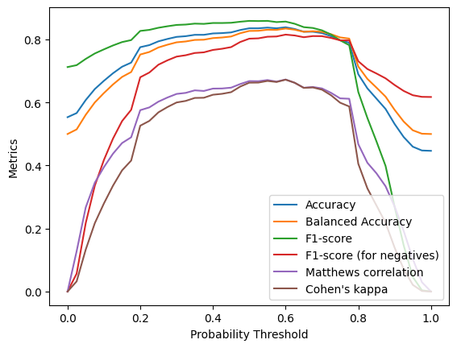
    


```python
fpr, tpr, thresholds = roc_curve(obs_heart,pred_prob_heart_svm_rbf[:,1])
plt.plot(fpr,tpr)
plt.xlabel('1 - Specificity (false positive rate)')
plt.ylabel('Sensitivity (true positive rate)');
```


    

    


```python
roc_auc_score(obs_heart,pred_prob_heart_svm_rbf[:,1])
```


    0.903732955636643


```python
log_loss(obs_heart, pred_prob_heart_svm_rbf[:,1])
```


    0.3962410782353765


```python
brier_score_loss(obs_heart,pred_prob_heart_svm_rbf[:,1])
```


    0.1230208503841092


```python
prob_true_svm_rbf, prob_pred_svm_rbf = calibration_curve(obs_heart,pred_prob_heart_svm_rbf[:,1], n_bins=10, strategy = 'quantile')
sm.graphics.abline_plot(intercept = 0,slope = 1,color = 'red')
plt.scatter(prob_true_svm_rbf,prob_pred_svm_rbf)
plt.xlabel('Observed Probability')
plt.ylabel('Predicted Probability');
```


    
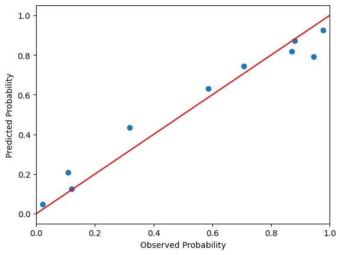
    


Let us also fit an SVM with a polynomial kernel of degree 3.


```python
parameters_poly = {'kernel':['poly'], 'C':[0.001, 0.01, 0.1, 1, 10, 100, 1000], 'gamma':[0.001, 0.01, 0.1, 1, 10, 100, 1000],'coef0':[0,1,10], 'degree':[3]}
svm_pipeline_heart_poly = make_pipeline(StandardScaler(),  GridSearchCV(estimator=svm.SVC(probability=True),param_grid=parameters_poly, scoring = 'balanced_accuracy'))
svm_pipeline_heart_poly_fit = svm_pipeline_heart_poly.fit(X = heart_final.iloc[:,range(0,17)], y = heart_final['heart_disease'])
svm_pipeline_heart_poly_fit._final_estimator.best_estimator_
```


<style>#sk-container-id-3 {
  /* Definition of color scheme common for light and dark mode */
  --sklearn-color-text: #000;
  --sklearn-color-text-muted: #666;
  --sklearn-color-line: gray;
  /* Definition of color scheme for unfitted estimators */
  --sklearn-color-unfitted-level-0: #fff5e6;
  --sklearn-color-unfitted-level-1: #f6e4d2;
  --sklearn-color-unfitted-level-2: #ffe0b3;
  --sklearn-color-unfitted-level-3: chocolate;
  /* Definition of color scheme for fitted estimators */
  --sklearn-color-fitted-level-0: #f0f8ff;
  --sklearn-color-fitted-level-1: #d4ebff;
  --sklearn-color-fitted-level-2: #b3dbfd;
  --sklearn-color-fitted-level-3: cornflowerblue;

  /* Specific color for light theme */
  --sklearn-color-text-on-default-background: var(--sg-text-color, var(--theme-code-foreground, var(--jp-content-font-color1, black)));
  --sklearn-color-background: var(--sg-background-color, var(--theme-background, var(--jp-layout-color0, white)));
  --sklearn-color-border-box: var(--sg-text-color, var(--theme-code-foreground, var(--jp-content-font-color1, black)));
  --sklearn-color-icon: #696969;

  @media (prefers-color-scheme: dark) {
    /* Redefinition of color scheme for dark theme */
    --sklearn-color-text-on-default-background: var(--sg-text-color, var(--theme-code-foreground, var(--jp-content-font-color1, white)));
    --sklearn-color-background: var(--sg-background-color, var(--theme-background, var(--jp-layout-color0, #111)));
    --sklearn-color-border-box: var(--sg-text-color, var(--theme-code-foreground, var(--jp-content-font-color1, white)));
    --sklearn-color-icon: #878787;
  }
}

#sk-container-id-3 {
  color: var(--sklearn-color-text);
}

#sk-container-id-3 pre {
  padding: 0;
}

#sk-container-id-3 input.sk-hidden--visually {
  border: 0;
  clip: rect(1px 1px 1px 1px);
  clip: rect(1px, 1px, 1px, 1px);
  height: 1px;
  margin: -1px;
  overflow: hidden;
  padding: 0;
  position: absolute;
  width: 1px;
}

#sk-container-id-3 div.sk-dashed-wrapped {
  border: 1px dashed var(--sklearn-color-line);
  margin: 0 0.4em 0.5em 0.4em;
  box-sizing: border-box;
  padding-bottom: 0.4em;
  background-color: var(--sklearn-color-background);
}

#sk-container-id-3 div.sk-container {
  /* jupyter's `normalize.less` sets `[hidden] { display: none; }`
     but bootstrap.min.css set `[hidden] { display: none !important; }`
     so we also need the `!important` here to be able to override the
     default hidden behavior on the sphinx rendered scikit-learn.org.
     See: https://github.com/scikit-learn/scikit-learn/issues/21755 */
  display: inline-block !important;
  position: relative;
}

#sk-container-id-3 div.sk-text-repr-fallback {
  display: none;
}

div.sk-parallel-item,
div.sk-serial,
div.sk-item {
  /* draw centered vertical line to link estimators */
  background-image: linear-gradient(var(--sklearn-color-text-on-default-background), var(--sklearn-color-text-on-default-background));
  background-size: 2px 100%;
  background-repeat: no-repeat;
  background-position: center center;
}

/* Parallel-specific style estimator block */

#sk-container-id-3 div.sk-parallel-item::after {
  content: "";
  width: 100%;
  border-bottom: 2px solid var(--sklearn-color-text-on-default-background);
  flex-grow: 1;
}

#sk-container-id-3 div.sk-parallel {
  display: flex;
  align-items: stretch;
  justify-content: center;
  background-color: var(--sklearn-color-background);
  position: relative;
}

#sk-container-id-3 div.sk-parallel-item {
  display: flex;
  flex-direction: column;
}

#sk-container-id-3 div.sk-parallel-item:first-child::after {
  align-self: flex-end;
  width: 50%;
}

#sk-container-id-3 div.sk-parallel-item:last-child::after {
  align-self: flex-start;
  width: 50%;
}

#sk-container-id-3 div.sk-parallel-item:only-child::after {
  width: 0;
}

/* Serial-specific style estimator block */

#sk-container-id-3 div.sk-serial {
  display: flex;
  flex-direction: column;
  align-items: center;
  background-color: var(--sklearn-color-background);
  padding-right: 1em;
  padding-left: 1em;
}


/* Toggleable style: style used for estimator/Pipeline/ColumnTransformer box that is
clickable and can be expanded/collapsed.
- Pipeline and ColumnTransformer use this feature and define the default style
- Estimators will overwrite some part of the style using the `sk-estimator` class
*/

/* Pipeline and ColumnTransformer style (default) */

#sk-container-id-3 div.sk-toggleable {
  /* Default theme specific background. It is overwritten whether we have a
  specific estimator or a Pipeline/ColumnTransformer */
  background-color: var(--sklearn-color-background);
}

/* Toggleable label */
#sk-container-id-3 label.sk-toggleable__label {
  cursor: pointer;
  display: flex;
  width: 100%;
  margin-bottom: 0;
  padding: 0.5em;
  box-sizing: border-box;
  text-align: center;
  align-items: start;
  justify-content: space-between;
  gap: 0.5em;
}

#sk-container-id-3 label.sk-toggleable__label .caption {
  font-size: 0.6rem;
  font-weight: lighter;
  color: var(--sklearn-color-text-muted);
}

#sk-container-id-3 label.sk-toggleable__label-arrow:before {
  /* Arrow on the left of the label */
  content: "▸";
  float: left;
  margin-right: 0.25em;
  color: var(--sklearn-color-icon);
}

#sk-container-id-3 label.sk-toggleable__label-arrow:hover:before {
  color: var(--sklearn-color-text);
}

/* Toggleable content - dropdown */

#sk-container-id-3 div.sk-toggleable__content {
  display: none;
  text-align: left;
  /* unfitted */
  background-color: var(--sklearn-color-unfitted-level-0);
}

#sk-container-id-3 div.sk-toggleable__content.fitted {
  /* fitted */
  background-color: var(--sklearn-color-fitted-level-0);
}

#sk-container-id-3 div.sk-toggleable__content pre {
  margin: 0.2em;
  border-radius: 0.25em;
  color: var(--sklearn-color-text);
  /* unfitted */
  background-color: var(--sklearn-color-unfitted-level-0);
}

#sk-container-id-3 div.sk-toggleable__content.fitted pre {
  /* unfitted */
  background-color: var(--sklearn-color-fitted-level-0);
}

#sk-container-id-3 input.sk-toggleable__control:checked~div.sk-toggleable__content {
  /* Expand drop-down */
  display: block;
  width: 100%;
  overflow: visible;
}

#sk-container-id-3 input.sk-toggleable__control:checked~label.sk-toggleable__label-arrow:before {
  content: "▾";
}

/* Pipeline/ColumnTransformer-specific style */

#sk-container-id-3 div.sk-label input.sk-toggleable__control:checked~label.sk-toggleable__label {
  color: var(--sklearn-color-text);
  background-color: var(--sklearn-color-unfitted-level-2);
}

#sk-container-id-3 div.sk-label.fitted input.sk-toggleable__control:checked~label.sk-toggleable__label {
  background-color: var(--sklearn-color-fitted-level-2);
}

/* Estimator-specific style */

/* Colorize estimator box */
#sk-container-id-3 div.sk-estimator input.sk-toggleable__control:checked~label.sk-toggleable__label {
  /* unfitted */
  background-color: var(--sklearn-color-unfitted-level-2);
}

#sk-container-id-3 div.sk-estimator.fitted input.sk-toggleable__control:checked~label.sk-toggleable__label {
  /* fitted */
  background-color: var(--sklearn-color-fitted-level-2);
}

#sk-container-id-3 div.sk-label label.sk-toggleable__label,
#sk-container-id-3 div.sk-label label {
  /* The background is the default theme color */
  color: var(--sklearn-color-text-on-default-background);
}

/* On hover, darken the color of the background */
#sk-container-id-3 div.sk-label:hover label.sk-toggleable__label {
  color: var(--sklearn-color-text);
  background-color: var(--sklearn-color-unfitted-level-2);
}

/* Label box, darken color on hover, fitted */
#sk-container-id-3 div.sk-label.fitted:hover label.sk-toggleable__label.fitted {
  color: var(--sklearn-color-text);
  background-color: var(--sklearn-color-fitted-level-2);
}

/* Estimator label */

#sk-container-id-3 div.sk-label label {
  font-family: monospace;
  font-weight: bold;
  display: inline-block;
  line-height: 1.2em;
}

#sk-container-id-3 div.sk-label-container {
  text-align: center;
}

/* Estimator-specific */
#sk-container-id-3 div.sk-estimator {
  font-family: monospace;
  border: 1px dotted var(--sklearn-color-border-box);
  border-radius: 0.25em;
  box-sizing: border-box;
  margin-bottom: 0.5em;
  /* unfitted */
  background-color: var(--sklearn-color-unfitted-level-0);
}

#sk-container-id-3 div.sk-estimator.fitted {
  /* fitted */
  background-color: var(--sklearn-color-fitted-level-0);
}

/* on hover */
#sk-container-id-3 div.sk-estimator:hover {
  /* unfitted */
  background-color: var(--sklearn-color-unfitted-level-2);
}

#sk-container-id-3 div.sk-estimator.fitted:hover {
  /* fitted */
  background-color: var(--sklearn-color-fitted-level-2);
}

/* Specification for estimator info (e.g. "i" and "?") */

/* Common style for "i" and "?" */

.sk-estimator-doc-link,
a:link.sk-estimator-doc-link,
a:visited.sk-estimator-doc-link {
  float: right;
  font-size: smaller;
  line-height: 1em;
  font-family: monospace;
  background-color: var(--sklearn-color-background);
  border-radius: 1em;
  height: 1em;
  width: 1em;
  text-decoration: none !important;
  margin-left: 0.5em;
  text-align: center;
  /* unfitted */
  border: var(--sklearn-color-unfitted-level-1) 1pt solid;
  color: var(--sklearn-color-unfitted-level-1);
}

.sk-estimator-doc-link.fitted,
a:link.sk-estimator-doc-link.fitted,
a:visited.sk-estimator-doc-link.fitted {
  /* fitted */
  border: var(--sklearn-color-fitted-level-1) 1pt solid;
  color: var(--sklearn-color-fitted-level-1);
}

/* On hover */
div.sk-estimator:hover .sk-estimator-doc-link:hover,
.sk-estimator-doc-link:hover,
div.sk-label-container:hover .sk-estimator-doc-link:hover,
.sk-estimator-doc-link:hover {
  /* unfitted */
  background-color: var(--sklearn-color-unfitted-level-3);
  color: var(--sklearn-color-background);
  text-decoration: none;
}

div.sk-estimator.fitted:hover .sk-estimator-doc-link.fitted:hover,
.sk-estimator-doc-link.fitted:hover,
div.sk-label-container:hover .sk-estimator-doc-link.fitted:hover,
.sk-estimator-doc-link.fitted:hover {
  /* fitted */
  background-color: var(--sklearn-color-fitted-level-3);
  color: var(--sklearn-color-background);
  text-decoration: none;
}

/* Span, style for the box shown on hovering the info icon */
.sk-estimator-doc-link span {
  display: none;
  z-index: 9999;
  position: relative;
  font-weight: normal;
  right: .2ex;
  padding: .5ex;
  margin: .5ex;
  width: min-content;
  min-width: 20ex;
  max-width: 50ex;
  color: var(--sklearn-color-text);
  box-shadow: 2pt 2pt 4pt #999;
  /* unfitted */
  background: var(--sklearn-color-unfitted-level-0);
  border: .5pt solid var(--sklearn-color-unfitted-level-3);
}

.sk-estimator-doc-link.fitted span {
  /* fitted */
  background: var(--sklearn-color-fitted-level-0);
  border: var(--sklearn-color-fitted-level-3);
}

.sk-estimator-doc-link:hover span {
  display: block;
}

/* "?"-specific style due to the `<a>` HTML tag */

#sk-container-id-3 a.estimator_doc_link {
  float: right;
  font-size: 1rem;
  line-height: 1em;
  font-family: monospace;
  background-color: var(--sklearn-color-background);
  border-radius: 1rem;
  height: 1rem;
  width: 1rem;
  text-decoration: none;
  /* unfitted */
  color: var(--sklearn-color-unfitted-level-1);
  border: var(--sklearn-color-unfitted-level-1) 1pt solid;
}

#sk-container-id-3 a.estimator_doc_link.fitted {
  /* fitted */
  border: var(--sklearn-color-fitted-level-1) 1pt solid;
  color: var(--sklearn-color-fitted-level-1);
}

/* On hover */
#sk-container-id-3 a.estimator_doc_link:hover {
  /* unfitted */
  background-color: var(--sklearn-color-unfitted-level-3);
  color: var(--sklearn-color-background);
  text-decoration: none;
}

#sk-container-id-3 a.estimator_doc_link.fitted:hover {
  /* fitted */
  background-color: var(--sklearn-color-fitted-level-3);
}

.estimator-table summary {
    padding: .5rem;
    font-family: monospace;
    cursor: pointer;
}

.estimator-table details[open] {
    padding-left: 0.1rem;
    padding-right: 0.1rem;
    padding-bottom: 0.3rem;
}

.estimator-table .parameters-table {
    margin-left: auto !important;
    margin-right: auto !important;
}

.estimator-table .parameters-table tr:nth-child(odd) {
    background-color: #fff;
}

.estimator-table .parameters-table tr:nth-child(even) {
    background-color: #f6f6f6;
}

.estimator-table .parameters-table tr:hover {
    background-color: #e0e0e0;
}

.estimator-table table td {
    border: 1px solid rgba(106, 105, 104, 0.232);
}

.user-set td {
    color:rgb(255, 94, 0);
    text-align: left;
}

.user-set td.value pre {
    color:rgb(255, 94, 0) !important;
    background-color: transparent !important;
}

.default td {
    color: black;
    text-align: left;
}

.user-set td i,
.default td i {
    color: black;
}

.copy-paste-icon {
    background-image: url(data:image/svg+xml;base64,PHN2ZyB4bWxucz0iaHR0cDovL3d3dy53My5vcmcvMjAwMC9zdmciIHZpZXdCb3g9IjAgMCA0NDggNTEyIj48IS0tIUZvbnQgQXdlc29tZSBGcmVlIDYuNy4yIGJ5IEBmb250YXdlc29tZSAtIGh0dHBzOi8vZm9udGF3ZXNvbWUuY29tIExpY2Vuc2UgLSBodHRwczovL2ZvbnRhd2Vzb21lLmNvbS9saWNlbnNlL2ZyZWUgQ29weXJpZ2h0IDIwMjUgRm9udGljb25zLCBJbmMuLS0+PHBhdGggZD0iTTIwOCAwTDMzMi4xIDBjMTIuNyAwIDI0LjkgNS4xIDMzLjkgMTQuMWw2Ny45IDY3LjljOSA5IDE0LjEgMjEuMiAxNC4xIDMzLjlMNDQ4IDMzNmMwIDI2LjUtMjEuNSA0OC00OCA0OGwtMTkyIDBjLTI2LjUgMC00OC0yMS41LTQ4LTQ4bDAtMjg4YzAtMjYuNSAyMS41LTQ4IDQ4LTQ4ek00OCAxMjhsODAgMCAwIDY0LTY0IDAgMCAyNTYgMTkyIDAgMC0zMiA2NCAwIDAgNDhjMCAyNi41LTIxLjUgNDgtNDggNDhMNDggNTEyYy0yNi41IDAtNDgtMjEuNS00OC00OEwwIDE3NmMwLTI2LjUgMjEuNS00OCA0OC00OHoiLz48L3N2Zz4=);
    background-repeat: no-repeat;
    background-size: 14px 14px;
    background-position: 0;
    display: inline-block;
    width: 14px;
    height: 14px;
    cursor: pointer;
}
</style><body><div id="sk-container-id-3" class="sk-top-container"><div class="sk-text-repr-fallback"><pre>SVC(C=0.01, coef0=1, gamma=0.1, kernel=&#x27;poly&#x27;, probability=True)</pre><b>In a Jupyter environment, please rerun this cell to show the HTML representation or trust the notebook. <br />On GitHub, the HTML representation is unable to render, please try loading this page with nbviewer.org.</b></div><div class="sk-container" hidden><div class="sk-item"><div class="sk-estimator fitted sk-toggleable"><input class="sk-toggleable__control sk-hidden--visually" id="sk-estimator-id-3" type="checkbox" checked><label for="sk-estimator-id-3" class="sk-toggleable__label fitted sk-toggleable__label-arrow"><div><div>SVC</div></div><div><a class="sk-estimator-doc-link fitted" rel="noreferrer" target="_blank" href="https://scikit-learn.org/1.7/modules/generated/sklearn.svm.SVC.html">?<span>Documentation for SVC</span></a><span class="sk-estimator-doc-link fitted">i<span>Fitted</span></span></div></label><div class="sk-toggleable__content fitted" data-param-prefix="">
        <div class="estimator-table">
            <details>
                <summary>Parameters</summary>
                <table class="parameters-table">
                  <tbody>

        <tr class="user-set">
            <td><i class="copy-paste-icon"
                 onclick="copyToClipboard('C',
                          this.parentElement.nextElementSibling)"
            ></i></td>
            <td class="param">C&nbsp;</td>
            <td class="value">0.01</td>
        </tr>


        <tr class="user-set">
            <td><i class="copy-paste-icon"
                 onclick="copyToClipboard('kernel',
                          this.parentElement.nextElementSibling)"
            ></i></td>
            <td class="param">kernel&nbsp;</td>
            <td class="value">&#x27;poly&#x27;</td>
        </tr>


        <tr class="default">
            <td><i class="copy-paste-icon"
                 onclick="copyToClipboard('degree',
                          this.parentElement.nextElementSibling)"
            ></i></td>
            <td class="param">degree&nbsp;</td>
            <td class="value">3</td>
        </tr>


        <tr class="user-set">
            <td><i class="copy-paste-icon"
                 onclick="copyToClipboard('gamma',
                          this.parentElement.nextElementSibling)"
            ></i></td>
            <td class="param">gamma&nbsp;</td>
            <td class="value">0.1</td>
        </tr>


        <tr class="user-set">
            <td><i class="copy-paste-icon"
                 onclick="copyToClipboard('coef0',
                          this.parentElement.nextElementSibling)"
            ></i></td>
            <td class="param">coef0&nbsp;</td>
            <td class="value">1</td>
        </tr>


        <tr class="default">
            <td><i class="copy-paste-icon"
                 onclick="copyToClipboard('shrinking',
                          this.parentElement.nextElementSibling)"
            ></i></td>
            <td class="param">shrinking&nbsp;</td>
            <td class="value">True</td>
        </tr>


        <tr class="user-set">
            <td><i class="copy-paste-icon"
                 onclick="copyToClipboard('probability',
                          this.parentElement.nextElementSibling)"
            ></i></td>
            <td class="param">probability&nbsp;</td>
            <td class="value">True</td>
        </tr>


        <tr class="default">
            <td><i class="copy-paste-icon"
                 onclick="copyToClipboard('tol',
                          this.parentElement.nextElementSibling)"
            ></i></td>
            <td class="param">tol&nbsp;</td>
            <td class="value">0.001</td>
        </tr>


        <tr class="default">
            <td><i class="copy-paste-icon"
                 onclick="copyToClipboard('cache_size',
                          this.parentElement.nextElementSibling)"
            ></i></td>
            <td class="param">cache_size&nbsp;</td>
            <td class="value">200</td>
        </tr>


        <tr class="default">
            <td><i class="copy-paste-icon"
                 onclick="copyToClipboard('class_weight',
                          this.parentElement.nextElementSibling)"
            ></i></td>
            <td class="param">class_weight&nbsp;</td>
            <td class="value">None</td>
        </tr>


        <tr class="default">
            <td><i class="copy-paste-icon"
                 onclick="copyToClipboard('verbose',
                          this.parentElement.nextElementSibling)"
            ></i></td>
            <td class="param">verbose&nbsp;</td>
            <td class="value">False</td>
        </tr>


        <tr class="default">
            <td><i class="copy-paste-icon"
                 onclick="copyToClipboard('max_iter',
                          this.parentElement.nextElementSibling)"
            ></i></td>
            <td class="param">max_iter&nbsp;</td>
            <td class="value">-1</td>
        </tr>


        <tr class="default">
            <td><i class="copy-paste-icon"
                 onclick="copyToClipboard('decision_function_shape',
                          this.parentElement.nextElementSibling)"
            ></i></td>
            <td class="param">decision_function_shape&nbsp;</td>
            <td class="value">&#x27;ovr&#x27;</td>
        </tr>


        <tr class="default">
            <td><i class="copy-paste-icon"
                 onclick="copyToClipboard('break_ties',
                          this.parentElement.nextElementSibling)"
            ></i></td>
            <td class="param">break_ties&nbsp;</td>
            <td class="value">False</td>
        </tr>


        <tr class="default">
            <td><i class="copy-paste-icon"
                 onclick="copyToClipboard('random_state',
                          this.parentElement.nextElementSibling)"
            ></i></td>
            <td class="param">random_state&nbsp;</td>
            <td class="value">None</td>
        </tr>

                  </tbody>
                </table>
            </details>
        </div>
    </div></div></div></div></div><script>function copyToClipboard(text, element) {
    // Get the parameter prefix from the closest toggleable content
    const toggleableContent = element.closest('.sk-toggleable__content');
    const paramPrefix = toggleableContent ? toggleableContent.dataset.paramPrefix : '';
    const fullParamName = paramPrefix ? `${paramPrefix}${text}` : text;

    const originalStyle = element.style;
    const computedStyle = window.getComputedStyle(element);
    const originalWidth = computedStyle.width;
    const originalHTML = element.innerHTML.replace('Copied!', '');

    navigator.clipboard.writeText(fullParamName)
        .then(() => {
            element.style.width = originalWidth;
            element.style.color = 'green';
            element.innerHTML = "Copied!";

            setTimeout(() => {
                element.innerHTML = originalHTML;
                element.style = originalStyle;
            }, 2000);
        })
        .catch(err => {
            console.error('Failed to copy:', err);
            element.style.color = 'red';
            element.innerHTML = "Failed!";
            setTimeout(() => {
                element.innerHTML = originalHTML;
                element.style = originalStyle;
            }, 2000);
        });
    return false;
}

document.querySelectorAll('.fa-regular.fa-copy').forEach(function(element) {
    const toggleableContent = element.closest('.sk-toggleable__content');
    const paramPrefix = toggleableContent ? toggleableContent.dataset.paramPrefix : '';
    const paramName = element.parentElement.nextElementSibling.textContent.trim();
    const fullParamName = paramPrefix ? `${paramPrefix}${paramName}` : paramName;

    element.setAttribute('title', fullParamName);
});
</script></body>


```python
pred_prob_heart_svm_poly = svm_pipeline_heart_poly_fit.predict_proba(heart_final.iloc[:,range(0,17)])

accuracy_scores_svm_poly = np.zeros(41)
balanced_accuracy_scores_svm_poly = np.zeros(41)
f1_scores_svm_poly = np.zeros(41)
f1_scores_neg_svm_poly = np.zeros(41)
matthews_corrcoefs_svm_poly = np.zeros(41)
cohen_kappa_scores_svm_poly = np.zeros(41)

for k in range(41):
    accuracy_thresholds[k] = k/40
    accuracy_scores_svm_poly[k] = accuracy_score(obs_heart,(pred_prob_heart_svm_poly[:,1] > accuracy_thresholds[k]).astype(int))
    balanced_accuracy_scores_svm_poly[k] = balanced_accuracy_score(obs_heart,(pred_prob_heart_svm_poly[:,1] > accuracy_thresholds[k]).astype(int))
    f1_scores_svm_poly[k] = f1_score(obs_heart,(pred_prob_heart_svm_poly[:,1] > accuracy_thresholds[k]).astype(int))
    f1_scores_neg_svm_poly[k] = f1_score(obs_heart,(pred_prob_heart_svm_poly[:,1] > accuracy_thresholds[k]).astype(int),pos_label=0)
    matthews_corrcoefs_svm_poly[k] = matthews_corrcoef(obs_heart,(pred_prob_heart_svm_poly[:,1] > accuracy_thresholds[k]).astype(int))
    cohen_kappa_scores_svm_poly[k] = cohen_kappa_score(obs_heart,(pred_prob_heart_svm_poly[:,1] > accuracy_thresholds[k]).astype(int))
```


```python
plt.plot(accuracy_thresholds,accuracy_scores_svm_poly)
plt.plot(accuracy_thresholds,balanced_accuracy_scores_svm_poly)
plt.plot(accuracy_thresholds,f1_scores_svm_poly)
plt.plot(accuracy_thresholds,f1_scores_neg_svm_poly)
plt.plot(accuracy_thresholds,matthews_corrcoefs_svm_poly)
plt.plot(accuracy_thresholds,cohen_kappa_scores_svm_poly)

plt.legend(['Accuracy','Balanced Accuracy','F1-score','F1-score (for negatives)','Matthews correlation',"Cohen's kappa"], loc="lower right")
plt.xlabel('Probability Threshold')
plt.ylabel('Metrics');
```


    
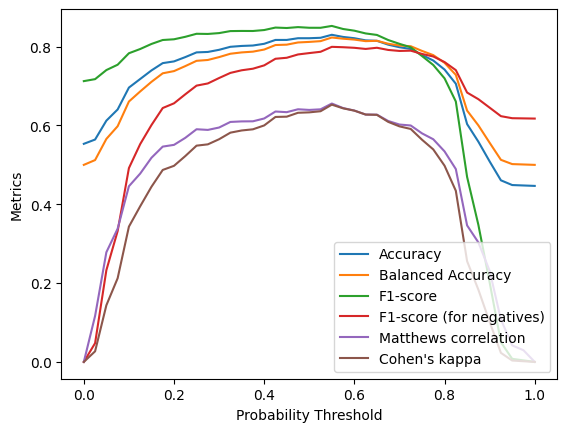
    


```python
fpr, tpr, thresholds = roc_curve(obs_heart,pred_prob_heart_svm_poly[:,1])
plt.plot(fpr,tpr)
plt.xlabel('1 - Specificity (false positive rate)')
plt.ylabel('Sensitivity (true positive rate)');
```


    
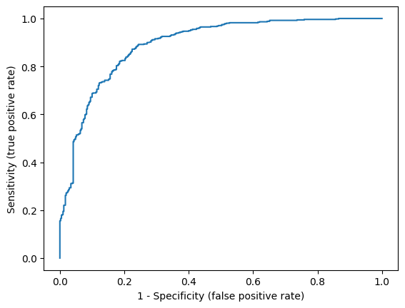
    


```python
roc_auc_score(obs_heart,pred_prob_heart_svm_poly[:,1])
```


    0.893047820241982


```python
log_loss(obs_heart, pred_prob_heart_svm_poly[:,1])
```


    0.41195670826660885


```python
brier_score_loss(obs_heart,pred_prob_heart_svm_poly[:,1])
```


    0.12955553384830787


```python
prob_true_svm_poly, prob_pred_svm_poly = calibration_curve(obs_heart,pred_prob_heart_svm_poly[:,1], n_bins=10, strategy = 'quantile')
sm.graphics.abline_plot(intercept = 0,slope = 1,color = 'red')
plt.scatter(prob_true_svm_poly,prob_pred_svm_poly)
plt.xlabel('Observed Probability')
plt.ylabel('Predicted Probability');
```


    
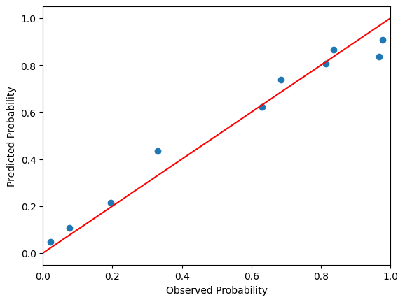
    


We observe that the fit is fairly similar to the radial kernel. Lastly, let us also check the sigmoid kernel. We will follow the advice from [[7](#7)] and consider positive values of $\gamma$, and both positive and negative values for the shift.


```python
parameters_sig = {'kernel':['sigmoid'], 'C':[0.001, 0.01, 0.1, 1, 10, 100, 1000], 'gamma':[0.001, 0.01, 0.1, 1, 10, 100, 1000],'coef0':[-10, -1, 0.1, 0, 0.1, 1, 10]}

svm_pipeline_heart_sig = make_pipeline(StandardScaler(),  GridSearchCV(estimator=svm.SVC(probability=True),param_grid=parameters_sig, scoring = 'balanced_accuracy'))
svm_pipeline_heart_sig_fit = svm_pipeline_heart_sig.fit(X = heart_final.iloc[:,range(0,17)], y = heart_final['heart_disease'])
svm_pipeline_heart_sig_fit._final_estimator.best_estimator_
```


<style>#sk-container-id-4 {
  /* Definition of color scheme common for light and dark mode */
  --sklearn-color-text: #000;
  --sklearn-color-text-muted: #666;
  --sklearn-color-line: gray;
  /* Definition of color scheme for unfitted estimators */
  --sklearn-color-unfitted-level-0: #fff5e6;
  --sklearn-color-unfitted-level-1: #f6e4d2;
  --sklearn-color-unfitted-level-2: #ffe0b3;
  --sklearn-color-unfitted-level-3: chocolate;
  /* Definition of color scheme for fitted estimators */
  --sklearn-color-fitted-level-0: #f0f8ff;
  --sklearn-color-fitted-level-1: #d4ebff;
  --sklearn-color-fitted-level-2: #b3dbfd;
  --sklearn-color-fitted-level-3: cornflowerblue;

  /* Specific color for light theme */
  --sklearn-color-text-on-default-background: var(--sg-text-color, var(--theme-code-foreground, var(--jp-content-font-color1, black)));
  --sklearn-color-background: var(--sg-background-color, var(--theme-background, var(--jp-layout-color0, white)));
  --sklearn-color-border-box: var(--sg-text-color, var(--theme-code-foreground, var(--jp-content-font-color1, black)));
  --sklearn-color-icon: #696969;

  @media (prefers-color-scheme: dark) {
    /* Redefinition of color scheme for dark theme */
    --sklearn-color-text-on-default-background: var(--sg-text-color, var(--theme-code-foreground, var(--jp-content-font-color1, white)));
    --sklearn-color-background: var(--sg-background-color, var(--theme-background, var(--jp-layout-color0, #111)));
    --sklearn-color-border-box: var(--sg-text-color, var(--theme-code-foreground, var(--jp-content-font-color1, white)));
    --sklearn-color-icon: #878787;
  }
}

#sk-container-id-4 {
  color: var(--sklearn-color-text);
}

#sk-container-id-4 pre {
  padding: 0;
}

#sk-container-id-4 input.sk-hidden--visually {
  border: 0;
  clip: rect(1px 1px 1px 1px);
  clip: rect(1px, 1px, 1px, 1px);
  height: 1px;
  margin: -1px;
  overflow: hidden;
  padding: 0;
  position: absolute;
  width: 1px;
}

#sk-container-id-4 div.sk-dashed-wrapped {
  border: 1px dashed var(--sklearn-color-line);
  margin: 0 0.4em 0.5em 0.4em;
  box-sizing: border-box;
  padding-bottom: 0.4em;
  background-color: var(--sklearn-color-background);
}

#sk-container-id-4 div.sk-container {
  /* jupyter's `normalize.less` sets `[hidden] { display: none; }`
     but bootstrap.min.css set `[hidden] { display: none !important; }`
     so we also need the `!important` here to be able to override the
     default hidden behavior on the sphinx rendered scikit-learn.org.
     See: https://github.com/scikit-learn/scikit-learn/issues/21755 */
  display: inline-block !important;
  position: relative;
}

#sk-container-id-4 div.sk-text-repr-fallback {
  display: none;
}

div.sk-parallel-item,
div.sk-serial,
div.sk-item {
  /* draw centered vertical line to link estimators */
  background-image: linear-gradient(var(--sklearn-color-text-on-default-background), var(--sklearn-color-text-on-default-background));
  background-size: 2px 100%;
  background-repeat: no-repeat;
  background-position: center center;
}

/* Parallel-specific style estimator block */

#sk-container-id-4 div.sk-parallel-item::after {
  content: "";
  width: 100%;
  border-bottom: 2px solid var(--sklearn-color-text-on-default-background);
  flex-grow: 1;
}

#sk-container-id-4 div.sk-parallel {
  display: flex;
  align-items: stretch;
  justify-content: center;
  background-color: var(--sklearn-color-background);
  position: relative;
}

#sk-container-id-4 div.sk-parallel-item {
  display: flex;
  flex-direction: column;
}

#sk-container-id-4 div.sk-parallel-item:first-child::after {
  align-self: flex-end;
  width: 50%;
}

#sk-container-id-4 div.sk-parallel-item:last-child::after {
  align-self: flex-start;
  width: 50%;
}

#sk-container-id-4 div.sk-parallel-item:only-child::after {
  width: 0;
}

/* Serial-specific style estimator block */

#sk-container-id-4 div.sk-serial {
  display: flex;
  flex-direction: column;
  align-items: center;
  background-color: var(--sklearn-color-background);
  padding-right: 1em;
  padding-left: 1em;
}


/* Toggleable style: style used for estimator/Pipeline/ColumnTransformer box that is
clickable and can be expanded/collapsed.
- Pipeline and ColumnTransformer use this feature and define the default style
- Estimators will overwrite some part of the style using the `sk-estimator` class
*/

/* Pipeline and ColumnTransformer style (default) */

#sk-container-id-4 div.sk-toggleable {
  /* Default theme specific background. It is overwritten whether we have a
  specific estimator or a Pipeline/ColumnTransformer */
  background-color: var(--sklearn-color-background);
}

/* Toggleable label */
#sk-container-id-4 label.sk-toggleable__label {
  cursor: pointer;
  display: flex;
  width: 100%;
  margin-bottom: 0;
  padding: 0.5em;
  box-sizing: border-box;
  text-align: center;
  align-items: start;
  justify-content: space-between;
  gap: 0.5em;
}

#sk-container-id-4 label.sk-toggleable__label .caption {
  font-size: 0.6rem;
  font-weight: lighter;
  color: var(--sklearn-color-text-muted);
}

#sk-container-id-4 label.sk-toggleable__label-arrow:before {
  /* Arrow on the left of the label */
  content: "▸";
  float: left;
  margin-right: 0.25em;
  color: var(--sklearn-color-icon);
}

#sk-container-id-4 label.sk-toggleable__label-arrow:hover:before {
  color: var(--sklearn-color-text);
}

/* Toggleable content - dropdown */

#sk-container-id-4 div.sk-toggleable__content {
  display: none;
  text-align: left;
  /* unfitted */
  background-color: var(--sklearn-color-unfitted-level-0);
}

#sk-container-id-4 div.sk-toggleable__content.fitted {
  /* fitted */
  background-color: var(--sklearn-color-fitted-level-0);
}

#sk-container-id-4 div.sk-toggleable__content pre {
  margin: 0.2em;
  border-radius: 0.25em;
  color: var(--sklearn-color-text);
  /* unfitted */
  background-color: var(--sklearn-color-unfitted-level-0);
}

#sk-container-id-4 div.sk-toggleable__content.fitted pre {
  /* unfitted */
  background-color: var(--sklearn-color-fitted-level-0);
}

#sk-container-id-4 input.sk-toggleable__control:checked~div.sk-toggleable__content {
  /* Expand drop-down */
  display: block;
  width: 100%;
  overflow: visible;
}

#sk-container-id-4 input.sk-toggleable__control:checked~label.sk-toggleable__label-arrow:before {
  content: "▾";
}

/* Pipeline/ColumnTransformer-specific style */

#sk-container-id-4 div.sk-label input.sk-toggleable__control:checked~label.sk-toggleable__label {
  color: var(--sklearn-color-text);
  background-color: var(--sklearn-color-unfitted-level-2);
}

#sk-container-id-4 div.sk-label.fitted input.sk-toggleable__control:checked~label.sk-toggleable__label {
  background-color: var(--sklearn-color-fitted-level-2);
}

/* Estimator-specific style */

/* Colorize estimator box */
#sk-container-id-4 div.sk-estimator input.sk-toggleable__control:checked~label.sk-toggleable__label {
  /* unfitted */
  background-color: var(--sklearn-color-unfitted-level-2);
}

#sk-container-id-4 div.sk-estimator.fitted input.sk-toggleable__control:checked~label.sk-toggleable__label {
  /* fitted */
  background-color: var(--sklearn-color-fitted-level-2);
}

#sk-container-id-4 div.sk-label label.sk-toggleable__label,
#sk-container-id-4 div.sk-label label {
  /* The background is the default theme color */
  color: var(--sklearn-color-text-on-default-background);
}

/* On hover, darken the color of the background */
#sk-container-id-4 div.sk-label:hover label.sk-toggleable__label {
  color: var(--sklearn-color-text);
  background-color: var(--sklearn-color-unfitted-level-2);
}

/* Label box, darken color on hover, fitted */
#sk-container-id-4 div.sk-label.fitted:hover label.sk-toggleable__label.fitted {
  color: var(--sklearn-color-text);
  background-color: var(--sklearn-color-fitted-level-2);
}

/* Estimator label */

#sk-container-id-4 div.sk-label label {
  font-family: monospace;
  font-weight: bold;
  display: inline-block;
  line-height: 1.2em;
}

#sk-container-id-4 div.sk-label-container {
  text-align: center;
}

/* Estimator-specific */
#sk-container-id-4 div.sk-estimator {
  font-family: monospace;
  border: 1px dotted var(--sklearn-color-border-box);
  border-radius: 0.25em;
  box-sizing: border-box;
  margin-bottom: 0.5em;
  /* unfitted */
  background-color: var(--sklearn-color-unfitted-level-0);
}

#sk-container-id-4 div.sk-estimator.fitted {
  /* fitted */
  background-color: var(--sklearn-color-fitted-level-0);
}

/* on hover */
#sk-container-id-4 div.sk-estimator:hover {
  /* unfitted */
  background-color: var(--sklearn-color-unfitted-level-2);
}

#sk-container-id-4 div.sk-estimator.fitted:hover {
  /* fitted */
  background-color: var(--sklearn-color-fitted-level-2);
}

/* Specification for estimator info (e.g. "i" and "?") */

/* Common style for "i" and "?" */

.sk-estimator-doc-link,
a:link.sk-estimator-doc-link,
a:visited.sk-estimator-doc-link {
  float: right;
  font-size: smaller;
  line-height: 1em;
  font-family: monospace;
  background-color: var(--sklearn-color-background);
  border-radius: 1em;
  height: 1em;
  width: 1em;
  text-decoration: none !important;
  margin-left: 0.5em;
  text-align: center;
  /* unfitted */
  border: var(--sklearn-color-unfitted-level-1) 1pt solid;
  color: var(--sklearn-color-unfitted-level-1);
}

.sk-estimator-doc-link.fitted,
a:link.sk-estimator-doc-link.fitted,
a:visited.sk-estimator-doc-link.fitted {
  /* fitted */
  border: var(--sklearn-color-fitted-level-1) 1pt solid;
  color: var(--sklearn-color-fitted-level-1);
}

/* On hover */
div.sk-estimator:hover .sk-estimator-doc-link:hover,
.sk-estimator-doc-link:hover,
div.sk-label-container:hover .sk-estimator-doc-link:hover,
.sk-estimator-doc-link:hover {
  /* unfitted */
  background-color: var(--sklearn-color-unfitted-level-3);
  color: var(--sklearn-color-background);
  text-decoration: none;
}

div.sk-estimator.fitted:hover .sk-estimator-doc-link.fitted:hover,
.sk-estimator-doc-link.fitted:hover,
div.sk-label-container:hover .sk-estimator-doc-link.fitted:hover,
.sk-estimator-doc-link.fitted:hover {
  /* fitted */
  background-color: var(--sklearn-color-fitted-level-3);
  color: var(--sklearn-color-background);
  text-decoration: none;
}

/* Span, style for the box shown on hovering the info icon */
.sk-estimator-doc-link span {
  display: none;
  z-index: 9999;
  position: relative;
  font-weight: normal;
  right: .2ex;
  padding: .5ex;
  margin: .5ex;
  width: min-content;
  min-width: 20ex;
  max-width: 50ex;
  color: var(--sklearn-color-text);
  box-shadow: 2pt 2pt 4pt #999;
  /* unfitted */
  background: var(--sklearn-color-unfitted-level-0);
  border: .5pt solid var(--sklearn-color-unfitted-level-3);
}

.sk-estimator-doc-link.fitted span {
  /* fitted */
  background: var(--sklearn-color-fitted-level-0);
  border: var(--sklearn-color-fitted-level-3);
}

.sk-estimator-doc-link:hover span {
  display: block;
}

/* "?"-specific style due to the `<a>` HTML tag */

#sk-container-id-4 a.estimator_doc_link {
  float: right;
  font-size: 1rem;
  line-height: 1em;
  font-family: monospace;
  background-color: var(--sklearn-color-background);
  border-radius: 1rem;
  height: 1rem;
  width: 1rem;
  text-decoration: none;
  /* unfitted */
  color: var(--sklearn-color-unfitted-level-1);
  border: var(--sklearn-color-unfitted-level-1) 1pt solid;
}

#sk-container-id-4 a.estimator_doc_link.fitted {
  /* fitted */
  border: var(--sklearn-color-fitted-level-1) 1pt solid;
  color: var(--sklearn-color-fitted-level-1);
}

/* On hover */
#sk-container-id-4 a.estimator_doc_link:hover {
  /* unfitted */
  background-color: var(--sklearn-color-unfitted-level-3);
  color: var(--sklearn-color-background);
  text-decoration: none;
}

#sk-container-id-4 a.estimator_doc_link.fitted:hover {
  /* fitted */
  background-color: var(--sklearn-color-fitted-level-3);
}

.estimator-table summary {
    padding: .5rem;
    font-family: monospace;
    cursor: pointer;
}

.estimator-table details[open] {
    padding-left: 0.1rem;
    padding-right: 0.1rem;
    padding-bottom: 0.3rem;
}

.estimator-table .parameters-table {
    margin-left: auto !important;
    margin-right: auto !important;
}

.estimator-table .parameters-table tr:nth-child(odd) {
    background-color: #fff;
}

.estimator-table .parameters-table tr:nth-child(even) {
    background-color: #f6f6f6;
}

.estimator-table .parameters-table tr:hover {
    background-color: #e0e0e0;
}

.estimator-table table td {
    border: 1px solid rgba(106, 105, 104, 0.232);
}

.user-set td {
    color:rgb(255, 94, 0);
    text-align: left;
}

.user-set td.value pre {
    color:rgb(255, 94, 0) !important;
    background-color: transparent !important;
}

.default td {
    color: black;
    text-align: left;
}

.user-set td i,
.default td i {
    color: black;
}

.copy-paste-icon {
    background-image: url(data:image/svg+xml;base64,PHN2ZyB4bWxucz0iaHR0cDovL3d3dy53My5vcmcvMjAwMC9zdmciIHZpZXdCb3g9IjAgMCA0NDggNTEyIj48IS0tIUZvbnQgQXdlc29tZSBGcmVlIDYuNy4yIGJ5IEBmb250YXdlc29tZSAtIGh0dHBzOi8vZm9udGF3ZXNvbWUuY29tIExpY2Vuc2UgLSBodHRwczovL2ZvbnRhd2Vzb21lLmNvbS9saWNlbnNlL2ZyZWUgQ29weXJpZ2h0IDIwMjUgRm9udGljb25zLCBJbmMuLS0+PHBhdGggZD0iTTIwOCAwTDMzMi4xIDBjMTIuNyAwIDI0LjkgNS4xIDMzLjkgMTQuMWw2Ny45IDY3LjljOSA5IDE0LjEgMjEuMiAxNC4xIDMzLjlMNDQ4IDMzNmMwIDI2LjUtMjEuNSA0OC00OCA0OGwtMTkyIDBjLTI2LjUgMC00OC0yMS41LTQ4LTQ4bDAtMjg4YzAtMjYuNSAyMS41LTQ4IDQ4LTQ4ek00OCAxMjhsODAgMCAwIDY0LTY0IDAgMCAyNTYgMTkyIDAgMC0zMiA2NCAwIDAgNDhjMCAyNi41LTIxLjUgNDgtNDggNDhMNDggNTEyYy0yNi41IDAtNDgtMjEuNS00OC00OEwwIDE3NmMwLTI2LjUgMjEuNS00OCA0OC00OHoiLz48L3N2Zz4=);
    background-repeat: no-repeat;
    background-size: 14px 14px;
    background-position: 0;
    display: inline-block;
    width: 14px;
    height: 14px;
    cursor: pointer;
}
</style><body><div id="sk-container-id-4" class="sk-top-container"><div class="sk-text-repr-fallback"><pre>SVC(C=0.1, coef0=-1, gamma=0.1, kernel=&#x27;sigmoid&#x27;, probability=True)</pre><b>In a Jupyter environment, please rerun this cell to show the HTML representation or trust the notebook. <br />On GitHub, the HTML representation is unable to render, please try loading this page with nbviewer.org.</b></div><div class="sk-container" hidden><div class="sk-item"><div class="sk-estimator fitted sk-toggleable"><input class="sk-toggleable__control sk-hidden--visually" id="sk-estimator-id-4" type="checkbox" checked><label for="sk-estimator-id-4" class="sk-toggleable__label fitted sk-toggleable__label-arrow"><div><div>SVC</div></div><div><a class="sk-estimator-doc-link fitted" rel="noreferrer" target="_blank" href="https://scikit-learn.org/1.7/modules/generated/sklearn.svm.SVC.html">?<span>Documentation for SVC</span></a><span class="sk-estimator-doc-link fitted">i<span>Fitted</span></span></div></label><div class="sk-toggleable__content fitted" data-param-prefix="">
        <div class="estimator-table">
            <details>
                <summary>Parameters</summary>
                <table class="parameters-table">
                  <tbody>

        <tr class="user-set">
            <td><i class="copy-paste-icon"
                 onclick="copyToClipboard('C',
                          this.parentElement.nextElementSibling)"
            ></i></td>
            <td class="param">C&nbsp;</td>
            <td class="value">0.1</td>
        </tr>


        <tr class="user-set">
            <td><i class="copy-paste-icon"
                 onclick="copyToClipboard('kernel',
                          this.parentElement.nextElementSibling)"
            ></i></td>
            <td class="param">kernel&nbsp;</td>
            <td class="value">&#x27;sigmoid&#x27;</td>
        </tr>


        <tr class="default">
            <td><i class="copy-paste-icon"
                 onclick="copyToClipboard('degree',
                          this.parentElement.nextElementSibling)"
            ></i></td>
            <td class="param">degree&nbsp;</td>
            <td class="value">3</td>
        </tr>


        <tr class="user-set">
            <td><i class="copy-paste-icon"
                 onclick="copyToClipboard('gamma',
                          this.parentElement.nextElementSibling)"
            ></i></td>
            <td class="param">gamma&nbsp;</td>
            <td class="value">0.1</td>
        </tr>


        <tr class="user-set">
            <td><i class="copy-paste-icon"
                 onclick="copyToClipboard('coef0',
                          this.parentElement.nextElementSibling)"
            ></i></td>
            <td class="param">coef0&nbsp;</td>
            <td class="value">-1</td>
        </tr>


        <tr class="default">
            <td><i class="copy-paste-icon"
                 onclick="copyToClipboard('shrinking',
                          this.parentElement.nextElementSibling)"
            ></i></td>
            <td class="param">shrinking&nbsp;</td>
            <td class="value">True</td>
        </tr>


        <tr class="user-set">
            <td><i class="copy-paste-icon"
                 onclick="copyToClipboard('probability',
                          this.parentElement.nextElementSibling)"
            ></i></td>
            <td class="param">probability&nbsp;</td>
            <td class="value">True</td>
        </tr>


        <tr class="default">
            <td><i class="copy-paste-icon"
                 onclick="copyToClipboard('tol',
                          this.parentElement.nextElementSibling)"
            ></i></td>
            <td class="param">tol&nbsp;</td>
            <td class="value">0.001</td>
        </tr>


        <tr class="default">
            <td><i class="copy-paste-icon"
                 onclick="copyToClipboard('cache_size',
                          this.parentElement.nextElementSibling)"
            ></i></td>
            <td class="param">cache_size&nbsp;</td>
            <td class="value">200</td>
        </tr>


        <tr class="default">
            <td><i class="copy-paste-icon"
                 onclick="copyToClipboard('class_weight',
                          this.parentElement.nextElementSibling)"
            ></i></td>
            <td class="param">class_weight&nbsp;</td>
            <td class="value">None</td>
        </tr>


        <tr class="default">
            <td><i class="copy-paste-icon"
                 onclick="copyToClipboard('verbose',
                          this.parentElement.nextElementSibling)"
            ></i></td>
            <td class="param">verbose&nbsp;</td>
            <td class="value">False</td>
        </tr>


        <tr class="default">
            <td><i class="copy-paste-icon"
                 onclick="copyToClipboard('max_iter',
                          this.parentElement.nextElementSibling)"
            ></i></td>
            <td class="param">max_iter&nbsp;</td>
            <td class="value">-1</td>
        </tr>


        <tr class="default">
            <td><i class="copy-paste-icon"
                 onclick="copyToClipboard('decision_function_shape',
                          this.parentElement.nextElementSibling)"
            ></i></td>
            <td class="param">decision_function_shape&nbsp;</td>
            <td class="value">&#x27;ovr&#x27;</td>
        </tr>


        <tr class="default">
            <td><i class="copy-paste-icon"
                 onclick="copyToClipboard('break_ties',
                          this.parentElement.nextElementSibling)"
            ></i></td>
            <td class="param">break_ties&nbsp;</td>
            <td class="value">False</td>
        </tr>


        <tr class="default">
            <td><i class="copy-paste-icon"
                 onclick="copyToClipboard('random_state',
                          this.parentElement.nextElementSibling)"
            ></i></td>
            <td class="param">random_state&nbsp;</td>
            <td class="value">None</td>
        </tr>

                  </tbody>
                </table>
            </details>
        </div>
    </div></div></div></div></div><script>function copyToClipboard(text, element) {
    // Get the parameter prefix from the closest toggleable content
    const toggleableContent = element.closest('.sk-toggleable__content');
    const paramPrefix = toggleableContent ? toggleableContent.dataset.paramPrefix : '';
    const fullParamName = paramPrefix ? `${paramPrefix}${text}` : text;

    const originalStyle = element.style;
    const computedStyle = window.getComputedStyle(element);
    const originalWidth = computedStyle.width;
    const originalHTML = element.innerHTML.replace('Copied!', '');

    navigator.clipboard.writeText(fullParamName)
        .then(() => {
            element.style.width = originalWidth;
            element.style.color = 'green';
            element.innerHTML = "Copied!";

            setTimeout(() => {
                element.innerHTML = originalHTML;
                element.style = originalStyle;
            }, 2000);
        })
        .catch(err => {
            console.error('Failed to copy:', err);
            element.style.color = 'red';
            element.innerHTML = "Failed!";
            setTimeout(() => {
                element.innerHTML = originalHTML;
                element.style = originalStyle;
            }, 2000);
        });
    return false;
}

document.querySelectorAll('.fa-regular.fa-copy').forEach(function(element) {
    const toggleableContent = element.closest('.sk-toggleable__content');
    const paramPrefix = toggleableContent ? toggleableContent.dataset.paramPrefix : '';
    const paramName = element.parentElement.nextElementSibling.textContent.trim();
    const fullParamName = paramPrefix ? `${paramPrefix}${paramName}` : paramName;

    element.setAttribute('title', fullParamName);
});
</script></body>


We notice that the optimal shift is indeed negative.


```python
pred_prob_heart_svm_sig = svm_pipeline_heart_sig_fit.predict_proba(heart_final.iloc[:,range(0,17)])

accuracy_scores_svm_sig = np.zeros(41)
balanced_accuracy_scores_svm_sig = np.zeros(41)
f1_scores_svm_sig = np.zeros(41)
f1_scores_neg_svm_sig = np.zeros(41)
matthews_corrcoefs_svm_sig = np.zeros(41)
cohen_kappa_scores_svm_sig = np.zeros(41)

for k in range(41):
    accuracy_thresholds[k] = k/40
    accuracy_scores_svm_sig[k] = accuracy_score(obs_heart,(pred_prob_heart_svm_sig[:,1] > accuracy_thresholds[k]).astype(int))
    balanced_accuracy_scores_svm_sig[k] = balanced_accuracy_score(obs_heart,(pred_prob_heart_svm_sig[:,1] > accuracy_thresholds[k]).astype(int))
    f1_scores_svm_sig[k] = f1_score(obs_heart,(pred_prob_heart_svm_sig[:,1] > accuracy_thresholds[k]).astype(int))
    f1_scores_neg_svm_sig[k] = f1_score(obs_heart,(pred_prob_heart_svm_sig[:,1] > accuracy_thresholds[k]).astype(int),pos_label=0)
    matthews_corrcoefs_svm_sig[k] = matthews_corrcoef(obs_heart,(pred_prob_heart_svm_sig[:,1] > accuracy_thresholds[k]).astype(int))
    cohen_kappa_scores_svm_sig[k] = cohen_kappa_score(obs_heart,(pred_prob_heart_svm_sig[:,1] > accuracy_thresholds[k]).astype(int))
```


```python
plt.plot(accuracy_thresholds,accuracy_scores_svm_sig)
plt.plot(accuracy_thresholds,balanced_accuracy_scores_svm_sig)
plt.plot(accuracy_thresholds,f1_scores_svm_sig)
plt.plot(accuracy_thresholds,f1_scores_neg_svm_sig)
plt.plot(accuracy_thresholds,matthews_corrcoefs_svm_sig)
plt.plot(accuracy_thresholds,cohen_kappa_scores_svm_sig)

plt.legend(['Accuracy','Balanced Accuracy','F1-score','F1-score (for negatives)','Matthews correlation',"Cohen's kappa"], loc="lower right")
plt.xlabel('Probability Threshold')
plt.ylabel('Metrics');
```


    
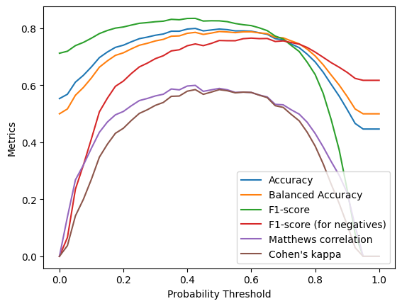
    


```python
fpr, tpr, thresholds = roc_curve(obs_heart,pred_prob_heart_svm_sig[:,1])
plt.plot(fpr,tpr)
plt.xlabel('1 - Specificity (false positive rate)')
plt.ylabel('Sensitivity (true positive rate)');
```


    
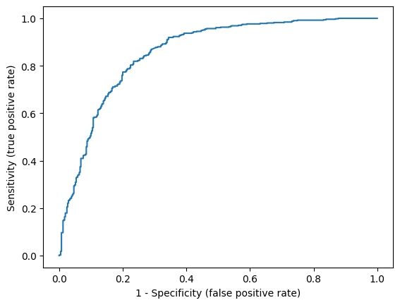
    


```python
roc_auc_score(obs_heart,pred_prob_heart_svm_sig[:,1])
```


    0.8562992125984252


```python
log_loss(obs_heart, pred_prob_heart_svm_sig[:,1])
```


    0.45873777723198195


```python
brier_score_loss(obs_heart,pred_prob_heart_svm_sig[:,1])
```


    0.14682440938171434


```python
prob_true_svm_sig, prob_pred_svm_sig = calibration_curve(obs_heart,pred_prob_heart_svm_sig[:,1], n_bins=10, strategy = 'quantile')
sm.graphics.abline_plot(intercept = 0,slope = 1,color = 'red')
plt.scatter(prob_true_svm_sig,prob_pred_svm_sig)
plt.xlabel('Observed Probability')
plt.ylabel('Predicted Probability');
```


    
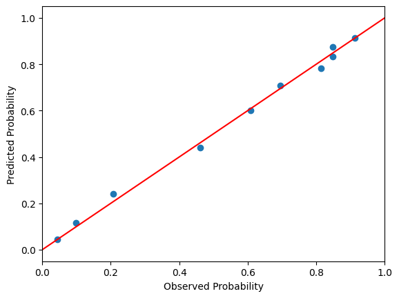
    


The results seem slightly worse for the sigmoid kernel than for the radial and polynomial kernels. 

### Quadratic Discriminant Analysis <a class="anchor" id="qda-heart"></a>

Quadratic discriminant analysis (QDA) is a straightforward generalization of LDA in which we do not assume that the covariance matrix of predictors $\Sigma$ is constant for each class. Instead, we consider a separate covariance matrix $\Sigma_k$ for each class. Consequently, instead of a linear decision boundary, QDA attains a more general quadratic decision boundary [[3](#3)].


```python
from sklearn.discriminant_analysis import QuadraticDiscriminantAnalysis

qda_heart = QuadraticDiscriminantAnalysis(store_covariance=True) # store_covariance=True to explicitly compute the covariance matrices
qda_heart_fit = qda_heart.fit(X = heart_final.iloc[:,range(0,17)], y = heart_final['heart_disease']) 

pred_prob_heart_qda = qda_heart_fit.predict_proba(heart_final.iloc[:,range(0,17)])
```

We can check that *fit* indeed estimates two covariance matrices.


```python
len(qda_heart_fit.covariance_)
```


    2


The prediction metrics are as follows.


```python
accuracy_scores_qda = np.zeros(41)
balanced_accuracy_scores_qda = np.zeros(41)
f1_scores_qda = np.zeros(41)
f1_scores_neg_qda = np.zeros(41)
matthews_corrcoefs_qda = np.zeros(41)
cohen_kappa_scores_qda = np.zeros(41)

for k in range(41):
    accuracy_thresholds[k] = k/40
    accuracy_scores_qda[k] = accuracy_score(obs_heart,(pred_prob_heart_qda[:,1] > accuracy_thresholds[k]).astype(int))
    balanced_accuracy_scores_qda[k] = balanced_accuracy_score(obs_heart,(pred_prob_heart_qda[:,1] > accuracy_thresholds[k]).astype(int))
    f1_scores_qda[k] = f1_score(obs_heart,(pred_prob_heart_qda[:,1] > accuracy_thresholds[k]).astype(int))
    f1_scores_neg_qda[k] = f1_score(obs_heart,(pred_prob_heart_qda[:,1] > accuracy_thresholds[k]).astype(int),pos_label=0)
    matthews_corrcoefs_qda[k] = matthews_corrcoef(obs_heart,(pred_prob_heart_qda[:,1] > accuracy_thresholds[k]).astype(int))
    cohen_kappa_scores_qda[k] = cohen_kappa_score(obs_heart,(pred_prob_heart_qda[:,1] > accuracy_thresholds[k]).astype(int))
```


```python
plt.plot(accuracy_thresholds,accuracy_scores_qda)
plt.plot(accuracy_thresholds,balanced_accuracy_scores_qda)
plt.plot(accuracy_thresholds,f1_scores_qda)
plt.plot(accuracy_thresholds,f1_scores_neg_qda)
plt.plot(accuracy_thresholds,matthews_corrcoefs_qda)
plt.plot(accuracy_thresholds,cohen_kappa_scores_qda)

plt.legend(['Accuracy','Balanced Accuracy','F1-score','F1-score (for negatives)','Matthews correlation',"Cohen's kappa"], loc="lower right")
plt.xlabel('Probability Threshold')
plt.ylabel('Metrics');
```


    
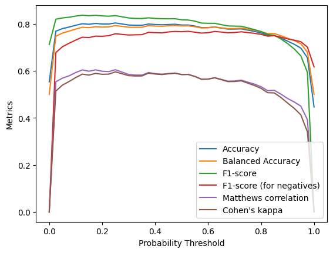
    


```python
fpr, tpr, thresholds = roc_curve(obs_heart,pred_prob_heart_qda[:,1])
plt.plot(fpr,tpr)
plt.xlabel('1 - Specificity (false positive rate)')
plt.ylabel('Sensitivity (true positive rate)');
```


    

    


```python
roc_auc_score(obs_heart,pred_prob_heart_qda[:,1])
```


    0.8591031304013828


```python
log_loss(obs_heart, pred_prob_heart_qda[:,1])
```


    0.6929275271270017


```python
brier_score_loss(obs_heart,pred_prob_heart_qda[:,1])
```


    0.16461984447517047


```python
prob_true_qda, prob_pred_qda = calibration_curve(obs_heart,pred_prob_heart_qda[:,1], n_bins=10, strategy = 'quantile')
sm.graphics.abline_plot(intercept = 0,slope = 1,color = 'red')
plt.scatter(prob_true_qda,prob_pred_qda)
plt.xlabel('Observed Probability')
plt.ylabel('Predicted Probability');
```


    
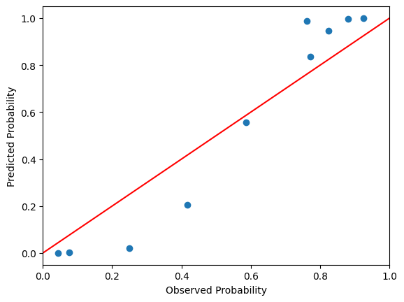
    


We observe that AUC improved slightly compared to logistic regression, LDA, and linear SVM; however, the Brier score and log loss are slightly worse. In addition, calibration is also noticeably off. To demonstrate what is happening, let us plot the histograms for the predicted probabilities.


```python
plt.hist(pred_prob_heart_qda[:,1])
plt.xlabel('Predicted Probability')
plt.ylabel('Observed Frequencies');
```


    
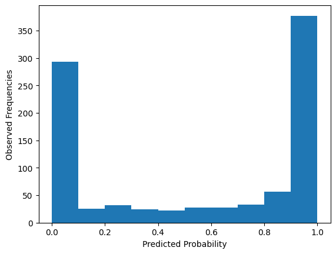
    


We observe that the probabilities are skewed way too much to 0 and 1 (i.e., the classifier is overconfident). For a comparison, let us plot the probabilities for the logistic regression model.


```python
plt.hist(pred_prob_heart);
plt.xlabel('Predicted Probability')
plt.ylabel('Observed Frequencies');
```


    

    


We can attempt to fix the apparent issue with probability predictions by recalibrating the model using Platt’s scaling (as we did to obtain probability predictions from SVM).


```python
from sklearn.calibration import CalibratedClassifierCV

calibrated_qda_heart = CalibratedClassifierCV(qda_heart)
calibrated_qda_heart_fit = calibrated_qda_heart.fit(X = heart_final.iloc[:,range(0,17)], y = heart_final['heart_disease']) 

pred_prob_heart_qda_calibrated = calibrated_qda_heart_fit.predict_proba(heart_final.iloc[:,range(0,17)])
```


```python
prob_true_qda_calibrated, prob_pred_qda_calibrated = calibration_curve(obs_heart,pred_prob_heart_qda_calibrated[:,1], n_bins=10, strategy = 'quantile')
sm.graphics.abline_plot(intercept = 0,slope = 1,color = 'red')
plt.scatter(prob_true_qda_calibrated,prob_pred_qda_calibrated)
plt.xlabel('Observed Probability')
plt.ylabel('Predicted Probability');
```


    
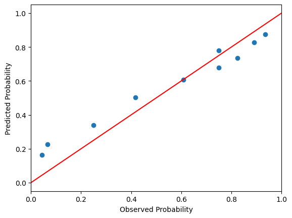
    


```python
plt.hist(pred_prob_heart_qda_calibrated[:,1]);
plt.xlabel('Predicted Probability')
plt.ylabel('Observed Frequencies');
```


    

    


We observe  that the calibration noticeably improved. Let us investigate the effect on the metrics.


```python
roc_auc_score(obs_heart,pred_prob_heart_qda_calibrated[:,1])
```


    0.8629681198386786


```python
log_loss(obs_heart, pred_prob_heart_qda_calibrated[:,1])
```


    0.4729022130239288


```python
brier_score_loss(obs_heart,pred_prob_heart_qda_calibrated[:,1])
```


    0.1506190703672272


After recalibration, the Brier score and log loss improved dramatically, bringing QDA's performance metrics into line with those of other classifiers.

### Naive Bayes <a class="anchor" id="nb-heart"></a>

Naive Bayes is another popular generative method. It assumes that the predictors $X$ are conditionally independent (for each class $Y$), i.e., $P(X|Y) = P(X_1|Y)P(X_2|Y)\ldots$. Naturally, this assumption is often unrealistic; however, it allows us to replace the computationally challenging estimation of the joint probability $P(X|Y)$ with simple, scalable estimation of marginal densities. 

The class conditional probability using the Bayes rule is $P(Y = k|X = x) = \frac{\pi_k \Pi_iP(X = x_i |Y = k)}{\sum_j\pi_j \Pi_iP(X = x_i |Y = j)}$, where $\pi_Y$ is the prior class probability. Consequently, the log odds under the conditional independence condition is $$\mathrm{log}\frac{p}{1-p} = \mathrm{log}\frac{\pi_1\Pi_i P(X_i|Y =1)}{\pi_0\Pi_i P(X_i|Y =0)} = \mathrm{log} \frac{\pi_1}{\pi_0} + \sum_i\mathrm{log}\frac{P(X_i|Y =1)}{ P(X_i|Y =0)} = \mathrm{log} \frac{\pi_1}{\pi_0} + \sum_i f(X_i),$$ which is the form of a *generalized additive model* [[2](#2)].  Hence, a generalized additive logistic model is a discriminative analogue to naive Bayes, just as logistic regression is a discriminative analogue to LDA.

For estimating densities, the density of continuous predictors can be approximated by a normal distribution. Alternatively, we could use a nonparametric density estimate, corresponding to the smooths used in generalized additive models. The categorical predictors can be naturally modeled by observed proportions [[3](#3)]. 

In *sklearn*, our choices for naive Bayes are a bit limited (https://scikit-learn.org/stable/api/sklearn.naive_bayes.html); we do not have a nonparametric density estimate available, and crucially, mixing and matching appropriate densities is not built in. Hence, we have to do a bit of coding to obtain a proper naive Bayes classifier. First, we obtain density estimates for the continuous predictors using a Gaussian naive Bayes classifier, *GaussianNB*.


```python
from sklearn.naive_bayes import GaussianNB
gaussNB_heart = GaussianNB()
gaussNB_heart_fit = gaussNB_heart.fit(heart_final[['age','trestbps','chol','thalch','oldpeak']], y = heart_final['heart_disease'])
```

Next, we fit a categorical naive Bayes via *CategoricalNB*


```python
from sklearn.naive_bayes import CategoricalNB
catNB_heart = CategoricalNB()
catNB_heart_fit = catNB_heart.fit(heart_imp_MissForest[['sex','cp','restecg','exang','fbs','slope','thal']], y = heart_final['heart_disease'])
```

We need to compute the conditional probability $P(Y|X)$ from *GaussianNB* and *CategoricalNB*. First, we extract log join probabilities $\mathrm{log} P(X_{\mathrm{cont}},Y)$ and $\mathrm{log} P(X_{\mathrm{cat}},Y)$.


```python
# log P(X_1,Y) and log P(X_2,Y)
joint_logprob_cont_heart =  gaussNB_heart_fit.predict_joint_log_proba(heart_final[['age','trestbps','chol','thalch','oldpeak']])
joint_logprob_cat_heart =  catNB_heart_fit.predict_joint_log_proba(heart_imp_MissForest[['sex','cp','restecg','exang','fbs','slope','thal']])
```

Next, we use that $P(X_{\mathrm{cont}}|Y) = P(X_{\mathrm{cont}},Y)/\pi_Y$ and $P(X_\mathrm{cat}|Y) = P(X_{\mathrm{cat}},Y)/\pi_Y$  and the fact that $X_\mathrm{cont}$ and $X_\mathrm{cat}$ are conditionally independent. Consequently, we obtain  $P(X|Y) = P(X_{\mathrm{cont}}|Y)P(X_\mathrm{cat}|Y) = P(X_{\mathrm{cont}},Y)P(X_{\mathrm{cat}},Y)/(\pi_Y)^2$. Thus, we obtain from the Bayes theorem $$P(Y|X) = \frac{P(X|Y)\pi_Y}{\sum_Y P(X|Y)\pi_Y} = \frac{P(X_{\mathrm{cont}},Y)P(X_{\mathrm{cat}},Y)/\pi_Y}{\sum_Y P(X_{\mathrm{cont}},Y)P(X_{\mathrm{cat}},Y)/\pi_Y}.$$


```python
pred_prob_heart_nb = np.exp(joint_logprob_cont_heart - catNB_heart_fit.class_log_prior_ + joint_logprob_cat_heart) # compute numerator
pred_prob_heart_nb = np.divide(pred_prob_heart_nb.T,pred_prob_heart_nb.sum(axis = 1)).T # normalize the density
```


```python
accuracy_scores_nb = np.zeros(41)
balanced_accuracy_scores_nb = np.zeros(41)
f1_scores_nb = np.zeros(41)
f1_scores_neg_nb = np.zeros(41)
matthews_corrcoefs_nb = np.zeros(41)
cohen_kappa_scores_nb = np.zeros(41)

for k in range(41):
    accuracy_thresholds[k] = k/40
    accuracy_scores_nb[k] = accuracy_score(obs_heart,(pred_prob_heart_nb[:,1] > accuracy_thresholds[k]).astype(int))
    balanced_accuracy_scores_nb[k] = balanced_accuracy_score(obs_heart,(pred_prob_heart_nb[:,1] > accuracy_thresholds[k]).astype(int))
    f1_scores_nb[k] = f1_score(obs_heart,(pred_prob_heart_nb[:,1] > accuracy_thresholds[k]).astype(int))
    f1_scores_neg_nb[k] = f1_score(obs_heart,(pred_prob_heart_nb[:,1] > accuracy_thresholds[k]).astype(int),pos_label=0)
    matthews_corrcoefs_nb[k] = matthews_corrcoef(obs_heart,(pred_prob_heart_nb[:,1] > accuracy_thresholds[k]).astype(int))
    cohen_kappa_scores_nb[k] = cohen_kappa_score(obs_heart,(pred_prob_heart_nb[:,1] > accuracy_thresholds[k]).astype(int))
```


```python
plt.plot(accuracy_thresholds,accuracy_scores_nb)
plt.plot(accuracy_thresholds,balanced_accuracy_scores_nb)
plt.plot(accuracy_thresholds,f1_scores_nb)
plt.plot(accuracy_thresholds,f1_scores_neg_nb)
plt.plot(accuracy_thresholds,matthews_corrcoefs_nb)
plt.plot(accuracy_thresholds,cohen_kappa_scores_nb)

plt.legend(['Accuracy','Balanced Accuracy','F1-score','F1-score (for negatives)','Matthews correlation',"Cohen's kappa"], loc="lower right")
plt.xlabel('Probability Threshold')
plt.ylabel('Metrics');
```


    
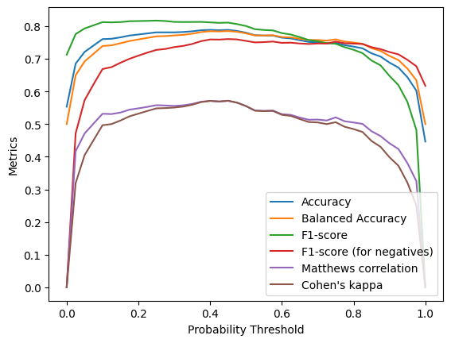
    


```python
fpr, tpr, thresholds = roc_curve(obs_heart,pred_prob_heart_nb[:,1])
plt.plot(fpr,tpr)
plt.xlabel('1 - Specificity (false positive rate)')
plt.ylabel('Sensitivity (true positive rate)');
```


    
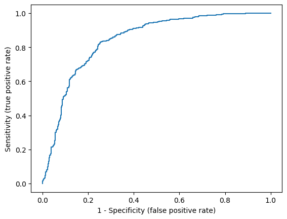
    


```python
roc_auc_score(obs_heart,pred_prob_heart_nb[:,1])
```


    0.8430382177837527


```python
log_loss(obs_heart, pred_prob_heart_nb[:,1])
```


    0.6071737399419606


```python
brier_score_loss(obs_heart,pred_prob_heart_nb[:,1])
```


    0.1669868401330874


```python
prob_true_nb, prob_pred_nb = calibration_curve(obs_heart,pred_prob_heart_nb[:,1], n_bins=10, strategy = 'quantile')
sm.graphics.abline_plot(intercept = 0,slope = 1,color = 'red')
plt.scatter(prob_true_nb,prob_pred_nb)
plt.xlabel('Observed Probability')
plt.ylabel('Predicted Probability');
```


    
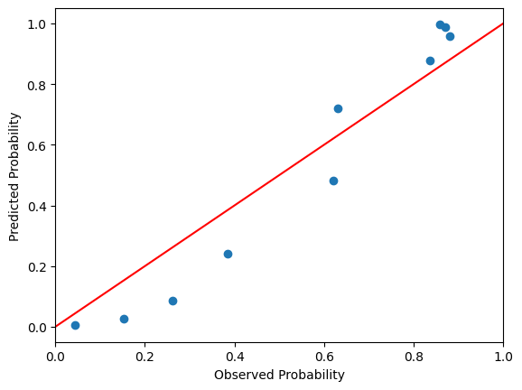
    


We observe that the naive Bayes classifier is slightly miscalibrated. This is actually quite typical since naive Bayes tends to push probabilities to 0 or 1 [[9](#9)].


```python
plt.hist(pred_prob_heart_nb[:,1]);
```


    
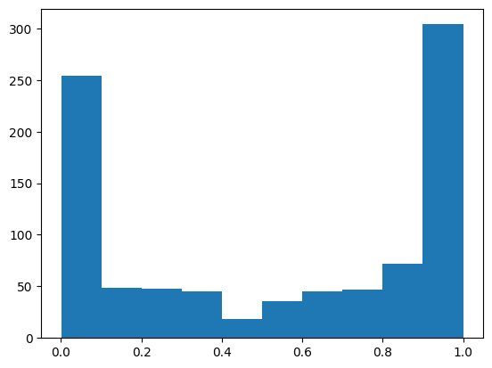
    


Let us recalibrate the model as we did with the QDA classifier. Since we implemented the predicted probabilities by hand (and we did not implement the whole estimator), we cannot use *CalibratedClassifierCV*. However, the implementation is relatively straightforward. We use cross-validation to learn the calibration coefficients; we learn the model on the train subset of the train set and calibnration coefficients are learned from the test sunset of the train set.


```python
from sklearn.model_selection import KFold
np.random.seed(123)

folds = 5
kf = KFold(n_splits=folds) # create folds

calib_coef =  pd.DataFrame(index=range(folds),columns = ['intercept','slope'])


idx_cv = np.random.choice([*range(len(heart_final))],len(heart_final), replace=False)
for j, (train_index, test_index) in enumerate(kf.split(idx_cv)):
    train_set = idx_cv[train_index]
    test_set = idx_cv[test_index]

    # split the train set
    heart_final_train = heart_final.iloc[train_set]
    heart_final_test = heart_final.iloc[test_set]
        
    heart_imp_MissForest_train = heart_imp_MissForest.iloc[train_set]
    heart_imp_MissForest_test = heart_imp_MissForest.iloc[test_set]

    # learn the naive Bayes classifier
    gaussNB_heart_new = GaussianNB()
    catNB_heart_new = CategoricalNB()
        
    gaussNB_heart_fit_new = gaussNB_heart_new.fit(heart_final_train[['age','trestbps','chol','thalch','oldpeak']], y = heart_final_train['heart_disease'])
    catNB_heart_fit_new = catNB_heart_new.fit(heart_imp_MissForest_train[['sex','cp','restecg','exang','fbs','slope','thal']], y = heart_final_train['heart_disease'])

    # obtain predicted probabilities for the test subset
    joint_logprob_cont_heart_new =  gaussNB_heart_fit_new.predict_joint_log_proba(heart_final_test[['age','trestbps','chol','thalch','oldpeak']])
    joint_logprob_cat_heart_new =  catNB_heart_fit_new.predict_joint_log_proba(heart_imp_MissForest_test[['sex','cp','restecg','exang','fbs','slope','thal']])
    pred_prob_heart_nb_new = np.exp(joint_logprob_cont_heart_new - catNB_heart_fit_new.class_log_prior_ + joint_logprob_cat_heart_new) 
    pred_prob_heart_nb_new = np.divide(pred_prob_heart_nb_new.T,pred_prob_heart_nb_new.sum(axis = 1)).T 

    # fit the logit model on the test subset and extract coefficients
    logitp_nb = np.log(pred_prob_heart_nb_new[:,1]/(1-pred_prob_heart_nb_new[:,1])) # logit p = log p/(1-p)

    calib_model_fit = sm.Logit(endog = heart_final_test['heart_disease'].reset_index(drop = True),exog = pd.DataFrame(logitp_nb).assign(const=1)).fit(disp=0) #logit model
    calib_coef.iloc[j,0] = calib_model_fit.params.iloc[1]
    calib_coef.iloc[j,1] = calib_model_fit.params.iloc[0]

```

We obtained the following parameters from the cross-validation. 


```python
calib_coef.mean()
```


    intercept    0.127849
    slope        0.432648
    dtype: object


Hence, we get the following calibrated probabilities.


```python
logitp_nb_all = np.log(pred_prob_heart_nb[:,1]/(1-pred_prob_heart_nb[:,1])) # logit p = log p/(1-p)
pred_prob_heart_nb_calib =  1 - 1/(1+np.exp(calib_coef.mean().iloc[1]*logitp_nb_all + calib_coef.mean().iloc[0])) #p_cal = ilogit(slope*log p/(1-p) + intercept)
```


```python
roc_auc_score(obs_heart,pred_prob_heart_nb_calib)
```


    0.8430382177837527


```python
log_loss(obs_heart, pred_prob_heart_nb_calib)
```


    0.4950402138362559


```python
brier_score_loss(obs_heart,pred_prob_heart_nb_calib)
```


    0.1576069591133016


```python
prob_true_nb_calib, prob_pred_nb_calib = calibration_curve(obs_heart,pred_prob_heart_nb_calib, n_bins=10, strategy = 'quantile')
sm.graphics.abline_plot(intercept = 0,slope = 1,color = 'red')
plt.scatter(prob_true_nb_calib,prob_pred_nb_calib)
plt.xlabel('Observed Probability')
plt.ylabel('Predicted Probability');
```


    
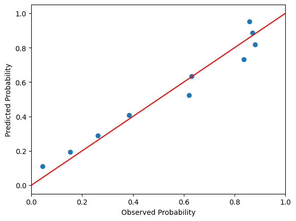
    


```python
plt.hist(pred_prob_heart_nb_calib);
```


    

    


We observed that calibration again significantly reduced the Brier score and the log loss.

## Validation <a class="anchor" id="valid"></a>

Let us validate all our models from this project. We will simplify cross-validation a bit (primarily to speed up computation) by omitting the imputation step, since we are mainly interested in comparing classifiers rather than estimating classification error in predicting the presence of heart disease itself. 


```python
# cross-validation
np.random.seed(123)

rep = 50
folds = 10
kf = KFold(n_splits=10) # create folds

metrics_cv_heart_log_reg =  pd.DataFrame(index=range(rep*folds),columns = ['AUC','Brier score','log score','calibration'])
metrics_cv_heart_lda =  pd.DataFrame(index=range(rep*folds),columns = ['AUC','Brier score','log score','calibration'])
metrics_cv_heart_linear_svm =  pd.DataFrame(index=range(rep*folds),columns = ['AUC','Brier score','log score','calibration'])
metrics_cv_heart_rbf_svm =  pd.DataFrame(index=range(rep*folds),columns = ['AUC','Brier score','log score','calibration'])
metrics_cv_heart_poly_svm =  pd.DataFrame(index=range(rep*folds),columns = ['AUC','Brier score','log score','calibration'])
metrics_cv_heart_sig_svm =  pd.DataFrame(index=range(rep*folds),columns = ['AUC','Brier score','log score','calibration'])
metrics_cv_heart_qda =  pd.DataFrame(index=range(rep*folds),columns = ['AUC','Brier score','log score','calibration'])
metrics_cv_heart_nb =  pd.DataFrame(index=range(rep*folds),columns = ['AUC','Brier score','log score','calibration'])


parameters_svm_linear = {'kernel':['linear'], 'C':[0.001, 0.01, 0.1, 1, 10, 100]}
parameters_svm_rbf = {'kernel':['rbf'], 'C':[0.001, 0.01, 0.1, 1, 10, 100], 'gamma':[0.001, 0.01, 0.1, 1, 10, 100, 1000]}
parameters_svm_poly = {'kernel':['poly'], 'C':[0.001, 0.01, 0.1, 1, 10, 100], 'gamma':[0.001, 0.01, 0.1, 1, 10, 100, 1000],'coef0':[0,1,10], 'degree':[3]}
parameters_svm_sig = {'kernel':['sigmoid'], 'C':[0.001, 0.01, 0.1, 1, 10, 100], 'gamma':[0.001, 0.01, 0.1, 1, 10, 100, 1000],'coef0':[-10, -1, 0.1, 0, 0.1, 1, 10]}

k = 0

for i in range(rep):
    
    idx_cv = np.random.choice([*range(len(heart_final))],len(heart_final), replace=False)
    
    for j, (train_index, test_index) in enumerate(kf.split(idx_cv)):
        
        train_set = idx_cv[train_index]
        test_set = idx_cv[test_index]
        
        heart_train = heart_final.iloc[train_set]
        heart_test = heart_final.iloc[test_set]
        
        heart_imp_train = heart_imp_MissForest.iloc[train_set] # train set for NB
        heart_imp_test = heart_imp_MissForest.iloc[test_set] # train set for NB
        
        
        # logit
        log_reg_new = smf.logit(formula='heart_disease ~ age + sex + cp_typ + cp_atyp + cp_nonang + restecg_hypertrophy + \
                                  restecg_stt + thalch + exang + trestbps + oldpeak + fbs + chol + slope_down + slope_up + \
                                  thal_rev + thal_fixed', data=heart_final)
                                  
        pred_prob_log_reg_new = log_reg_new.fit(disp=0).predict(heart_test)
        logitp_log_reg_new = np.log(pred_prob_log_reg_new/(1-pred_prob_log_reg_new)) 
        
        metrics_cv_heart_log_reg.iloc[k,0] = roc_auc_score(heart_test['heart_disease'],pred_prob_log_reg_new)
        metrics_cv_heart_log_reg.iloc[k,1] = brier_score_loss(heart_test['heart_disease'],pred_prob_log_reg_new)
        metrics_cv_heart_log_reg.iloc[k,2] = log_loss(heart_test['heart_disease'],pred_prob_log_reg_new)
        metrics_cv_heart_log_reg.iloc[k,3] = sm.Logit(endog= heart_test['heart_disease'],exog = pd.DataFrame(logitp_log_reg_new).assign(const=1)).fit(disp=0).params.iloc[0]
        

        # LDA
        lda_new = LinearDiscriminantAnalysis(store_covariance=True)
        lda_new_fit = lda_new.fit(X = heart_train.iloc[:,range(0,17)], y = heart_train['heart_disease']) 
        pred_heart_lda_new = lda_new_fit.predict_proba(heart_test.iloc[:,range(0,17)])[:,1]
        logitp_lda_new = np.log(pred_heart_lda_new/(1-pred_heart_lda_new))
        
        metrics_cv_heart_lda.iloc[k,0] = roc_auc_score(heart_test['heart_disease'],pred_heart_lda_new)
        metrics_cv_heart_lda.iloc[k,1] = brier_score_loss(heart_test['heart_disease'],pred_heart_lda_new)
        metrics_cv_heart_lda.iloc[k,2] = log_loss(heart_test['heart_disease'],pred_heart_lda_new)
        metrics_cv_heart_lda.iloc[k,3] = sm.Logit(endog= heart_test['heart_disease'].reset_index(drop=True),exog = pd.DataFrame(logitp_lda_new).assign(const=1)).fit(disp=0).params.iloc[0]
        
        
        # linear SVM
        svm_linear_pipeline_new = make_pipeline(StandardScaler(),  GridSearchCV(estimator=svm.SVC(),param_grid=parameters_svm_linear, scoring = 'balanced_accuracy', refit=False, n_jobs = 4))
        svm_linear_pipeline_fit_new = svm_linear_pipeline_new.fit(X = heart_train.iloc[:,range(0,17)], y = heart_train['heart_disease'])
        
        svm_linear_params_new = svm_linear_pipeline_fit_new._final_estimator.best_params_
        svm_linear_pipeline_new2 = make_pipeline(StandardScaler(),  svm.SVC(C=svm_linear_params_new['C'], kernel = 'linear', probability = True))
        svm_linear_pipeline_fit_new2 = svm_linear_pipeline_new2.fit(X = heart_train.iloc[:,range(0,17)], y = heart_train['heart_disease'])
        
        pred_prob_linear_svm_new = svm_linear_pipeline_fit_new2.predict_proba(heart_test.iloc[:,range(0,17)])[:,1]
        logitp_linear_svm_new = np.log(pred_prob_linear_svm_new/(1-pred_prob_linear_svm_new))
        
        metrics_cv_heart_linear_svm.iloc[k,0] = roc_auc_score(heart_test['heart_disease'],pred_prob_linear_svm_new)
        metrics_cv_heart_linear_svm.iloc[k,1] = brier_score_loss(heart_test['heart_disease'],pred_prob_linear_svm_new)
        metrics_cv_heart_linear_svm.iloc[k,2] = log_loss(heart_test['heart_disease'],pred_prob_linear_svm_new)
        metrics_cv_heart_linear_svm.iloc[k,3] = sm.Logit(endog= heart_test['heart_disease'].reset_index(drop=True),exog = pd.DataFrame(logitp_linear_svm_new).assign(const=1)).fit(disp=0).params.iloc[0]
        
        
        # rbf SVM
        svm_rbf_pipeline_new = make_pipeline(StandardScaler(),  GridSearchCV(estimator=svm.SVC(),param_grid=parameters_svm_rbf, scoring = 'balanced_accuracy', refit=False, n_jobs = 4))
        svm_rbf_pipeline_fit_new = svm_rbf_pipeline_new.fit(X = heart_train.iloc[:,range(0,17)], y = heart_train['heart_disease'])
        
        svm_rbf_params_new = svm_rbf_pipeline_fit_new._final_estimator.best_params_
        svm_rbf_pipeline_new2 = make_pipeline(StandardScaler(),  svm.SVC(C=svm_rbf_params_new['C'], gamma = svm_rbf_params_new['gamma'], kernel = 'rbf', probability = True))
        svm_rbf_pipeline_fit_new2 = svm_rbf_pipeline_new2.fit(X = heart_train.iloc[:,range(0,17)], y = heart_train['heart_disease'])
        
        pred_prob_rbf_svm_new = svm_rbf_pipeline_fit_new2.predict_proba(heart_test.iloc[:,range(0,17)])[:,1]
        logitp_rbf_svm_new = np.log(pred_prob_rbf_svm_new/(1-pred_prob_rbf_svm_new))
        
        metrics_cv_heart_rbf_svm.iloc[k,0] = roc_auc_score(heart_test['heart_disease'],pred_prob_rbf_svm_new)
        metrics_cv_heart_rbf_svm.iloc[k,1] = brier_score_loss(heart_test['heart_disease'],pred_prob_rbf_svm_new)
        metrics_cv_heart_rbf_svm.iloc[k,2] = log_loss(heart_test['heart_disease'],pred_prob_rbf_svm_new)
        metrics_cv_heart_rbf_svm.iloc[k,3] = sm.Logit(endog= heart_test['heart_disease'].reset_index(drop=True),exog = pd.DataFrame(logitp_rbf_svm_new).assign(const=1)).fit(disp=0).params.iloc[0]
        
        
        # poly SVM
        svm_poly_pipeline_new = make_pipeline(StandardScaler(),  GridSearchCV(estimator=svm.SVC(),param_grid=parameters_svm_poly, scoring = 'balanced_accuracy', refit=False, n_jobs = 4))
        svm_poly_pipeline_fit_new = svm_poly_pipeline_new.fit(X = heart_train.iloc[:,range(0,17)], y = heart_train['heart_disease'])
        
        svm_poly_params_new = svm_poly_pipeline_fit_new._final_estimator.best_params_
        svm_poly_pipeline_new2 = make_pipeline(StandardScaler(),  svm.SVC(C=svm_poly_params_new['C'], gamma = svm_poly_params_new['gamma'], coef0 = svm_poly_params_new['coef0'], kernel = 'poly', degree = 3, probability = True))
        svm_poly_pipeline_fit_new2 = svm_poly_pipeline_new2.fit(X = heart_train.iloc[:,range(0,17)], y = heart_train['heart_disease'])
        
        pred_prob_poly_svm_new = svm_poly_pipeline_fit_new2.predict_proba(heart_test.iloc[:,range(0,17)])[:,1]
        logitp_poly_svm_new = np.log(pred_prob_poly_svm_new/(1-pred_prob_poly_svm_new))
        
        metrics_cv_heart_poly_svm.iloc[k,0] = roc_auc_score(heart_test['heart_disease'],pred_prob_poly_svm_new)
        metrics_cv_heart_poly_svm.iloc[k,1] = brier_score_loss(heart_test['heart_disease'],pred_prob_poly_svm_new)
        metrics_cv_heart_poly_svm.iloc[k,2] = log_loss(heart_test['heart_disease'],pred_prob_poly_svm_new)
        metrics_cv_heart_poly_svm.iloc[k,3] = sm.Logit(endog= heart_test['heart_disease'].reset_index(drop=True),exog = pd.DataFrame(logitp_poly_svm_new).assign(const=1)).fit(disp=0).params.iloc[0]
        
        
        # sig SVM
        svm_sig_pipeline_new = make_pipeline(StandardScaler(),  GridSearchCV(estimator=svm.SVC(),param_grid=parameters_svm_sig, scoring = 'balanced_accuracy', refit=False, n_jobs = 4))
        svm_sig_pipeline_fit_new = svm_sig_pipeline_new.fit(X = heart_train.iloc[:,range(0,17)], y = heart_train['heart_disease'])
        
        svm_sig_params_new = svm_sig_pipeline_fit_new._final_estimator.best_params_
        svm_sig_pipeline_new2 = make_pipeline(StandardScaler(),  svm.SVC(C=svm_sig_params_new['C'], gamma = svm_sig_params_new['gamma'], coef0 = svm_sig_params_new['coef0'], kernel = 'sigmoid', probability = True))
        svm_sig_pipeline_fit_new2 = svm_sig_pipeline_new2.fit(X = heart_train.iloc[:,range(0,17)], y = heart_train['heart_disease'])
        

        pred_prob_sig_svm_new = svm_sig_pipeline_fit_new2.predict_proba(heart_test.iloc[:,range(0,17)])[:,1]
        logitp_sig_svm_new = np.log(pred_prob_sig_svm_new/(1-pred_prob_sig_svm_new))
        
        metrics_cv_heart_sig_svm.iloc[k,0] = roc_auc_score(heart_test['heart_disease'],pred_prob_sig_svm_new)
        metrics_cv_heart_sig_svm.iloc[k,1] = brier_score_loss(heart_test['heart_disease'],pred_prob_sig_svm_new)
        metrics_cv_heart_sig_svm.iloc[k,2] = log_loss(heart_test['heart_disease'],pred_prob_sig_svm_new)
        metrics_cv_heart_sig_svm.iloc[k,3] = sm.Logit(endog= heart_test['heart_disease'].reset_index(drop=True),exog = pd.DataFrame(logitp_sig_svm_new).assign(const=1)).fit(disp=0).params.iloc[0]
        
        
        # QDA
        qda_new = QuadraticDiscriminantAnalysis()
        qda_new_fit = qda_new.fit(X = heart_train.iloc[:,range(0,17)], y = heart_train['heart_disease']) 
        
        calibrated_qda_new = CalibratedClassifierCV(qda_new)
        calibrated_qda_fit_new = calibrated_qda_new.fit(X = heart_train.iloc[:,range(0,17)], y = heart_train['heart_disease']) 
        pred_prob_heart_qda_calibrated = calibrated_qda_fit_new.predict_proba(heart_test.iloc[:,range(0,17)])[:,1]
        
        logitp_qda_new = np.log(pred_prob_heart_qda_calibrated/(1-pred_prob_heart_qda_calibrated))

        metrics_cv_heart_qda.iloc[k,0] = roc_auc_score(heart_test['heart_disease'],pred_prob_heart_qda_calibrated)
        metrics_cv_heart_qda.iloc[k,1] = brier_score_loss(heart_test['heart_disease'],pred_prob_heart_qda_calibrated)
        metrics_cv_heart_qda.iloc[k,2] = log_loss(heart_test['heart_disease'],pred_prob_heart_qda_calibrated)
        metrics_cv_heart_qda.iloc[k,3] = sm.Logit(endog= heart_test['heart_disease'].reset_index(drop=True),exog = pd.DataFrame(logitp_qda_new).assign(const=1)).fit(disp=0).params.iloc[0]
        
    
        # NB    
        folds_inner = 5
        kf_inner = KFold(n_splits=folds_inner) # create folds

        calib_coef_new =  pd.DataFrame(index=range(folds_inner),columns = ['intercept','slope'])

        idx_cv_inner = np.random.choice([*range(len(heart_train))],len(heart_train), replace=False)
        
        for l, (train_index_inner, test_index_inner) in enumerate(kf_inner.split(idx_cv_inner)):
            train_set_inner = idx_cv_inner[train_index_inner]
            test_set_inner = idx_cv_inner[test_index_inner]

            # split the train set
            heart_train_inner = heart_train.iloc[train_set_inner]
            heart_test_inner = heart_train.iloc[test_set_inner]
                
            heart_imp_train_inner = heart_imp_train.iloc[train_set_inner]
            heart_imp_test_inner = heart_imp_train.iloc[test_set_inner]

            # learn the naive Bayes classifier
            gaussNB_new = GaussianNB()
            catNB_new = CategoricalNB()
                
            gaussNB_fit_new = gaussNB_new.fit(heart_train_inner[['age','trestbps','chol','thalch','oldpeak']], y = heart_train_inner['heart_disease'])
            catNBt_fit_new = catNB_new.fit(heart_imp_train_inner[['sex','cp','restecg','exang','fbs','slope','thal']], y = heart_train_inner['heart_disease'])

            # obtain predicted probabilities for the test subset
            joint_logprob_cont_new =  gaussNB_fit_new.predict_joint_log_proba(heart_test_inner[['age','trestbps','chol','thalch','oldpeak']])
            joint_logprob_cat_new =  catNBt_fit_new.predict_joint_log_proba(heart_imp_test_inner[['sex','cp','restecg','exang','fbs','slope','thal']])
            pred_prob_nb_new = np.exp(joint_logprob_cont_new - catNBt_fit_new.class_log_prior_ + joint_logprob_cat_new) 
            pred_prob_nb_new = np.divide(pred_prob_nb_new.T,pred_prob_nb_new.sum(axis = 1)).T 

            # fit the logit model on the test subset and extract coefficients
            logitp_nb_new = np.log(pred_prob_nb_new[:,1]/(1-pred_prob_nb_new[:,1])) # logit p = log p/(1-p)

            calib_model_fit_new = sm.Logit(endog = heart_test_inner['heart_disease'].reset_index(drop = True),exog = pd.DataFrame(logitp_nb_new).assign(const=1)).fit(disp=0) #logit model
            calib_coef_new.iloc[l,0] = calib_model_fit_new.params.iloc[1]
            calib_coef_new.iloc[l,1] = calib_model_fit_new.params.iloc[0]
            
            
        gaussNB_new = GaussianNB()
        catNB_new = CategoricalNB()
            
        gaussNB_fit_new = gaussNB_new.fit(heart_train[['age','trestbps','chol','thalch','oldpeak']], y = heart_train['heart_disease'])
        catNB_fit_new = catNB_new.fit(heart_imp_train[['sex','cp','restecg','exang','fbs','slope','thal']], y = heart_train['heart_disease'])


        joint_logprob_cont_new =  gaussNB_fit_new.predict_joint_log_proba(heart_test[['age','trestbps','chol','thalch','oldpeak']])
        joint_logprob_cat_new =  catNB_fit_new.predict_joint_log_proba(heart_imp_test[['sex','cp','restecg','exang','fbs','slope','thal']])
        pred_prob_nb_new = np.exp(joint_logprob_cont_new - catNB_fit_new.class_log_prior_ + joint_logprob_cat_new)
        pred_prob_nb_new = np.divide(pred_prob_nb_new.T,pred_prob_nb_new.sum(axis = 1)).T # normalize the density
        

        logitp_nb_new = np.log(pred_prob_nb_new[:,1]/(1-pred_prob_nb_new[:,1]))
        pred_prob_nb_new_calib =  1 - 1/(1+np.exp(calib_coef_new.mean().iloc[1]*logitp_nb_new + calib_coef_new.mean().iloc[0]))
        logitp_nb_new_calib = np.log(pred_prob_nb_new_calib/(1-pred_prob_nb_new_calib))
        
        
        metrics_cv_heart_nb.iloc[k,0] = roc_auc_score(heart_test['heart_disease'],pred_prob_nb_new_calib)
        metrics_cv_heart_nb.iloc[k,1] = brier_score_loss(heart_test['heart_disease'],pred_prob_nb_new_calib)
        metrics_cv_heart_nb.iloc[k,2] = log_loss(heart_test['heart_disease'],pred_prob_nb_new_calib)
        metrics_cv_heart_nb.iloc[k,3] = sm.Logit(endog= heart_test['heart_disease'].reset_index(drop=True),exog = pd.DataFrame(logitp_nb_new_calib).assign(const=1)).fit(disp=0).params.iloc[0]


        k = k + 1
```


```python
res = pd.concat([metrics_cv_heart_log_reg.mean(),\
                 metrics_cv_heart_lda.mean(),\
                 metrics_cv_heart_linear_svm.mean(),\
                 metrics_cv_heart_rbf_svm.mean(),\
                 metrics_cv_heart_poly_svm.mean(),\
                 metrics_cv_heart_sig_svm.mean(),\
                 metrics_cv_heart_qda.mean(),\
                 metrics_cv_heart_nb.mean()], axis=1)
    
res.columns = ['logist. reg.','LDA','linear SVM', 'RBF SVM', 'poly SVM', 'sigmoid SVM', 'QDA', 'Naive Bayes']        
res
```


<div>
<style scoped>
    .dataframe tbody tr th:only-of-type {
        vertical-align: middle;
    }

    .dataframe tbody tr th {
        vertical-align: top;
    }

    .dataframe thead th {
        text-align: right;
    }
</style>
<table border="1" class="dataframe">
  <thead>
    <tr style="text-align: right;">
      <th></th>
      <th>logist. reg.</th>
      <th>LDA</th>
      <th>linear SVM</th>
      <th>RBF SVM</th>
      <th>poly SVM</th>
      <th>sigmoid SVM</th>
      <th>QDA</th>
      <th>Naive Bayes</th>
    </tr>
  </thead>
  <tbody>
    <tr>
      <th>AUC</th>
      <td>0.852261</td>
      <td>0.839316</td>
      <td>0.83911</td>
      <td>0.841233</td>
      <td>0.840734</td>
      <td>0.837266</td>
      <td>0.818412</td>
      <td>0.83736</td>
    </tr>
    <tr>
      <th>Brier score</th>
      <td>0.151875</td>
      <td>0.160008</td>
      <td>0.159317</td>
      <td>0.15792</td>
      <td>0.157907</td>
      <td>0.160087</td>
      <td>0.16819</td>
      <td>0.161328</td>
    </tr>
    <tr>
      <th>log score</th>
      <td>0.472193</td>
      <td>0.497821</td>
      <td>0.493311</td>
      <td>0.489729</td>
      <td>0.488759</td>
      <td>0.495784</td>
      <td>0.517756</td>
      <td>0.506784</td>
    </tr>
    <tr>
      <th>calibration</th>
      <td>1.041433</td>
      <td>0.857694</td>
      <td>1.042147</td>
      <td>1.027867</td>
      <td>1.032012</td>
      <td>1.01668</td>
      <td>1.149318</td>
      <td>1.032068</td>
    </tr>
  </tbody>
</table>
</div>


We observe that all classifiers perform quite similarly on this (imputed) dataset. Even though the RBF SVM classifier performed best in terms of fit on the whole dataset, its cross-validated performance did not exceed that of logistic regression. In addition, the logistic regression model offers substantial explanatory power in describing the individual effects of predictors on the prediction, as we explained in detail in the previous circle.

## References <a class="anchor" id="references"></a>

<a id="1">[1]</a> DETRANO, Robert, et al. International application of a new probability algorithm for the diagnosis of coronary artery disease. *The American journal of cardiology*, 1989, 64.5: 304-310.

<a id="2">[2]</a> HASTIE, Trevor, et al. *The Elements of Statistical Learning: Data Mining, Inference, and Prediction, Second Edition*. Springer New York, NY. 2009.

<a id="3">[3]</a> CHICCO, Davide; JURMAN, Giuseppe. The Matthews correlation coefficient (MCC) should replace the ROC AUC as the standard metric for assessing binary classification. *BioData Mining*, 2023, 16.1: 4.

<a id="4">[4]</a> CHICCO, Davide; WARRENS, Matthijs J.; JURMAN, Giuseppe. The Matthews correlation coefficient (MCC) is more informative than Cohen’s Kappa and Brier score in binary classification assessment. *IEEE Access*, 2021, 9: 78368-78381.

<a id="5">[5]</a> JAMES, G., et al. *An introduction to statistical learning: Python edition*. Springer Cham. 2023.

<a id="6">[6]</a> SUZUKI, Joe. Kernel Methods for Machine Learning with Math and Python, 2022.

<a id="7">[7]</a> LIN, Hsuan-Tien; LIN, Chih-Jen. A study on sigmoid kernels for SVM and the training of non-PSD kernels by SMO-type methods. *Neural Comput*, 2003, 3.1-32: 16.

<a id="8">[8]</a> SCHÖLKOPF, Bernhard; HERBRICH, Ralf; SMOLA, Alex J. A generalized representer theorem. In: International conference on computational learning theory. Berlin, Heidelberg: Springer Berlin Heidelberg, 2001. p. 416-426.

<a id="9">[9]</a> ZADROZNY, Bianca; ELKAN, Charles. Obtaining calibrated probability estimates from decision trees and naive bayesian classifiers. In: *Icml*. 2001.
